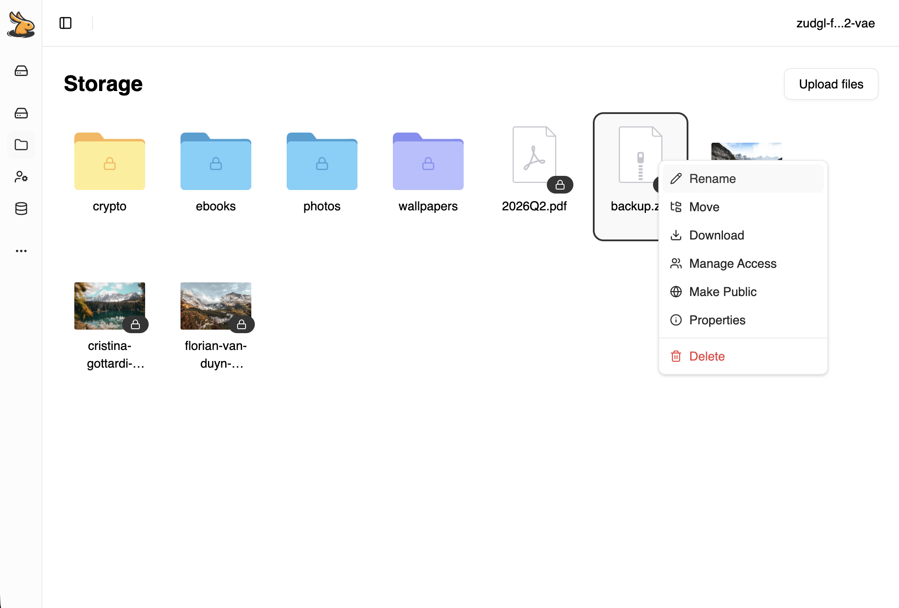
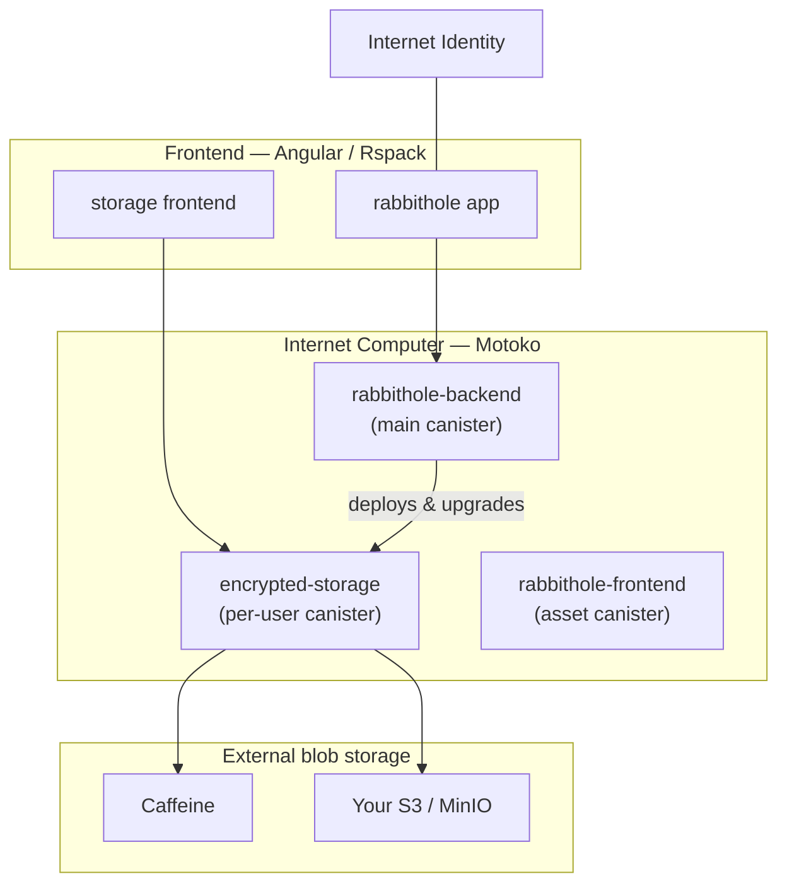

# Rabbithole

End-to-end encrypted, self-sovereign file storage on the [Internet Computer](https://internetcomputer.org).
Each user's storage is a personal canister they ultimately control; files are encrypted in the
browser before upload, and per-file keys are derived on demand via IC threshold cryptography
([vetKeys](https://docs.internetcomputer.org/concepts/vetkeys/)).

[](https://rabbithole.app)
[](https://docs.rabbithole.app)
[](https://internetcomputer.org)
[](./LICENSE)



> **Looking for how it works?** The product model — encryption, key derivation, sharing,
> storage modes, sovereignty, and the trust model — lives in the documentation at
> **[docs.rabbithole.app](https://docs.rabbithole.app)**. This README is the developer entry
> point: how the repository is laid out and how to run it locally.

## Architecture

An [Nx](https://nx.dev) monorepo pairing an Angular frontend with Motoko canisters on the
Internet Computer.



- **rabbithole** — main web app; talks to `rabbithole-backend`.
- **storage** — frontend served from each user's storage canister.
- **rabbithole-backend** — main canister, composed from mixin modules (payments, treasury,
  subscriptions, users, shared access, storage deployer, notifications, …).
- **encrypted-storage** — per-user storage canister; deployed and upgraded by the backend,
  not run standalone.
- **rabbithole-frontend** — certified asset canister serving the app.
- **External storage** — Caffeine blob storage or a user-supplied S3 bucket (MinIO locally).

## Repository layout

```
apps/
  rabbithole/         Main Angular app (frontend)
  backend/            ICP backend — Motoko canisters + local infra (icp.yaml)
  storage/            Storage-canister frontend (served from user canisters)
  docs/               Documentation site (Rspress)
libs/
  core/               IC management, file system, WASM, uploads
  auth/               Internet Identity auth services & guards
  encrypted-storage/  Client-side encryption, blob download, thumbnails
  features/           file-list, payment, storages, canisters, releases, …
  pages/              Routed pages (dashboard, login, profile, wallet)
  declarations/       Generated TypeScript types from Motoko canisters
  app-ui/ · ui/       App components · Spartan-ng component library
  motoko/             Motoko libraries (encrypted-storage, treasury, …)
infra/motoko-dev/     Shared Dockerfile & entrypoint for Motoko projects
```

## Getting started

### Prerequisites

- **Node** 22+ (repo is pinned via `.nvmrc`)
- **Docker Desktop**, running — hosts the local IC replica, MinIO, and Motoko builds
- **[icp-cli](https://cli.internetcomputer.org)** and toolchain, installed on the host:

  ```sh
  brew install icp-cli ic-wasm
  npm install -g ic-mops
  cargo install didc          # Candid encoder used when generating declarations
  ```

  `moc` (the Motoko compiler) is installed automatically by `mops` on the first build.

### Install

```sh
npm install
```

Optionally, to reach canisters over HTTPS at `https://<id>.localhost` (via Caddy), trust the
local root CA once per machine:

```sh
npx nx install-ca backend
```

## Local development

The frontend discovers canister IDs from the local network, so **start the backend first**,
then the frontend.

```sh
# 1. Backend — local IC replica + canisters
#    (docker compose up → bootstrap → generate declarations → deploy → sync env)
npx nx serve backend

# 2. Frontend — main app + storage frontend
npm start
# or a single app:
npx nx serve rabbithole
```

The backend project has its own detailed guide — the bootstrap chain, local subnet topology,
canister discovery, resetting state, and troubleshooting:

**→ [`apps/backend/README.md`](apps/backend/README.md)**

## Common tasks

```sh
# Build
npm run build:frontend                  # or: npx nx build rabbithole
npx nx build backend                    # icp build (canisters)

# Test
npm test                                # unit tests across main projects
npx nx test <project>                   # a single project
npx nx e2e rabbithole-e2e               # end-to-end (Playwright)

# Lint
npm run lint

# Regenerate TypeScript declarations after changing Motoko canisters
npx nx run backend:generate-declarations

# Stop / reset the local backend stack
npx nx compose backend -- down
npx nx run backend:reset-local
```

> Canister integration tests (PocketIC via `@dfinity/pic`) are run from a local machine, not
> inside Docker. On Apple Silicon the local IC infrastructure runs under `linux/arm64`.

## Tech stack

| Area | Technologies |
|---|---|
| Frontend | Angular, Rspack, Tailwind CSS, Spartan-ng, TanStack, RxJS |
| Backend | Motoko, Internet Computer, vetKeys, icp-cli, Mops |
| Storage | On-chain canisters, Caffeine blob storage, S3 / MinIO |
| Monorepo & test | Nx, Vitest, Playwright, @dfinity/pic (PocketIC) |

## Documentation

- **Product & concepts** — [docs.rabbithole.app](https://docs.rabbithole.app)
  ([introduction](https://docs.rabbithole.app/en/getting-started/introduction),
  [encryption](https://docs.rabbithole.app/en/how-it-works/encryption),
  [storage](https://docs.rabbithole.app/en/how-it-works/storage),
  [sovereignty](https://docs.rabbithole.app/en/how-it-works/sovereignty),
  [trust model](https://docs.rabbithole.app/en/how-it-works/trust-model))
- **Backend & local infra** — [`apps/backend/README.md`](apps/backend/README.md)

## License

Licensed under the [Functional Source License, Version 1.1, ALv2 Future License](./LICENSE)
(`FSL-1.1-ALv2`).
