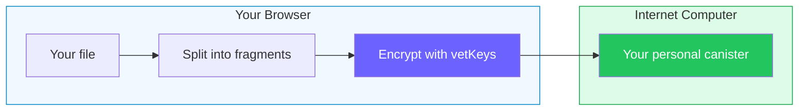

# Rabbithole — privacy-first storage without unnecessary trust

What if your cloud storage couldn't read your files — not because of a policy, but because of **mathematics** when encryption is enabled?

Rabbithole is a decentralized file storage built on the [Internet Computer](https://internetcomputer.org/). In its encrypted mode, Rabbithole does not ask you to trust a company with file confidentiality. It replaces that trust with **verifiable cryptographic guarantees**.

## The core idea

Rabbithole is designed around end-to-end encryption, even though encryption depends on your plan and folder settings.

Every encrypted storage service promises "we can't read your files." But there's a fundamental difference between **policy** and **math**:

| | Policy-based security | Math-based security (Rabbithole) |
|---|---|---|
| "We don't read your files" | Promise | **Impossible by design** |
| Encryption keys | Stored on company servers | **Never exist in one place** |
| Government request | Company may comply | **Nothing to hand over** |
| Company shuts down | Data may be lost | **Data persists on blockchain** |
| Who owns the infrastructure | The company | **You** |

## Why vetKeys change everything

Most encrypted storage services derive your key from a password. That means: if someone gets your password, they get your files. If the company is compelled, they can potentially recover keys.

Rabbithole uses [vetKeys](https://docs.internetcomputer.org/building-apps/network-features/vetkeys/introduction/) — a threshold cryptography protocol built into the Internet Computer:

- Your encryption key is **computed on-demand** by 13-34 independent nodes cooperating
- **No single node** ever knows your complete key
- The key is **derived from your identity** — no passwords to lose or steal
- Each file gets a **unique derived key** — compromising one file doesn't compromise others
- The math is based on **BLS12-381 threshold signatures** and **Identity-Based Encryption (IBE)** — well-studied cryptographic primitives

:::note{title="In simple terms"}

Imagine 13 to 34 guards, each holding a piece of a key. Only when enough of them agree it's you, the pieces combine into a key that exists only in your browser, for a split second, and then vanishes. No guard ever sees the full key.

:::

## How it compares

| Service | E2E Encrypted | Zero-Knowledge | Open Source | Decentralized | You own infrastructure | Key derivation |
|---------|:---:|:---:|:---:|:---:|:---:|---|
| Google Drive | — | — | — | — | — | Company keys |
| Dropbox | — | — | — | — | — | Company keys |
| Tresorit | Yes | Yes | — | — | — | Password-derived |
| ProtonDrive | Yes | Yes | Partial | — | — | Password-derived |
| Internxt | Yes | Yes | Yes | — | — | Password-derived |
| Filen | Yes | Yes | Partial | — | — | Password-derived |
| Storj | Yes | Yes | Yes | Yes | — | Client-side |
| **Rabbithole** | **Yes** | **Yes** | **Yes** | **Yes** | **Yes** | **Threshold crypto (vetKeys)** |

**What sets Rabbithole apart:**
- **No passwords for key derivation** — your key comes from your [Internet Identity](https://id.ai/), computed by the network itself
- **Per-user canister** — you own the smart contract where your data lives. After deployment, Rabbithole removes itself as controller
- **Verifiable** — all code is [open source](https://github.com/rabbithole-app/v2), the encryption runs in your browser, and the key derivation is enforced by blockchain consensus

## How it works (in 30 seconds)

1. **You own your canister** — a personal smart contract deployed just for you. See [Data Sovereignty](/en/how-it-works/sovereignty)
2. You sign in with **[Internet Identity](https://id.ai/)** — passkeys, biometrics, or social login. No passwords
3. If encryption is enabled for that file, it is **encrypted in your browser** using keys derived via vetKeys
4. The file is stored through **your personal canister**
5. When you download, the file is verified first and **decrypted locally** if encryption was enabled

In encrypted mode, the server never sees your plaintext data. Not because we promise — because it is mathematically blocked by the design.

:::tip{title="Want to go deeper?"}

- [How Encryption Works](/en/how-it-works/encryption) — fragments, AES-GCM, key derivation per file
- [Data Sovereignty](/en/how-it-works/sovereignty) — canister creation, controller transfer, what if Rabbithole disappears
- [Trust Model](/en/how-it-works/trust-model) — threat model, what you do and don't need to trust

:::
