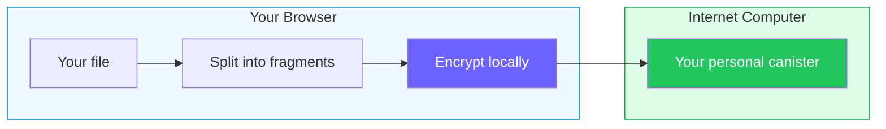

# Rabbithole — encrypted, decentralized file storage you control

Rabbithole is file storage for people who want a familiar cloud drive without a
central owner that must be trusted with files, access rules, and encryption
keys.

In a traditional cloud product, your files, backend logic, interface, and access
rules live inside the operator's infrastructure. Rabbithole works differently:
it creates separate storage for your account on the
[Internet Computer](https://internetcomputer.org/), with its own web interface,
code, state, and access rules.

The Internet Computer matters here because it is not just a blockchain label.
It is a network where the application can run as a whole: frontend, backend,
state, and user storage do not need to be moved into a traditional cloud
account. That lets Rabbithole create more than a row in a company database: it
creates a separate storage canister and hands control of it to you.

You can think of a
[canister](https://docs.internetcomputer.org/concepts/canisters/) as a
smart-contract application: it has code, state, and its own resource balance. In
Rabbithole, that canister keeps file records, permissions, and, depending on the
storage mode, the file bytes themselves.

In encrypted mode, the file is encrypted directly in your browser before
upload. Plaintext data is not sent to the storage backend, and keys are not
derived from a password or stored by Rabbithole as a master key. The technical
pages explain [vetKeys](https://docs.internetcomputer.org/concepts/vetkeys/)
and storage modes later; the starting point is simpler: storage control and
cryptography are built into the architecture, not only promised by the service.

New to Internet Computer terms? Read [Core concepts](./concepts) first.

## How it works in 30 seconds

1. You sign in with [Internet Identity](https://id.ai), without creating
   a Rabbithole password.
2. Rabbithole creates an independent storage canister for your account.
3. You upload files through the app.
4. If encryption is enabled, your browser encrypts the file before upload.
5. When you download it, the browser verifies and decrypts the file locally.

## The core idea

Most cloud storage products ask you to trust an operator's promise: that it will
protect the backend, enforce permissions correctly, keep the service alive, and
not expose your files or keys. Rabbithole tries to move more of that trust into
architecture.

Storage ownership is expressed through canister control. Access rules live with
the storage canister. When encryption is enabled, files are encrypted in your
browser, and key derivation is handled by the network instead of a
password-derived master key stored by Rabbithole.

The result is not magic, and it does not remove every assumption. Your browser,
the Internet Computer protocol, and Rabbithole's code still matter. But the
center of gravity changes: the product relies less on "trust us" and more on
protocol boundaries, canister ownership, and cryptography.

## How vetKeys fit in

Imagine a safe with no single master key. For each file, Rabbithole asks the
network to derive a file key through
[vetKeys](https://docs.internetcomputer.org/concepts/vetkeys/): each vetKD node
returns only its own piece, and the full key is assembled in your browser. One
node can't open the safe by itself and never sees the full key.

Standard and High Replication are Rabbithole's product names for two VetKey
levels. The node counts belong to the key service, not to file copies. Read
[Keys and vetKeys](/en/how-it-works/encryption/vetkeys) when you want that
detail.

## How it compares

| Service | E2E Encrypted | Zero-Knowledge | Open Source | Decentralized | You own infrastructure | Key derivation |
|---------|:---:|:---:|:---:|:---:|:---:|---|
| Google Drive | — | — | — | — | — | Company keys |
| Dropbox | — | — | — | — | — | Company keys |
| Tresorit | Yes | Yes | — | — | — | Password-derived |
| ProtonDrive | Yes | Yes | Partial | — | — | Password-derived |
| Internxt | Yes | Yes | Yes | — | — | Password-derived |
| Filen | Yes | Yes | Partial | — | — | Password-derived |
| Storj | Yes | Yes | Yes | Yes | — | Client-side |
| **Rabbithole** | **Yes** | **Yes** | **Yes** | **Yes** | **Yes** | **Threshold crypto (vetKeys)** |

**How Rabbithole differs:**
- **No passwords for key derivation** — your key comes from your
  [Internet Identity](https://id.ai), computed by the network itself
- **Per-user canister** — you own the smart contract where your data lives. After
  a successful handoff, Rabbithole removes itself as controller
- **Reviewable implementation** — the code is
  [open source](https://github.com/rabbithole-app/v2), encryption runs in your
  browser, and key derivation is enforced by IC consensus

In encrypted mode, plaintext is not uploaded to the canister or Blob Storage.
Rabbithole still relies on your browser, IC consensus, and correct code. The
[Trust Model](/en/how-it-works/trust-model) page lists those assumptions.

:::tip{title="Want to go deeper?"}

- [Core concepts](/en/getting-started/concepts) — canisters, principals,
  controllers, cycles, and vetKeys
- [How Encryption Works](/en/how-it-works/encryption) — the user-level privacy model
- [Keys and vetKeys](/en/how-it-works/encryption/vetkeys) — Standard, High Replication, and key derivation
- [Data Sovereignty](/en/how-it-works/sovereignty) — canister creation, controller transfer, what if Rabbithole disappears
- [Trust Model](/en/how-it-works/trust-model) — threat model, what you do and don't need to trust

:::
