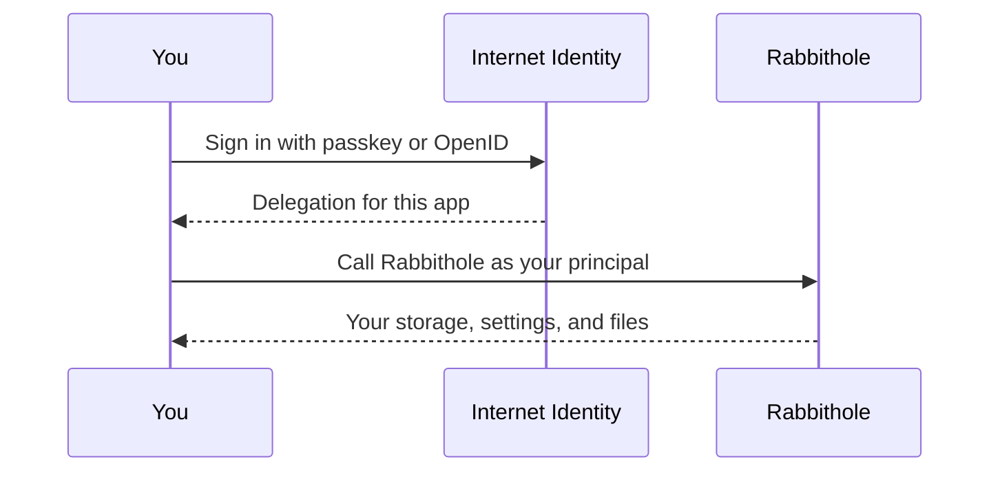
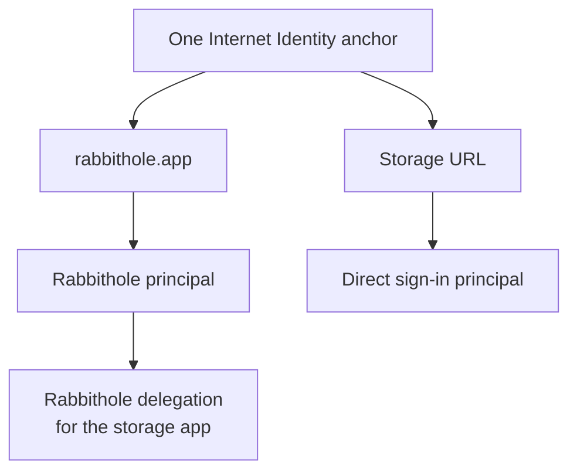
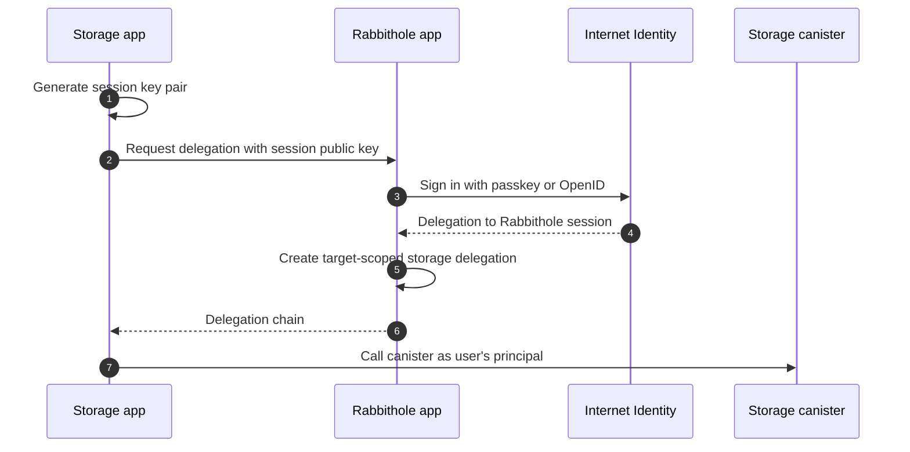
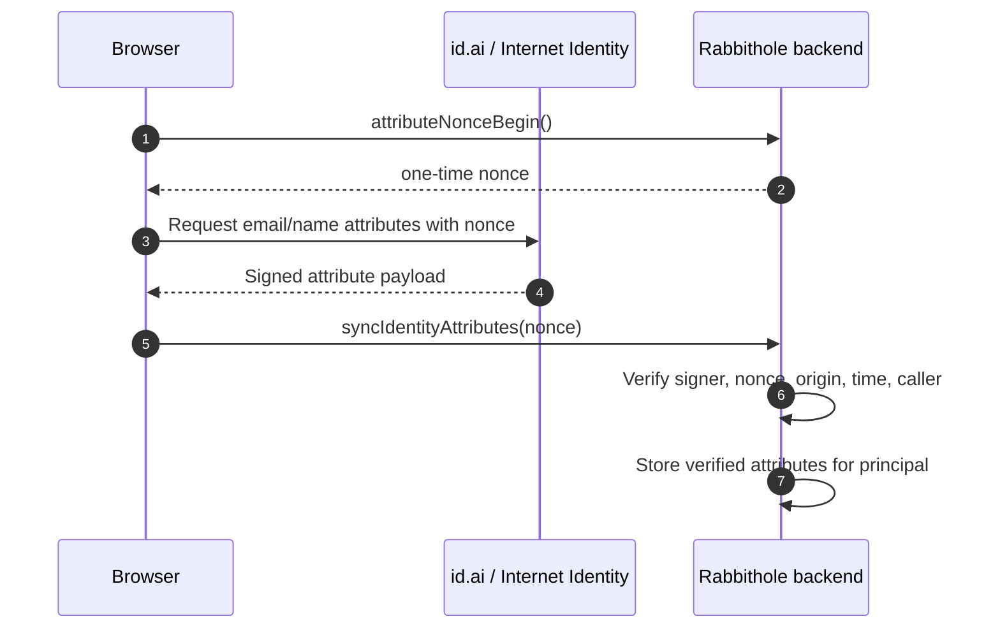

Authentication in Rabbithole starts with Internet Identity and ends with a
principal that can call canisters. Verified attributes, such as email, are a
separate layer. They help Rabbithole support collaboration and notifications
without turning email into your password or encryption key.

## Sign in without passwords

Rabbithole uses **[Internet Identity](https://id.ai)**, the Internet
Computer's authentication system. You can sign in with several passwordless
methods.

- **Passkeys** such as Touch ID, Face ID, Windows Hello, or security keys
- **OpenID accounts** such as Google, Apple, or Microsoft when the sign-in flow
  supports them
- **SSO** when organization sign-in is available for your account
- **Hardware security keys** such as YubiKey

There is no Rabbithole password to remember and no password database for
Rabbithole to protect. Your device or identity provider proves who you are to
Internet Identity, and Rabbithole receives a cryptographic identity called a
**principal**.



## Separate authentication from attributes

Your **principal** is enough to authenticate you. Rabbithole doesn't need an
email address to know which account is calling the backend.

Some sign-in flows can also share **verified identity attributes**, such as
email or name. These attributes are separate from authentication.

- Authentication answers: **which principal is calling?**
- Attributes answer: **what verified email or name did you choose to share?**

Rabbithole uses attributes only when they are available through the Internet
Identity flow and tied to the signed-in principal.

## Use email for collaboration

Rabbithole is built for sharing private storage, including with people who
haven't joined yet. A verified email supports workflows that are difficult to
build with principals alone.

- **Invite by email**: A storage owner can invite an email address before that
  person has a Rabbithole account. When the person later signs in with the
  matching verified email, Rabbithole can connect that invitation to their
  principal automatically.
- **Future notifications**: Email can deliver important storage, sharing,
  billing, or security notifications when you aren't signed in.
- **Less repeated verification**: If your email is already verified through the
  Internet Identity or OpenID flow, Rabbithole doesn't need a separate email
  confirmation loop for the same fact.

Email is not your password, private key, or encryption key. Your account and
file access are still controlled by your Internet Identity principal and the
permissions stored in your canister.

Read [Shared access](./sharing/) to see how verified email invites become
storage-canister permissions.

## Preserve privacy by default

Internet Identity is designed so apps don't receive a global user identifier.
You get a separate, stable pseudonym for each application frontend origin,
which helps prevent cross-app tracking.

For Rabbithole, this means:

- Other apps can't identify your Rabbithole account from their own Internet
  Identity login.
- Rabbithole doesn't receive your Internet Identity anchor number or passkey
  secrets.
- Biometric data never leaves your device; it only unlocks your local passkey.
- Shared attributes are limited to what the sign-in flow provides and what you
  allow.

## Reuse one account across storage apps

Your personal storage canister serves its own frontend. Without extra handling,
direct canister URLs and `rabbithole.app` would be separate web origins.

Rabbithole solves this with a **broker delegation** flow. You sign in through
Rabbithole, and Rabbithole issues a target-scoped delegation to the storage app
session. The storage app can call these canisters.

- Your storage canister
- The Rabbithole backend
- The IC management canister, when needed for canister operations

This keeps the user experience simple. You don't need a separate account just
because you opened your storage directly.

## Why one user can have different principals

Internet Identity protects privacy by avoiding one global identifier across all
apps. The same Internet Identity anchor receives different principals for
different application origins.

For Rabbithole, this matters in two scenarios:

- Signing in through `rabbithole.app` gives the principal for the main
  Rabbithole app.
- Signing in directly through `<your-storage>.icp0.io` gives a different
  principal because it is a different application origin.

In the normal flow, the storage still sees the main-app principal: the storage
app receives a delegation from Rabbithole and uses it to call the storage
canister. The user doesn't need to think about the difference.



The backup direct sign-in principal is used by recovery access. It lets the
owner prove ownership through the storage origin when they need a direct path
to their canister.

## Trust verified attributes

An ordinary form field is only a claim. A verified identity attribute is
different: it is signed or certified by the Internet Identity flow and submitted
to Rabbithole in a way the backend can verify.

Rabbithole verifies the attribute payload before storing it.

1. The payload must be signed by the trusted Internet Identity signer canister.
2. The payload must belong to the same principal that calls Rabbithole.
3. The nonce must be issued by Rabbithole and unused.
4. The origin must match the expected Rabbithole origin.
5. The timestamp must be fresh.

Only after those checks does Rabbithole store attributes such as `email`,
`name`, `verifiedEmail`, and `authProvider`.

---

## Technical details

The technical flow has two moving parts: delegations prove that a session can
act as a principal, and identity attributes prove specific profile facts that
the user shared through the sign-in flow.

:::details{title="Delegations, principals, and certified attributes"}

### Principal

A **principal** is the cryptographic identifier Rabbithole uses as your account
ID. It looks like this:

```text
o57ld-4as4d-f6pr2-nnmyc-mslbj-67jt3-3huxb-x6jul-f3doo-yxyhi-wqe
```

Your principal is used to:

- identify your Rabbithole user record,
- check storage permissions,
- derive access to encrypted file keys through vetKeys,
- and control your personal storage canister where applicable.

The principal depends on the application origin. This protects privacy:
different apps can't compare one global ID and learn that they are seeing the
same person.

### Delegation chain

Internet Identity doesn't hand Rabbithole your passkey private key. Instead, it
signs a short-lived delegation to a session key. Rabbithole also uses a broker
delegation when the storage frontend needs to act as the same user session.



The target scope limits where the delegated session can be used.

### Identity attribute sync

When attributes are available, Rabbithole requests them through the Internet
Identity auth client and submits them with an `AttributesIdentity`.



The backend rejects stale, unsigned, reused, wrong-origin, or wrong-signer
payloads.

### Further reading

Use these resources to learn more about Internet Identity and identity
attributes.

- [Internet Identity](https://id.ai)
- [Internet Identity GitHub repository](https://github.com/dfinity/internet-identity)
- [Internet Identity specification](https://docs.internetcomputer.org/reference/internet-identity-spec/)
- [Identity Attributes design discussion](https://forum.dfinity.org/t/identity-attributes/64212)
- [Shared access in Rabbithole](./sharing/)

:::
