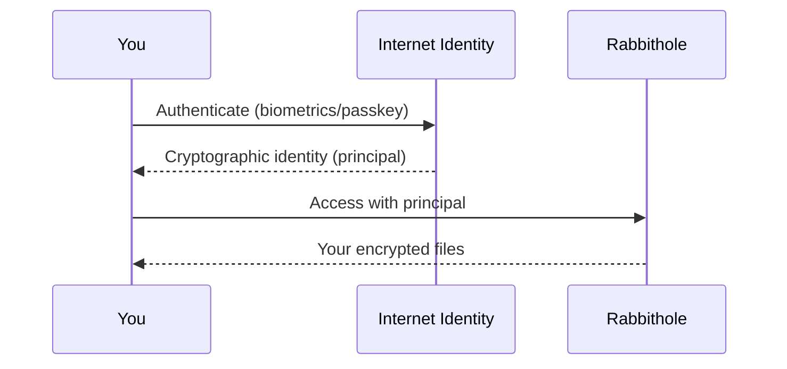
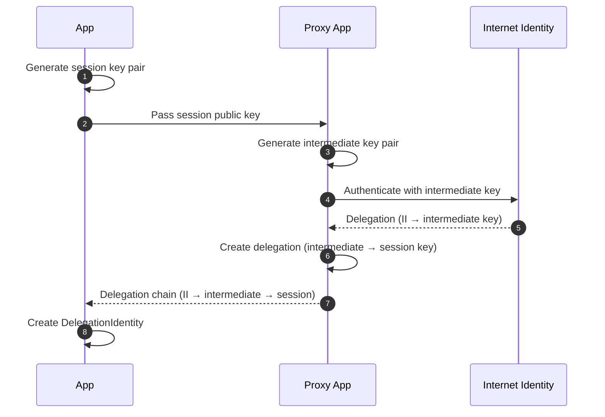

## No passwords. No emails. Just you.

Rabbithole uses **[Internet Identity](https://id.ai/)** — a decentralized authentication system built into the Internet Computer. You log in using:

- **Passkeys** (fingerprint, Face ID) — synced across your devices
- **Social login** (Google, Apple, Microsoft) — without sacrificing privacy
- **Hardware security keys** (YubiKey)

No email address. No password to forget. No database of credentials to hack.



## Same identity everywhere

Whether you access your storage through **rabbithole.app** or directly at **https://&lt;canisterId&gt;.icp0.io**, your identity stays the same. Rabbithole achieves this using a **key delegation chain** — a standard Internet Computer mechanism where Internet Identity issues a cryptographic delegation to an intermediate key, which in turn delegates to your session key.

This means you don't need to log in separately for each URL. Your Principal ID is always the same.

## Why is this better?

| | Traditional Auth | Internet Identity |
|---|---|---|
| **Credentials** | Email + password | Biometrics / passkey |
| **Stored where?** | Company database | Your device only |
| **Can be phished?** | Yes | No |
| **Data breaches?** | Millions of passwords leaked | Nothing to leak |
| **Cross-site tracking?** | Same email everywhere | Unique identity per app |

## Privacy by design

Internet Identity creates a **unique principal** (identity) for each app. This means:

- Rabbithole cannot track you across other apps
- Other apps cannot know you use Rabbithole
- No central identity provider sees all your activity

---

## Technical Details

:::details{title="Click to expand technical details"}

### How Internet Identity works

Internet Identity is a **canister** on the Internet Computer that:

1. Stores your device's public key (WebAuthn/FIDO2)
2. Issues **delegations** — short-lived cryptographic certificates
3. Each delegation is scoped to a specific app (different principal per app)

### Key delegation chain

Rabbithole uses an intermediate key delegation to ensure the same Principal across different access points (rabbithole.app, direct canister URL):



This approach follows the [IC security recommendation](https://internetcomputer.org/docs/building-apps/security/iam#recommendation-6): the intermediate key acts as a secure proxy, so the session key never goes directly to Internet Identity.

### Principals

Your identity in Rabbithole is a **principal** — a cryptographic identifier like:
```
o57ld-4as4d-f6pr2-nnmyc-mslbj-67jt3-3huxb-x6jul-f3doo-yxyhi-wqe
```

This principal is:
- Deterministically derived from your Internet Identity anchor + the app's origin
- Used to derive your encryption key via vetKeys
- The sole key to accessing your files

### Session management

- Delegations have a configurable expiry (typically 30 minutes to 24 hours)
- No session tokens are stored on servers
- Re-authentication requires biometric/passkey confirmation

:::
