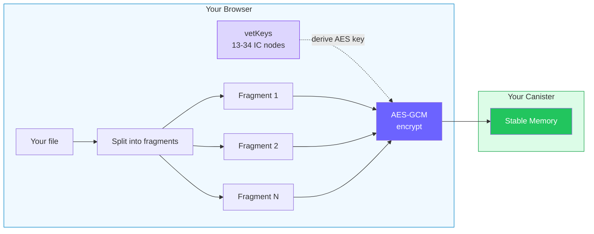
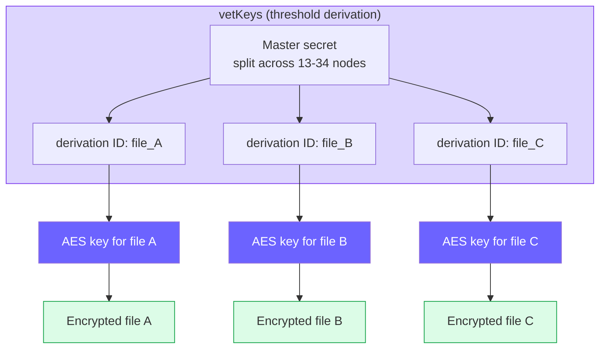
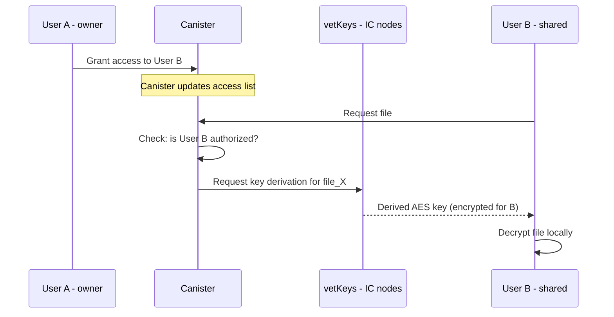
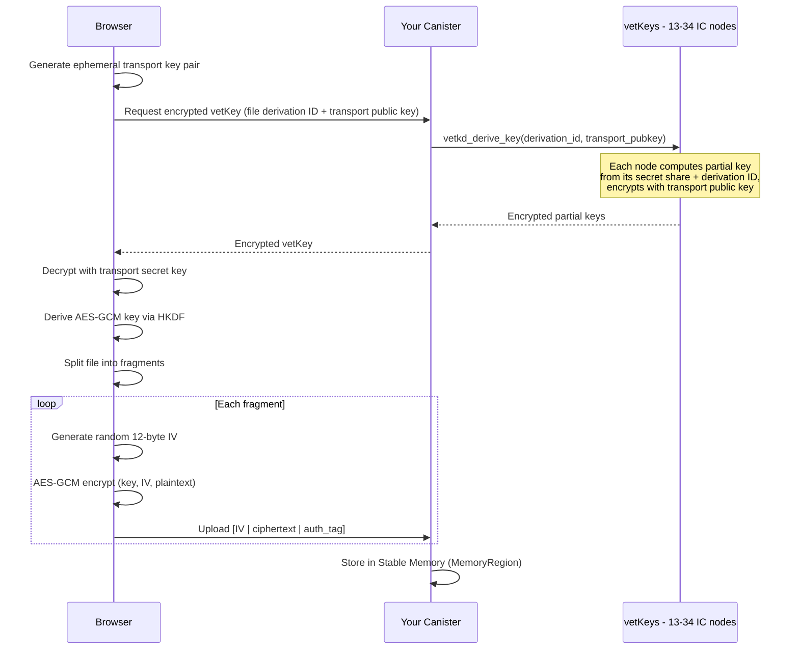

# Encryption is Rabbithole's intended privacy model

Rabbithole is designed around end-to-end encryption. When encryption is enabled, files are encrypted in your browser before upload.

Encryption is available with Pro and can be enabled or disabled depending on the folder and upload settings.

:::note{title="Important"}

This page describes Rabbithole's encrypted mode.  
If you upload a file without encryption, the storage path still works, but the confidentiality guarantees described here do not apply.

:::

## What this means for you

- **Nobody can read your files** — not even the Rabbithole team
- **Even the blockchain nodes** can't decrypt your data — they store only encrypted fragments. While IC nodes can technically access canister memory, all your data is encrypted with vetKeys before it reaches the canister. Without the threshold key derivation (which requires your identity), the stored data is indistinguishable from random noise
- **TEE support adds hardening, not the primary guarantee** — the Internet Computer is gradually rolling out [TEE support](https://forum.dfinity.org/t/upcoming-proposal-the-first-tee-enabled-subnet/64180) based on AMD SEV-SNP. This strengthens runtime isolation, but Rabbithole's main privacy guarantee still comes from client-side encryption and key derivation, not from trusting hardware alone
- **If Rabbithole shuts down** — your encrypted data persists on the blockchain
- **Each fragment is independent** — a problem with one doesn't affect others

## How encryption keys work

Your encryption key is derived from your **[Internet Identity](https://id.ai/)** using [vetKeys](https://docs.internetcomputer.org/building-apps/network-features/vetkeys/introduction/) — threshold cryptography built into the Internet Computer.

- No passwords to remember or lose
- No key files to back up
- The key is computed on-demand by **13-34 independent nodes** working together
- No single computer in the network knows your full key

:::note{title="In simple terms"}

Think of it like a vault that only opens when enough independent guards agree it's really you. No single guard can open it alone.

:::

## Unique key for each file

Unlike services that use one master key for everything, Rabbithole derives a **unique encryption key for each file** using a concept called **derivation ID**:

Each file has a unique **derivation ID** — the same master secret produces a completely different key for each file. This means:
- Compromising one file's key **doesn't reveal** keys for other files
- Keys are **deterministic** — the same derivation ID always produces the same key, so you can re-derive them on demand without storing key material
- The master secret **never exists** in one place — it's always split across multiple nodes

## Sharing encrypted data

When you share storage with another user, the sharing happens through **access control at the canister level**, not re-encryption:

The key insight: encryption keys are bound to **file IDs**, not user IDs. The canister decides who is allowed to request a key for a given file. When access is granted, the new user can derive the same file key — **no re-encryption needed**.

This design means:
- **Adding users** doesn't require re-encrypting all data
- **Revoking access** is handled at the canister level — the canister simply stops granting key derivation requests
- **The owner controls everything** — only the canister controller decides who gets access

## The cost of encryption

vetKey derivation costs approximately **$0.035 per operation**. This is paid from your canister's compute cycles — not from your wallet. A single derivation covers all operations in a session.

---

## Technical Details

:::details{title="Click to expand technical details"}

### Algorithm

- **AES-GCM** (Galois/Counter Mode) — authenticated encryption
- 12-byte random IV per fragment
- 16-byte authentication tag per fragment
- Total overhead: **28 bytes per fragment**

### Fragment sizes

| Parameter | Value |
|-----------|-------|
| Canister max chunk size | 2,097,152 bytes (2 MB) |
| Plaintext fragment (default) | 1,900,000 bytes (~1.9 MB) |
| Encrypted fragment | ~1,900,028 bytes (plaintext + 28 bytes overhead) |

Large files are automatically split into ~1.9 MB fragments. Each fragment is encrypted independently with a unique random initialization vector. The encrypted fragments are well within the canister's 2 MB chunk limit.

### Key derivation flow (vetKD protocol)

**Transport key mechanism:** The browser generates an ephemeral key pair for each key request. Each IC node encrypts its partial key contribution under this transport public key. Even if all network traffic is observed, the derived key remains secret — only the browser holding the transport secret key can decrypt the partial contributions.

### Cryptographic primitives

| Primitive | Usage |
|-----------|-------|
| **BLS12-381** | Threshold signature scheme for key derivation |
| **IBE (Boneh-Franklin)** | Identity-Based Encryption for derivation IDs |
| **AES-256-GCM** | Symmetric file encryption |
| **HKDF** | Key derivation from vetKey material |
| **SHA-256** | Fragment integrity verification |

### Security properties

- **Confidentiality** — AES-GCM encryption with unique IV per fragment
- **Integrity** — authentication tag detects any tampering
- **Threshold key derivation** — 13-34 nodes must cooperate to derive the key
- **Fragment isolation** — each fragment encrypted independently
- **Per-file keys** — unique derivation ID per file
- **Transport encryption** — ephemeral keys protect key material in transit

### Staging mechanism

To prevent data corruption during upload, new files are marked in a "staging" area until all fragments are uploaded and verified via SHA-256 checksum. Only then does the file become visible in your file system.

:::
