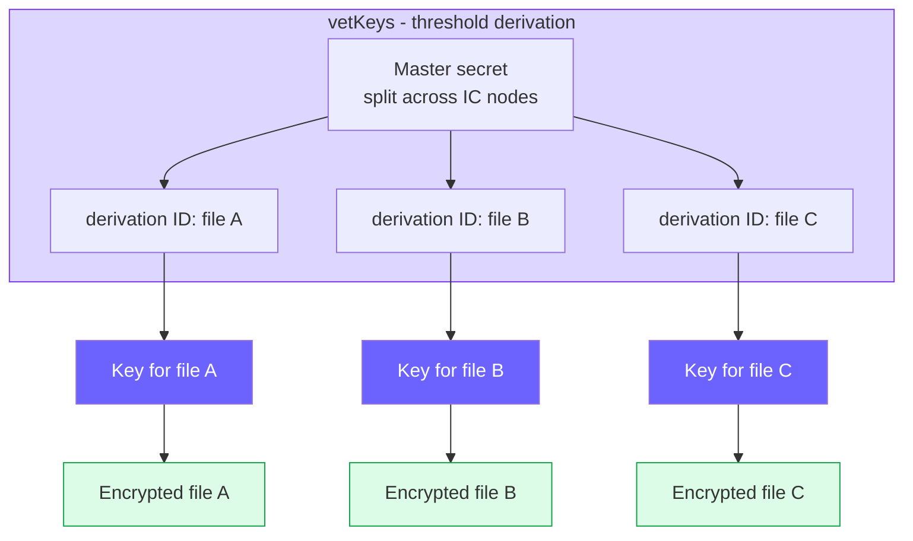
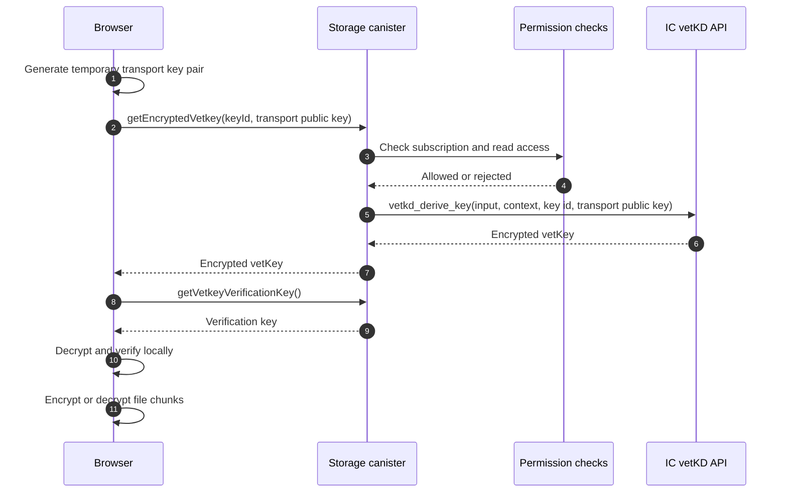

## What this page covers

This page is for readers who want the lower-level model: file derivation inputs,
transport keys, chunk encryption, and the boundary between access control and
cryptography.

For the user-level explanation, start with
[Encryption](/en/how-it-works/encryption). For the key-service choice, read
[Keys and vetKeys](/en/how-it-works/encryption/vetkeys).

## Unique key for each file

Each encrypted file has a key ID. In the storage canister, that key ID is made
from the key owner principal and the file identifier. The canister builds the
vetKD derivation input from those values and uses the `file_storage_dapp`
domain separator.

The result is deterministic: the same file key ID derives the same key material
again. That lets Rabbithole decrypt a file later without storing the raw file
key in the canister.

One master secret produces different keys for different derivation IDs. A key
for one file does not open the rest of your files.

## Key request flow

The canister checks access before it asks the Internet Computer to derive a
key. A caller without read access is rejected before the vetKD call.

The transport key pair is temporary. The public part goes to the canister. The
secret part stays in the browser, so the encrypted vetKey response is useful
only to that browser request.

## Chunking and encryption

Rabbithole encrypts file chunks in the browser. The implementation uses the
Internet Computer vetKeys client library for derived key material and
authenticated encryption.

| Parameter | Current value |
|-----------|---------------|
| Canister max chunk size | 2,097,152 bytes |
| Default on-chain pre-encryption chunk | 1,900,000 bytes |
| Blob Storage chunk | 1,048,576 bytes |
| AES-GCM overhead | 28 bytes: 12-byte IV + 16-byte authentication tag |
| Blob Storage pre-encryption chunk | 1,048,548 bytes |

Large files are split into chunks. Each encrypted chunk carries its own
authentication data, so tampering with ciphertext is detected during
decryption.

## Blob Storage integrity

When Blob Storage is used, encrypted chunks are uploaded outside the canister.
The canister stores the file record and the data needed to verify the blob:
content hashes, Merkle tree information, and IC-certified metadata.

That gives Rabbithole two separate checks:

- encryption protects confidentiality;
- integrity verification detects silent replacement or corruption.

Read [File integrity](/en/how-it-works/storage/integrity) for the storage-side
verification model.

## TEE support

Trusted Execution Environment support can harden runtime isolation when it is
available on the relevant IC subnet. It is not the core privacy assumption for
Rabbithole.

The main confidentiality boundary is still client-side encryption plus
canister-gated vetKey derivation. TEE is an extra layer, not the reason
Rabbithole can avoid reading encrypted file contents.

## Limits of the model

Encryption narrows the trust surface, but it does not remove every assumption.

- The browser must run the intended Rabbithole frontend code.
- The Internet Computer protocol and vetKD service must behave correctly.
- A user who already downloaded and decrypted a file may keep their copy after
  access is revoked.
- File metadata, such as names, sizes, and folder structure, does not receive the
  same confidentiality guarantees as file contents.

The broader assumptions are listed in the
[Trust Model](/en/how-it-works/trust-model).
