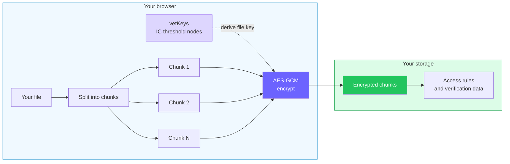
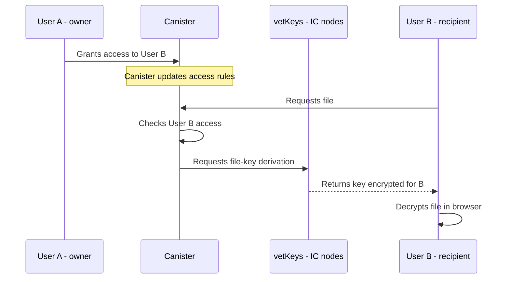

import { OverviewGroup } from '@rspress/core/theme';

## Encryption starts in your browser

Rabbithole encrypts file contents in your browser before upload. The storage path
then receives encrypted bytes: the canister, Blob Storage, or On-chain Storage
does not receive a readable file.

That difference matters. Rabbithole can move the file, store metadata, check
permissions, and verify integrity, but it does not need the readable file
contents to do that work.

## What this means for you

Rabbithole handles sealed data instead of readable data.

- The Rabbithole team cannot read file contents.
- Internet Computer nodes and storage services store encrypted chunks, not the
  plaintext file.
- The storage canister controls who may request the file key.
- The key is delivered encrypted for the browser session that requested it.
- Storage mode is still separate: Blob Storage and On-chain Storage decide where
  bytes live, while encryption decides whether those bytes are readable.

This is the main idea: Rabbithole is not asking you to trust a promise that the
operator will not look. It moves the readable file out of the operator's path.
There are still assumptions, especially around your browser, the served
frontend, and the Internet Computer protocol. Those assumptions are listed in
the [Trust Model](/how-it-works/trust-model).

## Where the key comes from

Rabbithole does not ask you to create an encryption password. When an encrypted
file needs to be opened, your browser asks the storage canister for a file key.
The canister checks whether your principal has access, then asks the Internet
Computer's [vetKeys](https://docs.internetcomputer.org/concepts/vetkeys/)
service to derive that key.

The important part: the key does not sit ready-made in the canister, and it is
not handed to Rabbithole. The Internet Computer returns an encrypted response
that only the browser making the request can open.

Read [Keys and vetKeys](/how-it-works/encryption/vetkeys) if you want to
understand how Standard differs from High Replication.

## Sharing does not re-encrypt the file

When you share a file, Rabbithole changes access rules. It does not upload a
second encrypted copy for the recipient.

If the recipient has access, the canister lets their browser request the same
file key. If access is revoked, the canister stops allowing future key requests
for the revoked scope. As with any file-sharing system, revocation cannot erase
a copy someone already downloaded.

Read [Encrypted sharing](/how-it-works/sharing/encryption-in-shared-access)
for the shared-access flow.

## Learn more

<OverviewGroup
  group={{
    name: 'Encryption topics',
    items: [
      {
        text: 'Keys and vetKeys',
        link: '/how-it-works/encryption/vetkeys',
      },
      {
        text: 'How encryption works',
        link: '/how-it-works/encryption/how-encryption-works',
      },
      {
        text: 'Storage modes',
        link: '/how-it-works/storage/',
      },
      {
        text: 'Shared access',
        link: '/how-it-works/sharing/',
      },
      {
        text: 'Trust Model',
        link: '/how-it-works/trust-model',
      },
    ],
  }}
/>

<OverviewGroup
  group={{
    name: 'Official Internet Computer references',
    items: [
      {
        text: 'vetKeys',
        link: 'https://docs.internetcomputer.org/concepts/vetkeys/',
      },
      {
        text: 'Canister smart contracts',
        link: 'https://docs.internetcomputer.org/concepts/canisters/',
      },
    ],
  }}
/>
