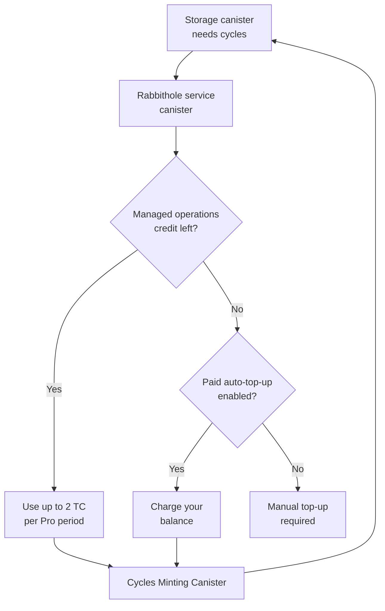
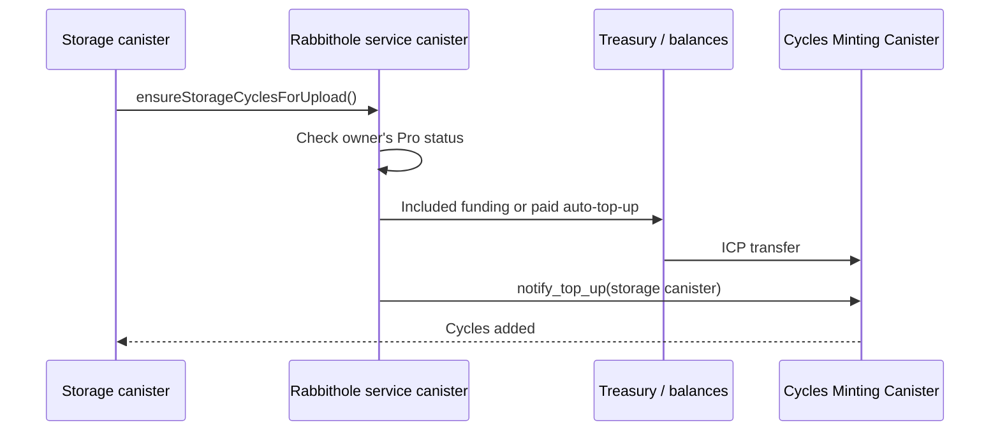
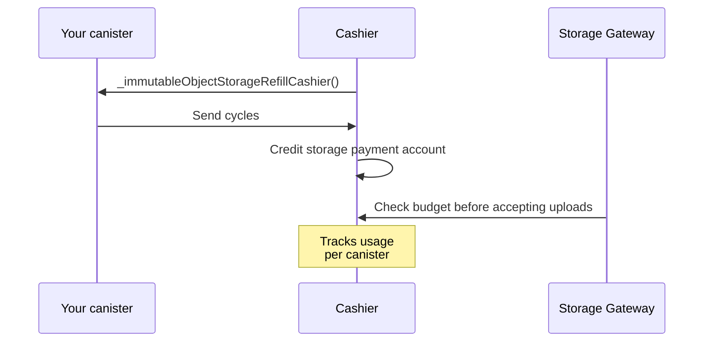

# Payment & Cycles

Your storage runs in a separate Internet Computer canister. The canister needs
[cycles](https://docs.internetcomputer.org/concepts/cycles/) to store data,
process operations, and stay available.

Think of cycles as prepaid fuel for the storage canister. Rabbithole can help
with top-ups through [Rabbithole Pro](/how-it-works/pro), but the storage
belongs to you, so you can also fund the canister directly with Internet
Computer tools.

## What you pay for

Payment in Rabbithole is not one subscription doing everything. There is the
one-time Starter Vault setup, the Rabbithole Pro account subscription, and the
cycles that keep each storage canister running.

| What | When it is paid | What it gives you |
|---|---|---|
| **Starter Vault** | Once | A starter vault on the Internet Computer: the storage canister, initial cycle balance, storage app installation, and starter encrypted storage limits. |
| **Rabbithole Pro** | Per subscription period | Account subscription for all vaults under your identity. It adds sharing, storage updates, encrypted uploads beyond starter limits while the subscription is active, automatic cycle top-ups, and 2 TC of managed operations credit. |
| **Cycles** | As they are spent | Storage canister work: uploads, downloads, file operations, storage, vetKey derivation, and availability. |

## Starter Vault and Rabbithole Pro

Starter Vault is the baseline. It is issued when storage is created, and it
still applies if Rabbithole Pro expires or is canceled. You can keep using
personal encrypted storage within the starter limits: included storage and
maximum file size.

Rabbithole Pro adds service features that run through Rabbithole on top of that
baseline. While Pro is active, it adds:

- encrypted uploads beyond starter limits, when managed credit or your balance
  can fund the operation;
- automatic cycle top-ups, where Rabbithole tops up the storage canister when
  needed;
- storage code and frontend asset updates after your approval;
- sharing and access management.

The full feature list is on the
[What Rabbithole Pro gives you](/how-it-works/pro) page.

## How automatic cycle top-ups work

Automatic top-ups are operation-driven, not calendar-driven. If you have an
active Pro subscription, Rabbithole can automatically top up the storage
canister before an expensive operation, such as a large On-chain Storage
upload.

Technically, the storage canister checks its cycle balance and requests a
top-up from the Rabbithole service canister.



For automatic top-ups, Rabbithole uses two sources in this order:

1. **Managed operations credit**: 2 TC for you during the Pro period.
   This credit is shared across all your vaults: Rabbithole spends it on the
   canisters that need cycles. The
   [What Rabbithole Pro gives you](/how-it-works/pro) page explains it in more
   detail.
2. **Paid auto-top-up**: paid funding from your balance, used only after
   managed operations credit is exhausted and you enable auto-top-up.

Without an active Pro subscription, the rule is simpler: the upload continues if
the storage canister already has enough cycles. If it does not, you top up the
canister manually.

## Supported tokens

The token list can change as payment providers add or remove support for
specific networks. Rabbithole shows the available options before you confirm a
payment.

| Network           | Tokens                     |
| ----------------- | -------------------------- |
| Internet Computer | ICP, ckETH, ckUSDC, ckUSDT |
| Base              | ETH, USDC, USDT            |
| Solana            | SOL, USDC, USDT            |

Your balance is used for Pro period renewal and, if you enable auto-top-up, for
paid auto-top-up after managed operations credit is exhausted.

## What cycles pay for

Cycles pay for Internet Computer resources and related storage operations.

| Resource             | What cycles pay for                                                       |
| -------------------- | ------------------------------------------------------------------------- |
| **Compute**          | Uploads, downloads, file operations, and access checks                    |
| **Stable Memory**    | Metadata, permissions, hashes, and verification records                   |
| **On-chain Storage** | File bytes, if you store them inside the canister                         |
| **Blob Storage**     | File-byte storage and transfer through Blob Storage, when this mode is on |
| **vetKeys**          | Key derivation for opening encrypted files                                |

## Canister Cycles card

The **Canister Cycles** card in the storage sidebar shows the cycle buffer:
whether the canister has enough for uploads, normal operations, and the Internet
Computer freezing reserve. It is visible only to the owner and recovery owners
because this is operational and billing information for the canister.

The card separates the cycle balance into practical zones:

- **Freeze** is the reserve the canister needs to avoid freezing.
- **Safe floor** is the freeze reserve plus the estimated cost of active
  uploads, key derivation, finalization work, and a margin.
- **Target** is the safe floor plus the buffer Rabbithole uses for automatic
  cycle top-ups.
- **Headroom** is the balance above the target that is available for regular
  work.

Use **Top up** when the balance approaches the safe floor or before a large
On-chain Storage upload. With active Pro, Rabbithole can top up the
canister for you. Without Pro, use manual top-up.

:::details{title="How the card is calculated"}

The storage canister refreshes runtime metrics through the Internet Computer
Management Canister and returns normalized card metrics to the app. The frontend
does not call `canister_status` directly for this sidebar card.

The safe floor is an estimate, not a fixed network value:

```text
safeFloor =
  freezingReserve
  + remainingUploadWriteCost
  + remainingUploadHashInstructionCycles
  + activeVetKeyDerivationCost
  + activeCommitCost
  + margin
```

Parallel uploads increase active reservations until they finish, are canceled,
or their upload sessions expire. The safe floor and target can rise while
several large uploads are in progress.

:::

## Self-managed funding

You do not need Pro to keep the storage alive. The canister belongs to
you, so you can top it up directly.

Available options:

- **manual top-up** through the [NNS dapp](https://nns.ic0.app), `icp-cli`, or
  an ICP wallet;
- **automated top-up** through third-party services such as
  [CycleOps](https://cycleops.dev).

:::tip{title="Your canister, your choice"}

Pro removes some operational work. The canister itself remains a
standard Internet Computer smart contract that you can manage with IC tooling.

:::

## What happens when cycles run out

When a canister runs out of cycles, ownership does not change. Availability
does: the network can restrict the canister's work.

**On-chain Storage.** The canister enters a frozen state when cycles drop below
the freezing threshold. Data is preserved, but the canister may stop processing
calls until you add cycles. If a canister remains unfunded long enough, the
Internet Computer can remove it according to the canister lifecycle rules.

**Blob Storage.** If Blob Storage cannot charge for storage, data becomes
unavailable on the gateway. In the current configuration, there is a 30-day
grace period. After 30 days with zero balance, the gateway removes the data
permanently.

:::note{title="Monitor the balance before it gets low"}

Active Pro reduces operational work because Rabbithole can top up the
canister when needed. If you do not use Pro, set up monitoring or check
the balance regularly, especially for On-chain Storage.

:::

## Technical details

This section is for readers who want approximate costs and the internal top-up
flow.

:::details{title="Cycle costs and top-up flows"}

### Cycle costs

Current approximate values:

| Resource                | Cost                         |
| ----------------------- | ---------------------------- |
| Canister creation       | ~0.5 TC                      |
| Initial storage balance | 1.5 TC                       |
| Stable Memory           | ~127 GiB-seconds per cycle   |
| Compute (update call)   | ~590K cycles per instruction |
| Blob Storage (30 days)  | ~38.5B cycles per GB         |
| Blob upload             | ~115.4B cycles per GB        |
| Blob download           | ~76.9B cycles per GB         |

These values are operational estimates for the current product configuration.
Internet Computer pricing, Blob Storage pricing, and exchange rates can change.

**TC = trillion cycles.** 1 TC = 1 XDR. The USD estimate is a reference value
and changes with the XDR/USD rate.

### CMC top-up flow



The storage canister does not mint cycles itself. It asks the Rabbithole
service canister for a top-up, and that canister buys cycles through the Cycles
Minting Canister. If the CMC returns an ambiguous status, the operation goes
into an administrative recovery queue. This is an operational recovery
mechanism, not a normal user action.

### Cashier flow (Blob Storage)



Cashier uses a pull model: it initiates cycle collection from your canister when
the Blob Storage payment account needs refilling. Those cycles pay for storing
and transferring bytes in Blob Storage. The canister must have enough cycles for
both its own computation and storage fees.

### Monitoring

You can check your canister's cycle balance in several ways:

- **In Rabbithole**: the storage sidebar shows the **Canister Cycles** card.
- **With `icp-cli`**: for full canister status, use the identity linked to your
  Internet Identity for `rabbithole.app`. The setup is described in
  [How to verify ownership](./sovereignty/verify-ownership).

  ```bash
  icp canister status <your-storage-canister-id> -n ic --identity rabbithole-app
  ```

- **Through NNS**: if the canister is added to NNS and managed by the matching
  identity.

:::
