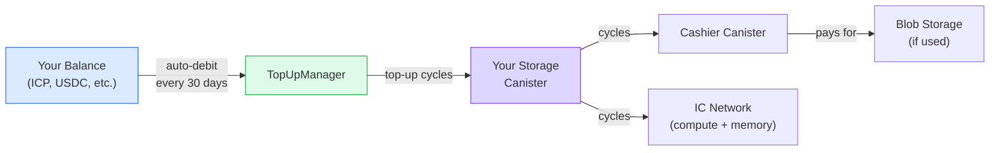
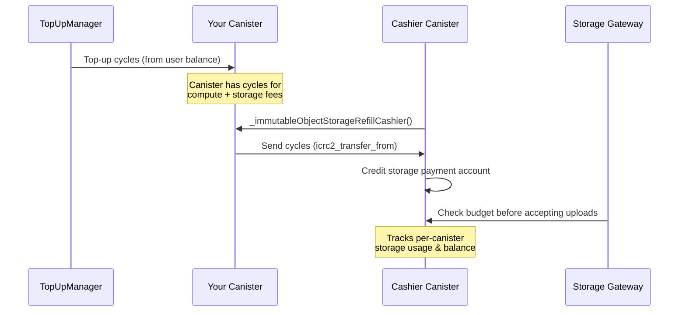

## Your storage runs on cycles

On the Internet Computer, computation and storage are paid for with
**cycles** — a stable unit of work pegged to a basket of currencies. Your
personal canister needs cycles to stay alive and serve your files.

You don't need to think about cycles directly. Rabbithole handles it for you.

## How it works

### Pro subscription

With a Pro subscription, you keep a balance in supported tokens. Rabbithole
automatically converts and tops up your canister's cycles every 30 days.

**Supported tokens:**

| Network | Tokens |
|---------|--------|
| Internet Computer | ICP, ckETH, ckUSDC, ckUSDT |
| Base | ETH, USDC, USDT |
| Solana | SOL, USDC, USDT |

Your balance is used for:

- **Cycle top-ups** — keeping your storage canister running
- **Subscription renewal** — automatic every 30 days

### What cycles pay for

| Resource | Description |
|----------|------------|
| **Compute** | Processing uploads, downloads, file operations |
| **Stable memory** | On-chain metadata (file names, permissions, hashes) |
| **Blob Storage** | If using Blob Storage — the Cashier canister charges for off-chain storage |

## Self-managed storage

You don't need a Pro subscription to keep your storage alive. Since your
canister belongs to you, you can manage cycles yourself:

- **Manual top-up** — via the [NNS dapp](https://nns.ic0.app),
  `icp-cli`, or any ICP wallet
- **Automated top-up** — using third-party services like [CycleOps](https://cycleops.dev) for automatic monitoring and refills

:::tip{title="Your canister, your choice"}

Rabbithole's Pro service is a convenience layer. The underlying canister is a
standard Internet Computer smart contract, and you can manage it independently
with ICP tooling.

:::

## What happens when cycles run out?

**On-chain storage:**
Your canister enters a **frozen** state when cycles drop below the freezing
threshold. Data is preserved but the canister may stop processing calls until
you add more cycles. If a canister remains unfunded long enough, the Internet
Computer can uninstall or remove it according to the network's canister
lifecycle rules. Keep a cycle buffer and monitor the balance.

**Blob Storage:**
The Cashier canister can no longer charge your canister for storage fees. There is a **30-day grace period** — your data remains on the gateway but becomes inaccessible. After 30 days with zero balance, the gateway removes the data permanently.

:::note{title="Plan ahead"}

If you're using Blob Storage, make sure your canister always has enough cycles. With Pro subscription, this is handled automatically. Without it, set up monitoring via CycleOps or check your balance regularly.

:::

---

## Technical Details

:::details{title="Cycles pricing and top-up flow"}

### Cycles pricing (approximate)

| Resource | Cost |
|----------|------|
| Canister creation | ~0.1 TC |
| Stable memory | ~127 GiB-seconds per cycle |
| Compute (update call) | ~590K cycles per instruction |
| Blob Storage (30 days) | ~38.5B cycles per GB |
| Blob upload | ~115.4B cycles per GB |
| Blob download | ~76.9B cycles per GB |

:::tip{title="TC = Trillion Cycles"}
1 TC ≈ $1.36 (varies with ICP price and SDR basket).
:::

### Cashier canister flow (Blob Storage)

The Cashier canister uses a **pull model** — it initiates cycle collection from your canister when the storage payment account needs refilling. Your canister must have sufficient cycles for both computation and storage fees.

### TopUpManager auto-renewal

Every 30 days, Rabbithole's TopUpManager:

1. Checks user's token balance
2. Converts tokens to ICP (if needed) via exchange rate canister
3. Converts ICP to cycles via Cycles Minting Canister (CMC)
4. Sends cycles to the user's storage canister
5. Renews the subscription period

### Monitoring

You can check your canister's cycle balance:

- **In Rabbithole** — the storage dashboard shows current balance
- **Via `icp-cli`** — `icp canister status <canister-id> -n ic`
- **Via NNS** — if your canister is linked to your NNS identity

:::
