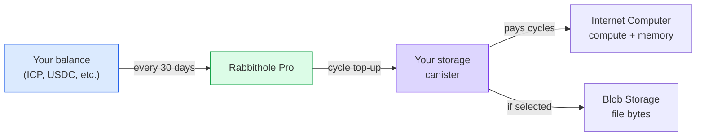
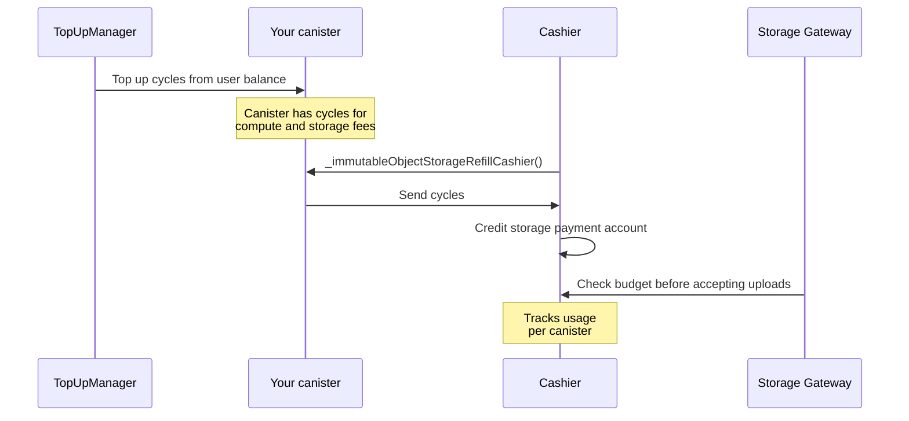

# Payment & Cycles

Your storage runs in a separate Internet Computer canister. The canister needs
[cycles](https://docs.internetcomputer.org/concepts/cycles/) to store data,
process operations, and stay available.

Think of cycles as prepaid fuel for the canister. Rabbithole Pro can top them up
automatically, but it is not the only path: because the canister belongs to you,
you can manage its funding yourself.

## Simple model

When Pro service is enabled, Rabbithole handles regular cycle top-ups. You keep
a balance in a supported token, and Rabbithole tops up your canister with cycles
every 30 days.



Cycles pay for the canister's work: uploads, downloads, file operations,
metadata storage, and, depending on the storage mode, the file bytes themselves.

## Pro subscription

With a Pro subscription, you keep a balance in supported tokens. Rabbithole
converts the required amount and tops up your canister's cycles every 30 days.

**Current supported tokens:**

| Network | Tokens |
|---------|--------|
| Internet Computer | ICP, ckETH, ckUSDC, ckUSDT |
| Base | ETH, USDC, USDT |
| Solana | SOL, USDC, USDT |

The exact list can change as payment providers add or remove support for
specific networks and tokens. Rabbithole shows the available options before you
confirm a payment.

Your balance is used for:

- **cycle top-ups**, so the canister can keep running;
- **Pro period renewal**, if you use automatic maintenance.

## What cycles pay for

Cycles pay for Internet Computer resources and related storage operations.

| Resource | What you pay for |
|----------|------------------|
| **Compute** | Uploads, downloads, file operations, and access checks |
| **Stable Memory** | Metadata: file names, folders, permissions, hashes, and verification records |
| **On-chain Storage** | File bytes, if you store them inside the canister |
| **Blob Storage** | File-byte storage and transfer through Blob Storage, if selected |

## Self-managed funding

You do not need a Pro subscription to keep your storage alive. The canister
belongs to you, so you can top up its cycles directly.

Available options:

- **manual top-up** through the [NNS dapp](https://nns.ic0.app), `icp-cli`, or
  an ICP wallet;
- **automated top-up** through third-party services such as
  [CycleOps](https://cycleops.dev).

:::tip{title="Your canister, your choice"}

Rabbithole Pro is a convenience layer. The canister itself remains a standard
Internet Computer smart contract that you can manage with IC tooling.

:::

## What happens when cycles run out

When a canister runs out of cycles, ownership does not change, but availability
does. The canister still belongs to you, but the network can restrict its work.

**On-chain Storage.** The canister enters a frozen state when cycles drop below
the freezing threshold. Data is preserved, but the canister may stop processing
calls until you add cycles. If a canister remains unfunded long enough, the
Internet Computer can remove it according to the canister lifecycle rules.

**Blob Storage.** If Blob Storage cannot charge for storage, data becomes
unavailable on the gateway. In the current configuration, there is a 30-day
grace period. After 30 days with zero balance, the gateway removes the data
permanently.

:::note{title="Monitor the balance before it gets low"}

With a Pro subscription, Rabbithole tops up cycles automatically. Without it,
set up monitoring or check the balance regularly, especially if you use Blob
Storage.

:::

## Technical details

This section is for readers who want approximate costs and the internal top-up
flow.

:::details{title="Cycle costs and top-up flow"}

### Cycle costs

Current approximate values:

| Resource | Cost |
|----------|------|
| Canister creation | ~0.5 TC |
| Initial storage balance | 1.5 TC |
| Stable Memory | ~127 GiB-seconds per cycle |
| Compute (update call) | ~590K cycles per instruction |
| Blob Storage (30 days) | ~38.5B cycles per GB |
| Blob upload | ~115.4B cycles per GB |
| Blob download | ~76.9B cycles per GB |

These values are operational estimates for the current product configuration.
Internet Computer pricing, Blob Storage pricing, and exchange rates can change.

**TC = trillion cycles.** 1 TC ≈ $1.36. The value depends on the ICP price and
SDR basket.

### Cashier flow (Blob Storage)



Cashier uses a pull model: it initiates cycle collection from your canister when
the Blob Storage payment account needs refilling. The canister must have enough
cycles for both computation and storage fees.

### TopUpManager auto-renewal

Every 30 days, Rabbithole's TopUpManager:

1. Checks the user's token balance.
2. Converts tokens to ICP if needed.
3. Converts ICP to cycles through the Cycles Minting Canister (CMC).
4. Sends cycles to the user's storage canister.
5. Renews the Pro period.

### Monitoring

You can check your canister's cycle balance in several ways:

- **In Rabbithole**: the storage dashboard shows the current balance.
- **With `icp-cli`**: for full canister status, use the identity linked to your
  Internet Identity for `rabbithole.app`. The setup is described in
  [How to verify ownership](./sovereignty/verify-ownership).

  ```bash
  icp canister status <your-storage-canister-id> -n ic --identity rabbithole-app
  ```

- **Through NNS**: if the canister is added to NNS and managed by the matching
  identity.

:::
