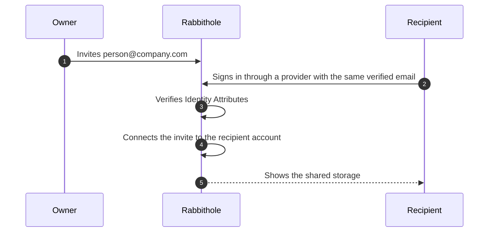
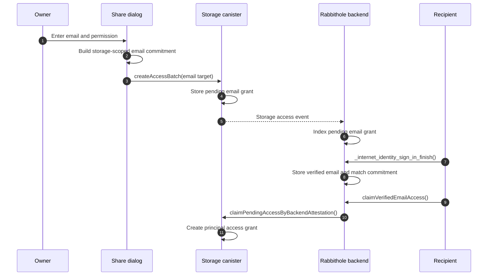

Email invites let you share access with a person before you know their
Internet Computer principal. You enter an email address, choose a permission,
and Rabbithole keeps the invite waiting until the right person signs in.

The email itself is not a password and not an encryption key. It is a verified
[Identity Attribute](/how-it-works/authentication#trust-verified-attributes) that helps Rabbithole
connect an invite to the right principal.

## When to use an email invite

Use an email invite when you know who must receive access, but that person
hasn't joined Rabbithole yet.

- Invite a colleague before they create an account.
- Share a folder with a future participant of a project.
- Prepare emergency access that is released after long owner inactivity.
- Let future notifications use the same verified email.

This is different from sharing with a principal. A principal works when the
recipient already has an account. Email works when you only know the person by
their address.

:::note Which emails are verified today

Internet Identity supports passkey sign-in, OpenID providers such as Google,
Microsoft, and Apple, and SSO where it is available. For Rabbithole, a verified
email is an attribute that comes from a supported Internet Identity flow and
passes backend verification in Rabbithole.

Typing any email address and verifying it through a Rabbithole confirmation
email is not implemented yet. That can become a separate profile setting later,
but the current invite flow relies on email from a supported sign-in provider.

:::

## What the recipient experiences

The recipient doesn't need a special link to claim the invite. They sign in to
Rabbithole with Internet Identity and share the matching verified email from a
supported sign-in provider.

Rabbithole can do this because it verifies the email through the identity flow.
It doesn't trust a profile field that anyone can type.

## Why Rabbithole can trust the email

A verified email is different from text typed into a form. Rabbithole accepts
it only after the backend verifies the identity payload.

The backend checks these facts before using the email:

1. The payload comes from the trusted Internet Identity signer.
2. The signed-in principal is the same principal that owns the attributes.
3. The nonce was issued by Rabbithole and has not been used before.
4. The origin matches Rabbithole.
5. The timestamp is fresh.
6. The email is marked as verified.

After those checks, Rabbithole can use the email to connect pending invites,
support future notifications, and reduce repeated verification steps.

:::details Technical view: email commitments and pending grants

Rabbithole doesn't need to store a global plain email identifier for access
matching. The frontend and canister calculate an email commitment from:

- a Rabbithole storage-access domain separator,
- the storage canister ID,
- and the normalized email address.

Because the storage canister ID is part of the commitment, the same email
doesn't become one reusable global access identifier across all storages.

The storage canister accepts backend attestation only from the trusted
Rabbithole backend configured for that storage. A direct storage app session
can also claim matching email grants after it receives verified attributes
from the identity flow.

:::

## Related pages

Use these pages to understand the surrounding model.

- [Authentication and identity attributes](/how-it-works/authentication#trust-verified-attributes)
- [Permission model](/how-it-works/sharing/permissions)
- [Encrypted sharing](/how-it-works/sharing/encryption-in-shared-access)
