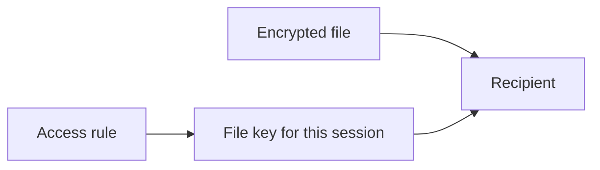
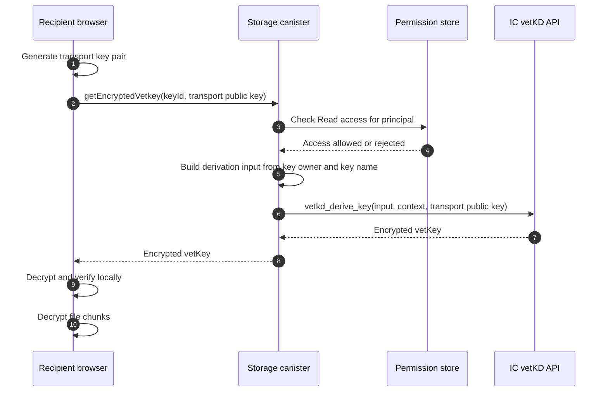

Sharing an encrypted file doesn't mean Rabbithole creates a new encrypted copy
for every recipient. Instead, the storage canister checks whether the recipient
has access. If they do, the Internet Computer derives the file key for that
session.

This keeps sharing fast and keeps the owner out of the recipient's read path.
The owner doesn't need to be online when the recipient opens a shared file.

## What changes when you share

Think of an encrypted file as having two parts:

- the encrypted file bytes,
- and a rule that says who can receive the key needed to decrypt them.

When you share the file, Rabbithole changes the rule. It doesn't upload the
file again, and it doesn't send the recipient a key from the owner.

The storage canister checks the rule before the recipient gets the key material
needed to decrypt the file.

## How the recipient gets the key

The raw key is not handed to the canister. The browser creates a temporary
transport key pair and sends only the public part to the canister. The derived
file key comes back encrypted for that browser session.

Only the browser holding the matching temporary secret can decrypt and use it.

If the user does not have `Read` access for the key ID, the canister rejects
the request before key derivation. Plaintext files don't expose a vetKey.

## What this means for permissions

Sharing changes permissions, not file contents.

- The encrypted file bytes stay where they are.
- The storage canister records who can read or edit the file.
- A recipient with **View** access can request the key for that file.
- A revoked recipient can no longer request new keys for the revoked scope.

This is why email invites work for encrypted files too. The invite can wait
until the person signs in, and then the canister grants that person's principal
the right to request the needed key.

The full operation-to-permission table lives in the
[Permission model](/en/how-it-works/sharing/permissions).

## Revocation limits

Revoking access stops future key requests and future file operations. It can't
remove a file copy or key material that the recipient already downloaded before
revocation.

This is the same practical limit as any file-sharing system: revocation
controls future access, not already-exported data.

## Related pages

Read these pages for the larger model.

- [How encryption works](/en/how-it-works/encryption)
- [Keys and vetKeys](/en/how-it-works/encryption/vetkeys)
- [Permission model](/en/how-it-works/sharing/permissions)
- [Storage modes](/en/how-it-works/storage)
