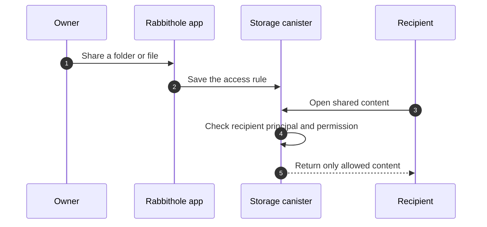
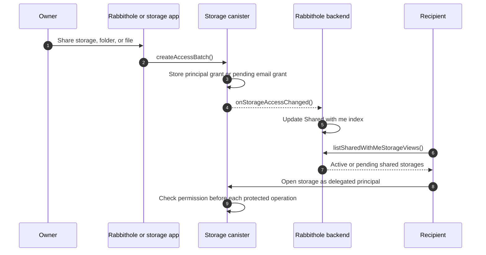
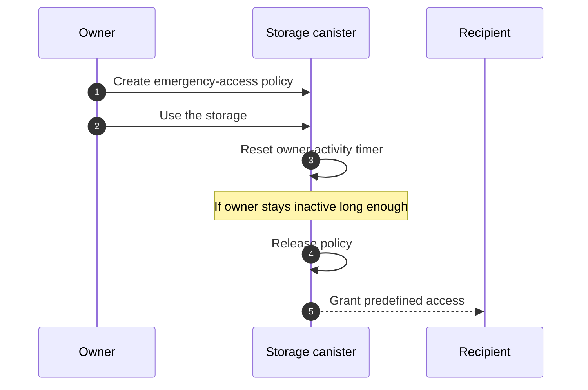

import { Badge, OverviewGroup } from '@rspress/core/theme';

Shared access lets you give another person access to a storage, folder, or
file. The storage stays yours, and the person you invite gets only the level of
access you choose.

You can share with an existing Rabbithole user profile or with an email
address. Email invites are important because you can give access before the
recipient creates a Rabbithole account.

## What this means in practice

Most users only need this model: you choose what to share, choose what the
recipient can do, and Rabbithole makes the access appear for that recipient.

- Share a whole storage, a folder, or a single file.
- Give **View**, **Edit**, or **Manage** access.
- Invite a person by email before they know Rabbithole.
- Let a person request access when they open a storage without permission.
- See incoming storages in **Shared with me**.

:::tip{title="Why email invites matter"}

You can share access with a future user. When that person later signs in with
the same verified email from
[Identity Attributes](/en/how-it-works/authentication#trust-verified-attributes), Rabbithole connects
the invite to their account automatically.

:::

## How Rabbithole keeps sharing safe

Rabbithole doesn't treat sharing as a note in a central database. The storage
itself checks access. In Internet Computer terms, each storage is a canister:
an independent smart contract that can keep data, rules, and frontend assets.

When someone opens a shared file, the storage canister checks that person's
principal before it returns file data or an encryption key. A principal is the
cryptographic account ID that Internet Identity gives to the app.

:::details{title="Technical view: canisters, events, and the Shared with me list"}

The storage canister is the source of truth for access. Rabbithole backend
keeps a synchronized index so users can discover storages shared with them in
the main app.

If the backend index is unavailable, the storage canister still owns the
permission decision. The index improves discovery and notifications; it doesn't
replace canister checks.

:::

## Types of shared access

Rabbithole uses simple labels in the interface and more precise labels inside
the canister.

| User-facing type | Technical class | What it is for |
|---|---|---|
| **Standard access** | `ordinary` | Normal sharing and approved access requests. |
| **Durable access** <Badge text="policy" type="info" outline /> | `durable` | Access described in advance by a policy and activated when the owner stays inactive. |
| **Recovery access** <Badge text="recovery" type="warning" outline /> | `ownerEquivalent` | A backup owner principal with owner-level powers. |

### Durable access

Durable access is for emergency workflows where the owner defines a policy in
advance: who receives access, which scope they receive, and which permission
they receive if the owner is inactive for a configured period.

While the owner keeps using the storage, the storage records owner activity
and resets the timer. If the owner stays inactive long enough, the policy is
released and creates normal access grants for the selected recipients.

### Recovery access

Recovery access covers the most conservative scenario: the owner must still be
able to open the storage directly even if the main Rabbithole interface is
unavailable.

In the normal flow, you sign in through `rabbithole.app`, and the storage app
receives a delegation from Rabbithole. The storage then sees the same
principal that the main app uses.

If the owner signs in directly through the storage URL, such as
`<your-storage>.icp0.io`, Internet Identity treats that URL as a different
application. For privacy, Internet Identity derives a separate principal for
each application origin. Recovery access stores that storage-origin principal
as a backup owner principal.

Read more on the
[Authentication](/en/how-it-works/authentication#why-one-user-can-have-different-principals)
page.

:::note{title="This is an extreme scenario"}

Mentioning the main app being unavailable doesn't describe normal Rabbithole
operation. It is an extreme case that demonstrates the sovereignty of the
architecture: the storage remains an independent canister, and the owner needs
a path to it even in the most negative scenarios.

:::

## Terms used in this section

These terms appear on the deeper pages.

- **Canister**: an Internet Computer smart contract. A Rabbithole storage is a
  canister.
- **Principal**: the cryptographic account ID used for permission checks.
- **Verified email**: an
  [Identity Attribute](/en/how-it-works/authentication#trust-verified-attributes) proved by the
  sign-in flow, not a free-form text field.
- **Grant**: an access rule stored by the storage canister.
- **vetKey**: a cryptographic key derived on demand after the canister checks
  access.

## Learn more

<OverviewGroup
  group={{
    name: 'Shared access topics',
    items: [
      {
        text: 'Invite people by email',
        link: '/en/how-it-works/sharing/email-invites',
      },
      {
        text: 'Permission model',
        link: '/en/how-it-works/sharing/permissions',
      },
      {
        text: 'Encryption and vetKeys',
        link: '/en/how-it-works/sharing/encryption-and-vetkeys',
      },
      {
        text: 'Authentication and identity attributes',
        link: '/en/how-it-works/authentication#trust-verified-attributes',
      },
    ],
  }}
/>
