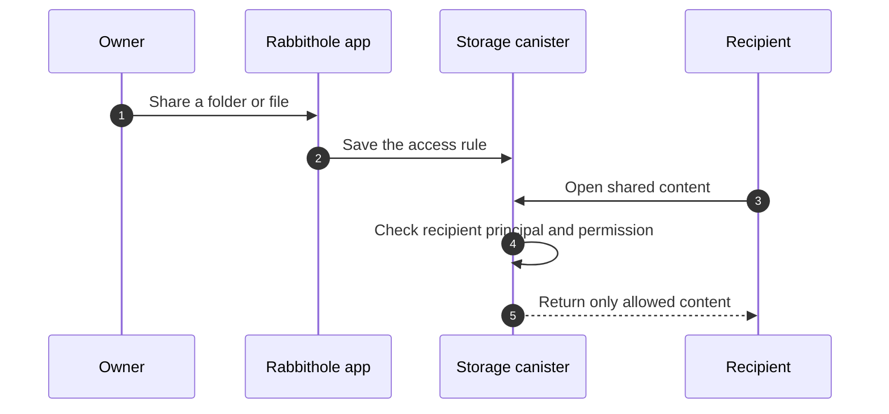
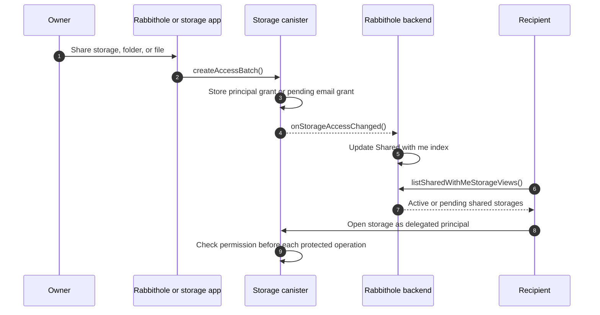

import { OverviewGroup } from '@rspress/core/theme';

Shared access opens a storage, folder, or file to another person. The storage
stays yours, and the person you invite gets only the access you choose.

You can share with an existing Rabbithole user profile or with an email
address. Email invites let you grant access before the recipient creates a
Rabbithole account.

Shared access is part of [Pro](/en/how-it-works/pro). A storage license keeps
the owner's personal encrypted storage available, but it does not replace active
Pro for invites, access management, or invited users.

## What this means in practice

Most flows come down to three choices: what to share, which access to grant, and
who receives it. Rabbithole then shows that access where the recipient expects
to find it.

- Share a whole storage, a folder, or a single file.
- Give **View**, **Edit**, or **Manage** access.
- Invite a person by email before they know Rabbithole.
- Let a person request access when they open a storage without permission.
- See incoming storages in **Shared with me**.

If a recipient with **Edit** access uploads a file, they use the owner's storage
canister. The owner controls both visibility and storage resource usage.

:::tip{title="Why email invites matter"}

You can share access with a future user. When that person later signs in with
the same verified email from
[Identity Attributes](/en/how-it-works/authentication#trust-verified-attributes), Rabbithole connects
the invite to their account automatically.

:::

## How Rabbithole keeps sharing safe

Rabbithole does not treat sharing as a note in a central database. The storage
itself checks access. In Internet Computer terms, each storage is a canister:
an independent smart contract with access rules, file structure, and frontend
assets.

When someone opens a shared file, the storage canister checks that person's
principal before it returns file data or an encryption key. A principal is the
cryptographic account ID that Internet Identity gives to the app.

:::details{title="Technical view: canisters, events, and the Shared with me list"}

The storage canister makes the access decision. Rabbithole backend keeps a
synchronized index so users can discover storages shared with them in the main
app.

If the backend index is unavailable, the storage canister still owns the
permission decision. The index improves discovery and notifications; it doesn't
replace canister checks.

:::

## Terms used in this section

These terms appear on the deeper pages.

- **Canister**: an Internet Computer smart contract. A Rabbithole storage is a
  canister.
- **Principal**: the cryptographic account ID used for permission checks.
- **Verified email**: an
  [Identity Attribute](/en/how-it-works/authentication#trust-verified-attributes) proved by the
  sign-in flow, not a free-form text field.
- **Grant**: an access rule stored by the storage canister.
- **Active Pro**: the state required for shared access and access management.
- **vetKey**: a cryptographic key derived on demand after the canister checks
  access.

## Learn more

<OverviewGroup
  group={{
    name: 'Shared access topics',
    items: [
      {
        text: 'Invite people by email',
        link: '/en/how-it-works/sharing/email-invites',
      },
      {
        text: 'Permission model',
        link: '/en/how-it-works/sharing/permissions',
      },
      {
        text: 'Encrypted sharing',
        link: '/en/how-it-works/sharing/encryption-in-shared-access',
      },
      {
        text: 'Authentication and identity attributes',
        link: '/en/how-it-works/authentication#trust-verified-attributes',
      },
      {
        text: 'What Pro gives you',
        link: '/en/how-it-works/pro',
      },
    ],
  }}
/>
