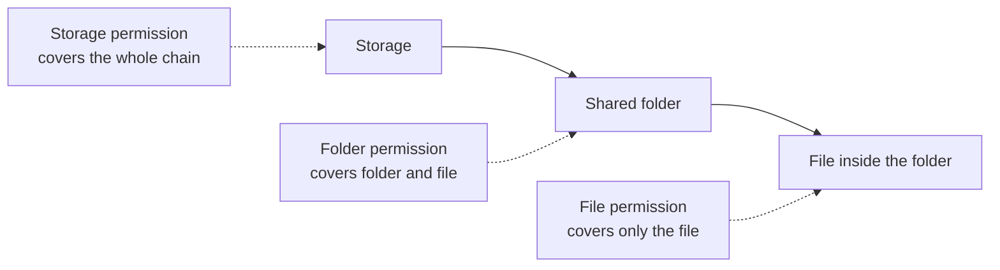
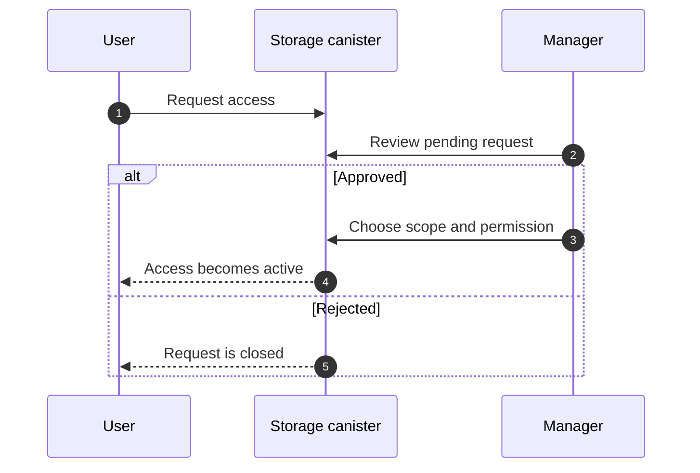

Permissions answer a simple question: what can this person do with this
storage, folder, or file?

Rabbithole keeps that decision close to the data. The storage canister checks
permissions before it lists files, changes content, changes sharing, or returns
an encryption key.

## Permission levels

Rabbithole shows three levels in the interface.

| Permission | What the recipient can do |
|---|---|
| **View** | Open folders and files that are shared with them. |
| **Edit** | View content and change it: upload, rename, move, or delete. |
| **Manage** | Edit content and manage access for the shared scope. |

Choose **View** for a reader, **Edit** for a collaborator, and **Manage** for
someone who can also invite or remove other people.

:::details{title="Technical names used by the canister"}

The canister stores these permissions as:

| UI label | Canister permission |
|---|---|
| **View** | `Read` |
| **Edit** | `ReadWrite` |
| **Manage** | `ReadWriteManage` |

`ReadWriteManage` is required to inspect and change access grants for a scope.

:::

## What a scope means

A scope is the thing you shared. It can be the whole storage, one folder, or
one file.

| Where the permission is granted | What it covers |
|---|---|
| **Storage** | The whole storage. |
| **Folder** | That folder and the files inside it. |
| **File** | Only that file. |

If a person has access to a folder, they can access files inside that folder at
the same permission level unless a stronger rule applies elsewhere.

:::details{title="Technical view: key IDs and effective permissions"}

Internally, the canister resolves folder and file entries to stable key IDs.
Permission checks use those key IDs and walk up the parent chain to find the
strongest effective permission.

This is why a folder grant can apply to a file inside the folder, and a root
grant can apply to the whole storage.

:::

## Invites and active access

Rabbithole distinguishes between access that is already active and access that
is waiting for the recipient.

- **Active access** means the storage canister knows the recipient's principal.
- **Pending access** means Rabbithole is waiting for the recipient to claim the
  invite, usually through a verified email.

When an email invite is claimed, pending access becomes active access for the
recipient's principal.

:::details{title="Technical view: grants"}

The canister stores active access as a principal grant and waiting access as a
pending grant. A pending email grant can later create a principal grant after
the verified email matches.

Managers can still see the invite history, including whether the email invite
was claimed through Rabbithole or through the direct storage app.

:::

## Access requests

If a signed-in user opens a storage without permission, Rabbithole can show a
request access action. The owner or a manager can approve or reject that
request.

When a request is approved, the manager chooses what to share and which
permission to grant.

## What revocation can and can't do

Revoking access stops future access checks. The recipient can't continue to
list, edit, manage, or derive keys for the revoked scope.

Revocation can't erase data the recipient already downloaded. This is the
normal limit of file sharing: you can stop future access, but you can't pull
back a copy that already left the system.

## Related pages

These pages cover the systems that permissions depend on.

- [Shared access overview](/en/how-it-works/sharing/)
- [Email invites](/en/how-it-works/sharing/email-invites)
- [Encryption and vetKeys](/en/how-it-works/sharing/encryption-and-vetkeys)
