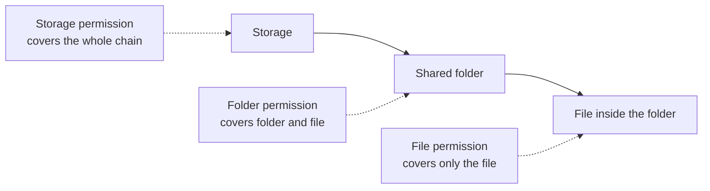
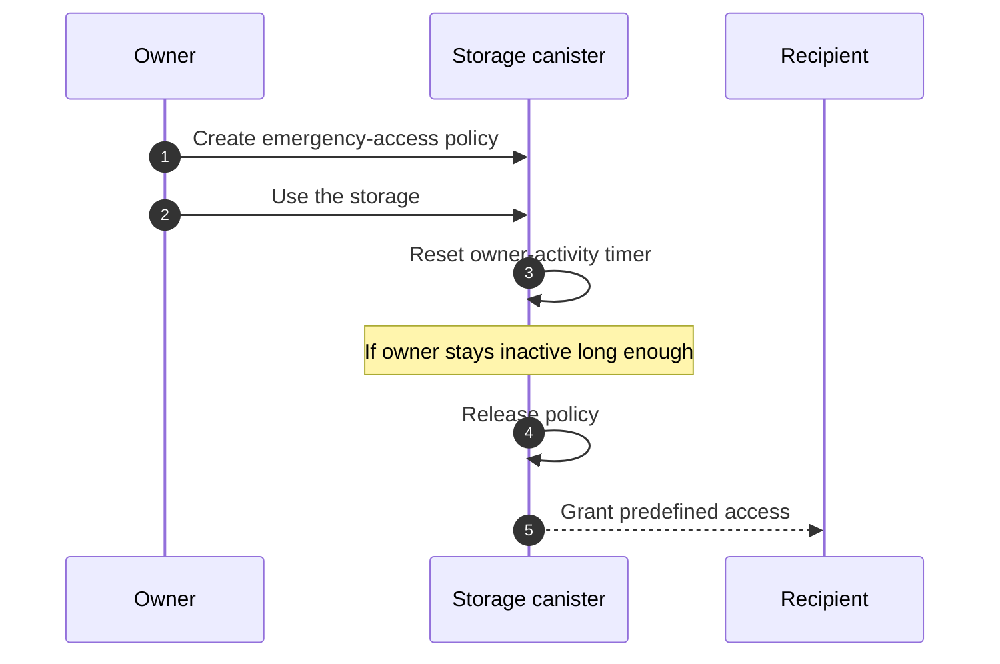
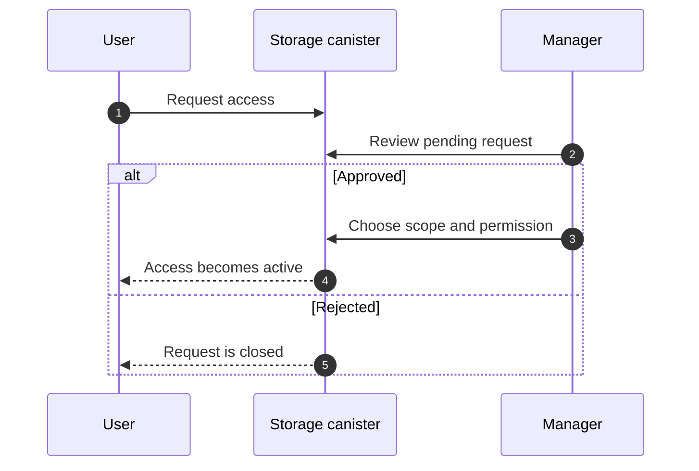

import { Badge } from '@rspress/core/theme';

Permissions answer a simple question: what can this person do with this
storage, folder, or file?

Rabbithole keeps that decision close to the data. The storage canister checks
permissions before it lists files, changes content, changes sharing, or returns
an encryption key.

## Permission levels

Rabbithole shows three permission levels in the interface.

| Permission | What the recipient can do |
|---|---|
| **View** | Open folders and files that are shared with them. |
| **Edit** | View content and change it: upload, rename, move, or delete. |
| **Manage** | Edit content and manage access for the shared scope. |

Choose **View** for a reader, **Edit** for a collaborator, and **Manage** for
someone who can also invite or remove other people.

## Operations and required permissions

The same permission model controls file operations, shared access, and key
requests for encrypted files. The name after `/` is the canister permission.

| Operation | Required permission |
|---|---|
| Open a folder or download a file | **View** / `Read` |
| Request the key for an encrypted file | **View** / `Read` |
| Upload, rename, move, or delete | **Edit** / `ReadWrite` |
| Manage shared access | **Manage** / `ReadWriteManage` |

Blob Storage changes where file bytes live. It does not bypass permission checks
in the storage canister.

:::note Shared access and Pro

Shared access and access management require the storage owner to have active
Pro. Starter Vault keeps the owner's personal encrypted storage available
within issued limits, but it does not keep shared access active after Pro
expires.

:::

## What a scope means

A scope is the thing you shared. It can be the whole storage, one folder, or
one file.

| Where the permission is granted | What it covers |
|---|---|
| **Storage** | The whole storage. |
| **Folder** | That folder and the files inside it. |
| **File** | Only that file. |

If a person has access to a folder, they can access files inside that folder at
the same permission level unless a stronger rule applies elsewhere.

:::details Technical view: key IDs and effective permissions

Internally, the canister resolves folder and file entries to stable key IDs.
Permission checks use those key IDs and walk up the parent chain to find the
strongest effective permission.

A folder grant can therefore apply to a file inside the folder, and a root
grant can apply to the whole storage.

:::

## Invites and active access

Rabbithole distinguishes between access that is already active and access that
is waiting for the recipient.

- **Active access** means the storage canister knows the recipient's principal.
- **Pending access** means Rabbithole is waiting for the recipient to claim the
  invite, usually through a verified email.

When an email invite is claimed, pending access becomes active access for the
recipient's principal.

:::details Technical view: grants

The canister stores active access as a principal grant and waiting access as a
pending grant. A pending email grant can later create a principal grant after
the verified email matches.

Managers can still see the invite history, including whether the email invite
was claimed through Rabbithole or through the direct storage app.

:::

## Special access classes

Most sharing uses standard access. Rabbithole also has rarer access classes for
recovery and predefined policies.

| User-facing type | Technical class | What it is for |
|---|---|---|
| **Standard access** | `ordinary` | Normal sharing and approved access requests. |
| **Durable access** <Badge text="policy" type="info" outline /> | `durable` | Access described in advance by a policy and activated when the owner stays inactive. |
| **Recovery access** <Badge text="recovery" type="warning" outline /> | `ownerEquivalent` | A backup owner principal with owner-level powers. |

Standard access depends on the owner's Pro status. Durable access and recovery
access cover sovereign scenarios: they can preserve access to permitted data
even when the owner's Pro is not active.

:::details Durable access

Durable access is for emergency workflows. The owner defines in advance who
receives access, which scope they receive, and which permission they receive if
the owner is inactive for a configured period.

While the owner keeps using the storage, the canister records owner activity and
resets the timer. If the owner stays inactive long enough, the policy is
released and creates normal access grants for the selected recipients.

:::

:::details Recovery access

Recovery access covers the most conservative scenario: the owner must still be
able to open the storage directly even if the main Rabbithole interface is
unavailable.

In the normal flow, you sign in through `rabbithole.app`, and the storage app
receives a delegation from Rabbithole. The storage then sees the same principal
that the main app uses.

If the owner signs in directly through the storage URL, such as
`<your-storage>.icp.net`, Internet Identity treats that URL as a different
application. For privacy, Internet Identity derives a separate principal for
each application origin. Recovery access stores that storage-origin principal as
a backup owner principal.

Read more on the
[Authentication](/how-it-works/authentication#why-one-user-can-have-different-principals)
page.

:::

## Access requests

If a signed-in user opens a storage without permission, Rabbithole can show a
request access action. The owner or a manager can approve or reject that
request.

When a request is approved, the manager chooses what to share and which
permission to grant.

## What revocation can and can't do

Revoking access stops future access checks. The recipient can't continue to
list, edit, manage, or derive keys for the revoked scope.

Revocation can't erase data the recipient already downloaded. This is the
normal limit of file sharing: you can stop future access, but you can't pull
back a copy that already left the system.

## Related pages

These pages cover the systems that permissions depend on.

- [Shared access overview](/how-it-works/sharing/index)
- [Email invites](/how-it-works/sharing/email-invites)
- [Encrypted sharing](/how-it-works/sharing/encryption-in-shared-access)
