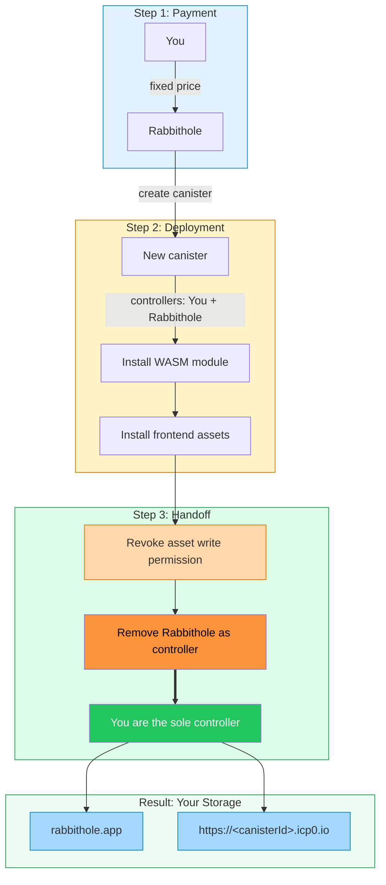
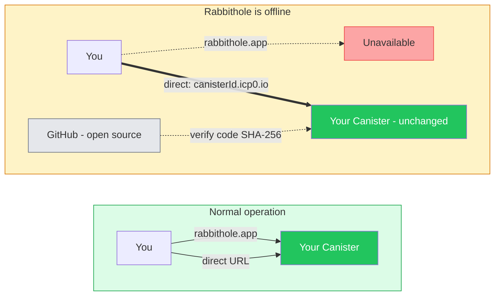
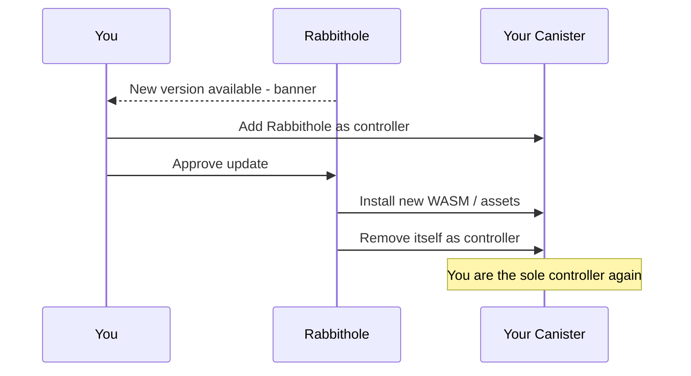

# Your Storage. Your Rules.

Rabbithole doesn't just encrypt your files — it gives you **actual ownership** of your storage infrastructure. This is fundamentally different from every other cloud storage service.

## What makes Rabbithole unique?

When you create storage on Rabbithole, we deploy a **personal canister** (smart contract) on the Internet Computer blockchain — and then **hand you the keys**.


After deployment:
- **You are the sole controller** of your canister
- Rabbithole **removes itself** from the list of controllers
- Your canister contains your encrypted files, your frontend UI, and your access rules
- Nobody — not Rabbithole, not any government, not any hacker — can access or delete your data

## How your storage is created



### Step 1: You pay a fixed price

You pay a fixed price in USD. This covers two things:
- **Canister creation** — the Internet Computer network [charges a fee](https://docs.internetcomputer.org/building-apps/essentials/gas-cost#canister-creation) for creating a new smart contract
- **Initial cycles balance** — "fuel" your canister needs for computation and storage

**Rabbithole does not profit from this step.** The entire payment goes to the Internet Computer network. Under the hood, Rabbithole converts your payment to cycles and sends them to the network — but you don't need to think about any of that.

### Step 2: Rabbithole deploys your canister

1. **Creates the canister** — at this point, both you and Rabbithole are listed as controllers (Rabbithole needs temporary access to install code)
2. **Installs the WASM module** — the storage canister logic, the same open-source code published on GitHub
3. **Installs frontend assets** — your canister will serve its own web UI

The Rabbithole backend automatically checks GitHub daily for new releases. When a new version is available, it downloads the latest WASM module and frontend assets — so every new canister gets up-to-date code.

### Step 3: Rabbithole steps away

After installation, Rabbithole performs a two-step handoff:
1. **Revokes its own write permission** on the canister's asset storage — so it can no longer modify your frontend files
2. **Removes itself as controller** — leaving you as the only controller

From this moment, you are the only one who can manage your canister. This is enforced at the IC protocol level — there is no backdoor.

### The result

You can access your storage in two ways:
- Through **rabbithole.app** — the main application interface
- Directly at **https://&lt;canisterId&gt;.icp0.io** — your canister serves its own frontend

Your identity (Principal ID) is the same in both cases — Rabbithole uses a key delegation mechanism so that Internet Identity recognizes you regardless of which URL you use. Read more on the [Authentication](/en/how-it-works/authentication) page.

## What if Rabbithole disappears?

This is the question nobody asks about Google Drive — because the answer is terrifying. With Rabbithole, it's simple: **nothing changes for your data**.

Your canister is a fully autonomous smart contract on the Internet Computer. Rabbithole.app is just a convenient way to interact with it — but it's not the only way and not a requirement.



- **Your data stays** on the Internet Computer blockchain — the canister keeps running independently
- **You access it directly** at `https://<canisterId>.icp0.io` — your canister already serves its own frontend
- **You top up cycles** directly through the IC management interface, without Rabbithole
- **The code is verifiable** — all WASM modules and frontend assets are [open source](https://github.com/rabbithole-app/v2). You can [verify](https://docs.internetcomputer.org/building-apps/best-practices/reproducible-builds) that the module installed in your canister matches the published release by comparing SHA-256 hashes: `dfx canister info <id> --network ic` returns the module hash
- **Updates are optional** — your canister works fine without ever being updated

Rabbithole is designed so that its own disappearance doesn't affect your data or access to it. Your canister is self-sufficient from the moment it's created.

---

:::details{title="How does controller transfer work?"}

The handoff is a two-step process:

1. **Revoke `#Commit` permission** — Rabbithole calls `revoke_permission` on the http-assets interface of your canister, removing its ability to write or modify frontend files.
2. **Remove as controller** — Rabbithole calls `IC.update_settings` with `controllers = [your_principal]`, removing itself entirely. Only your Principal remains.

The Internet Computer's management canister enforces controller rules at the protocol level — once Rabbithole is removed, there is no backdoor, no admin access, no override mechanism. The IC consensus protocol guarantees this.

You can verify your canister's controllers at any time:
```bash
dfx canister info <your-canister-id> --network ic
```

:::

:::details{title="What about canister upgrades?"}

Rabbithole has a built-in update delivery mechanism. When a new version is available, you see a notification banner in the interface. The update process works like this:

1. **You decide** — updates are never forced. You see a banner and choose whether to update
2. **Temporary access** — if you agree, Rabbithole is temporarily added as a controller of your canister
3. **Update** — Rabbithole installs the new WASM module and/or frontend assets
4. **Access removed** — Rabbithole removes itself as controller again



**Snapshots for safety:** Before any update, you can take a snapshot of your canister's state through the interface. A snapshot captures the current Stable Memory and WASM module. If something goes wrong after an update, you can roll back to the snapshot — restoring your data and code to the exact state before the update.

Your data is stored in **Stable Memory** — persistent storage that survives code upgrades. Even if you upgrade the canister's logic, your files remain intact.

:::
