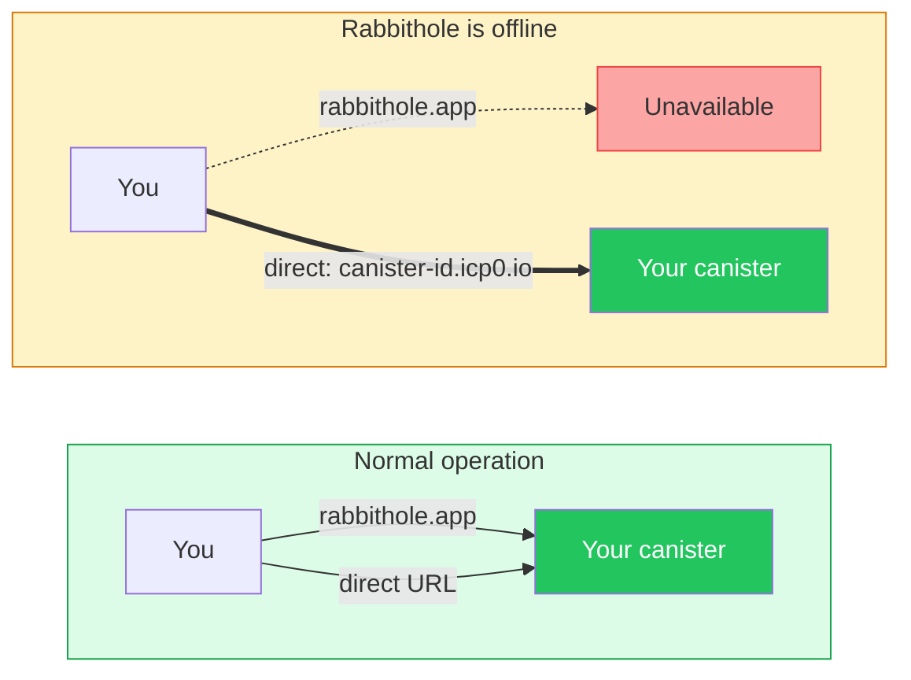
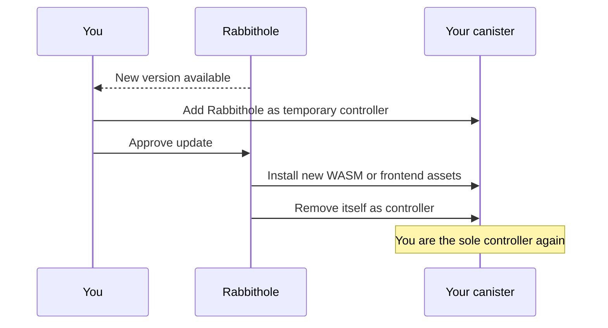

# Data sovereignty in Rabbithole

Data sovereignty means your storage is not just an account in Rabbithole's
database. When you create storage, Rabbithole deploys a personal Internet
Computer canister for you, installs the storage code and frontend assets, and
then removes itself from control.

:::tip{title="Short version"}

Your storage is a personal canister. Rabbithole helps create it, then hands
control to your Internet Identity principal. You can access the canister
directly, manage its cycles, and decide whether to accept future updates.

:::

## What you control

After the initial handoff, your principal is the controller of the storage
canister. That gives you direct control over the infrastructure that stores your
file records, permissions, frontend assets, and, in On-chain Storage, the file
bytes themselves.

You control these parts of your storage:

- **Controller rights**: your principal controls canister settings and upgrades.
- **Direct access**: your canister serves its own frontend at
  `https://<canister-id>.icp0.io`.
- **Cycle funding**: you can keep the canister alive with Rabbithole Pro or
  with direct Internet Computer tooling.
- **Updates**: you choose whether Rabbithole gets temporary access to install a
  new version.
- **Deletion**: you can delete the canister and its data when you no longer need
  the storage.

## What Rabbithole still provides

Sovereignty does not mean Rabbithole disappears from the user experience. It
means Rabbithole is a service layer around infrastructure that you control.

Rabbithole can still provide these conveniences:

- **Main app interface** at `rabbithole.app`.
- **Storage creation** for deploying and initializing a personal canister.
- **Optional updates** for new WASM modules and frontend assets.
- **Pro top-ups** that keep your canister funded with cycles automatically.
- **Blob Storage coordination** when you choose the lower-cost storage mode.

## What sovereignty does not guarantee

Data sovereignty removes Rabbithole as a permanent controller, but it does not
remove every operational dependency. These limits are important.

- **Cycles are still required**: an unfunded canister can freeze and may later
  be removed by the Internet Computer network.
- **Blob Storage has a separate availability model**: your canister keeps the
  trusted file record, but file bytes depend on Blob Storage funding and
  retention.
- **Encryption remains a separate setting**: sovereignty controls ownership and
  administration; encryption controls file confidentiality.
- **Lost identity is still a risk**: if you lose access to the Internet Identity
  that controls the canister, Rabbithole cannot recover control for you.
- **Updates create a temporary trust window**: when you approve an update,
  Rabbithole gets temporary access and then removes itself again.

## How storage is created

Rabbithole uses temporary access only to create and initialize your storage. The
handoff happens before the storage becomes your independent canister.


The creation flow has three phases:

1. **Pay for deployment**: the payment covers canister creation and the initial
   cycle balance.
2. **Install the storage**: Rabbithole installs the storage WASM module and the
   frontend assets served by your canister.
3. **Complete the handoff**: Rabbithole revokes its asset write permission and
   removes itself from the canister controllers.

After that handoff, Rabbithole no longer has permanent administrative access to
your canister.

## How to verify ownership

You can verify the canister controllers with `icp-cli`. Run the command with
the Internet Computer identity that controls your storage canister.

```bash
icp canister settings show <your-storage-canister-id> -n ic
```

Check the `controllers` field in the output:

- Your principal must be listed as a controller.
- Rabbithole must not remain listed after the handoff is complete.

To print the principal of your current `icp-cli` identity, run:

```bash
icp identity principal
```

You can also compare the installed module hash with the published release if you
want to verify the code. See the Internet Computer guide to
[reproducible builds](https://docs.internetcomputer.org/building-apps/best-practices/reproducible-builds)
for the full process.

## What happens if Rabbithole disappears?

Rabbithole is one interface to your storage, not the owner of the canister. If
`rabbithole.app` is unavailable, the canister can still serve its own frontend
while it has enough cycles.



What remains available depends on your storage mode:

- **On-chain Storage**: file bytes stay inside your canister while it remains
  funded.
- **Blob Storage**: your canister keeps the trusted file record and verification
  data, while file-byte availability depends on the Blob Storage retention
  lifecycle.

## Technical details

The technical details below explain how Rabbithole performs the handoff and how
optional updates work after the canister belongs to you.

:::details{title="Controller transfer and optional updates"}

### Controller transfer

The initial handoff has two protocol-level steps:

1. **Revoke `#Commit` permission**: Rabbithole calls `revoke_permission` on the
   `http-assets` interface, removing its ability to write or modify frontend
   files.
2. **Remove Rabbithole as controller**: Rabbithole calls `IC.update_settings`
   with `controllers = [your_principal]`. Only your principal remains.

The Internet Computer management canister enforces controller rules at the
protocol level. After Rabbithole is removed, it has no admin override.

### Optional canister upgrades

Rabbithole can deliver updates, but only after you approve a temporary access
window.



Before an update, you can create a snapshot from the Rabbithole interface. A
snapshot captures the current Stable Memory and WASM module. If the update fails
or behaves incorrectly, you can restore the canister to the snapshot.

Stable Memory survives canister upgrades, so file records and stored data remain
available across normal code updates.

:::

## Continue reading

Use these pages to understand the related parts of the model.

- [Authentication](/en/how-it-works/authentication)
- [Storage](/en/how-it-works/storage)
- [Payment & Cycles](/en/how-it-works/payment)
