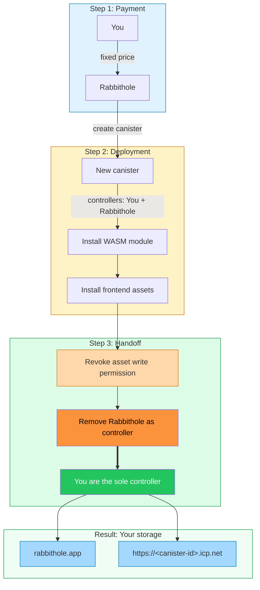
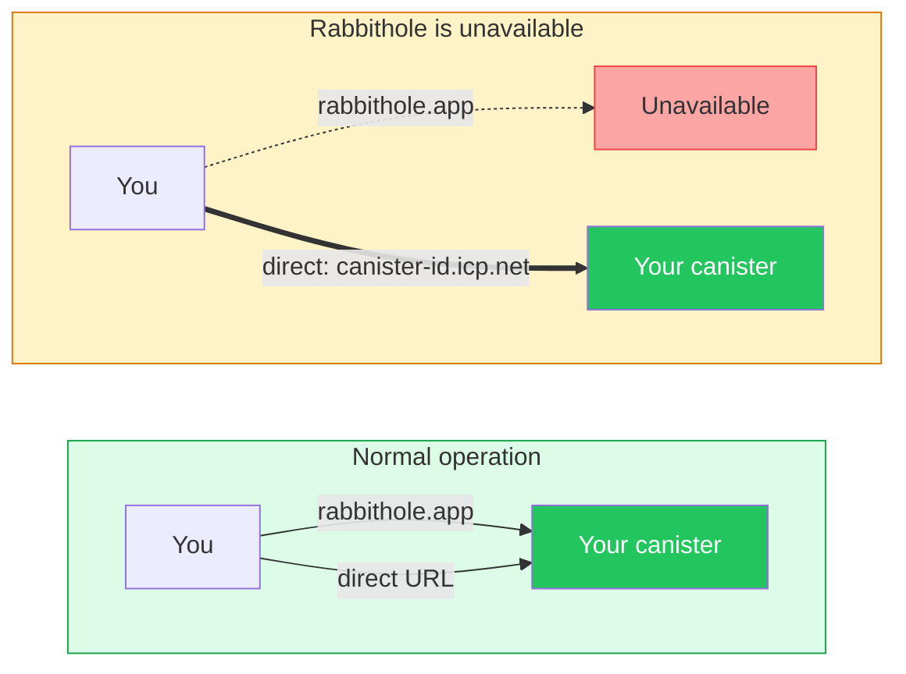

# Data sovereignty in Rabbithole

In Rabbithole, storage ownership is tied to a canister rather than only to an
account record. When you create storage, Rabbithole deploys a personal Internet
Computer canister for you with storage code, data, and its own web interface.

After the handoff completes, Rabbithole removes itself from the controllers.
The storage remains part of the Internet Computer, but control moves to you.

:::tip Short version

Rabbithole helps create the storage and remains a service around it. The storage
itself belongs to you: you can open it directly, fund the canister with cycles,
and decide whether to accept future updates.

:::

## What you control

After the initial handoff, your Internet Identity principal becomes the
controller of the storage canister. That gives you direct control over the
infrastructure that stores file records, access rules, frontend assets, and, in
On-chain Storage, the file bytes themselves.

You control these parts of your storage:

- **Canister settings**: your principal manages controllers and upgrades.
- **Direct access**: your canister serves its own frontend at
  `https://<canister-id>.icp.net`.
- **Cycle funding**: you can keep the storage running through automatic cycle
  top-ups in Pro or by funding the canister directly with Internet Computer
  tooling.
- **Updates**: you choose whether Rabbithole gets temporary access to install a
  new version.
- **Deletion**: you can delete the canister and its data when you no longer need
  the storage.

## What Rabbithole still does

Sovereignty does not mean Rabbithole disappears from the user experience. It
means Rabbithole can still help with infrastructure that you control.

Rabbithole can still provide:

- the main app interface at `rabbithole.app`;
- storage creation and initial setup;
- storage code and frontend asset updates when you have active Pro and
  approve temporary access;
- automatic cycle top-ups when the canister needs cycles before expensive
  operations;
- Blob Storage coordination when you choose the lower-cost storage mode.

## How storage is created

Rabbithole uses temporary access only to create and initialize your storage. The
handoff happens before the storage becomes your independent canister.

The creation flow has three phases:

1. **You pay for deployment**. The setup payment covers canister creation, the
   initial cycle balance, deployment operations, and related infrastructure
   costs.
2. **Rabbithole installs the storage**. The canister receives the storage code
   and frontend assets it will serve.
3. **Rabbithole completes the handoff**. The service revokes its asset write
   permission and removes itself from the canister controllers.

After that handoff, Rabbithole no longer has permanent administrative access to
your canister. The intended final state is your principal as the only
controller.

## What happens if Rabbithole is unavailable

Rabbithole is one interface to your storage, not the owner of the canister. If
`rabbithole.app` is unavailable, the canister can still serve its own frontend
while it has enough cycles.

What remains available depends on your storage mode:

- **On-chain Storage**: file bytes stay inside your canister while it remains
  funded.
- **Blob Storage**: your canister keeps the trusted file record and verification
  data, while file-byte availability depends on the Blob Storage retention
  lifecycle.

## Model boundaries

Data sovereignty removes Rabbithole as a permanent controller, but it does not
remove every operational dependency. These limits are worth understanding up
front.

- **Cycles are still required**. An unfunded canister can freeze and may later
  be removed by the Internet Computer network.
- **Blob Storage has a separate availability model**. The canister keeps the
  file record, but file bytes depend on Blob Storage funding and retention.
- **Encryption is a separate topic**. Sovereignty controls ownership and
  administration; encryption controls file confidentiality.
- **Lost identity is still a risk**. If you lose access to the Internet Identity
  that controls the canister, Rabbithole cannot recover control for you.

## Continue reading

These pages explain the sovereignty model and related product areas in more
detail.

- [How to verify ownership](./verify-ownership)
- [Storage updates](./updates)
- [Authentication](/how-it-works/authentication)
- [Storage](/how-it-works/storage/index)
- [Payment & Cycles](/how-it-works/payment)
