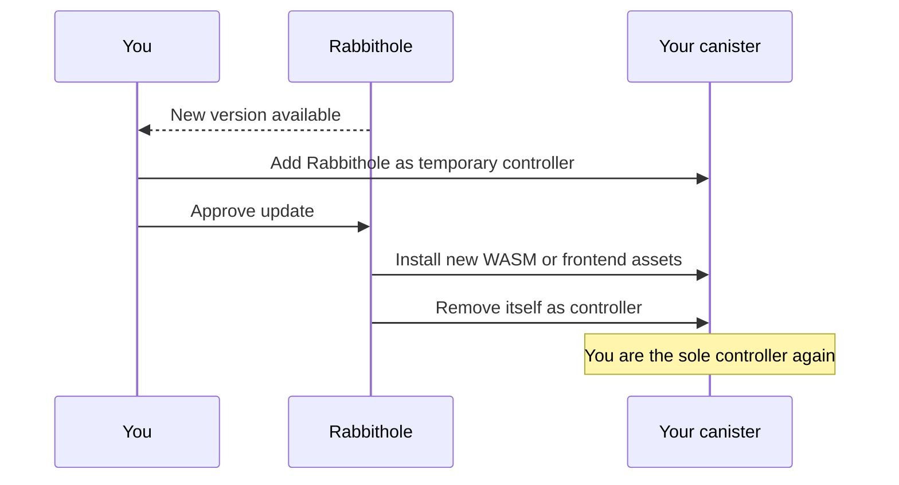

# Storage updates

After the handoff, Rabbithole cannot update your canister on its own. That is
intentional: to install a new version, the service needs a temporary access
window that you approve.

This model lets Rabbithole deliver fixes and new features without remaining a
permanent administrator of your storage.

Update delivery is a Pro service feature. Pro does not change the
control model: an update still requires your approval and temporary access to
the canister.

## Why temporary controller access is required

A canister update changes the code that serves the storage. On the Internet
Computer, only a canister controller can perform that operation. That means
Rabbithole cannot silently update your storage after control has been handed to
you.

When you approve an update, a task-limited process runs:

1. You add Rabbithole as a temporary controller.
2. Rabbithole installs the new WASM module or frontend assets.
3. Rabbithole removes itself from the controllers.
4. The storage is back under your control.

## What happens to data

A normal update changes canister code but should not erase data. File records,
access rules, and stored data live in Stable Memory, which survives canister
upgrades.

Before an update, you can create a snapshot from the Rabbithole interface. A
snapshot captures the current Stable Memory and WASM module. If the update fails
or behaves incorrectly, you can restore the canister to the snapshot.

## What Rabbithole does at the protocol level

During the initial handoff and later updates, Rabbithole works with two
different kinds of access:

- **Frontend asset permissions**. Rabbithole can install or update the web
  interface files served by your canister. After handoff, the service revokes
  its asset write permission.
- **Canister controller rights**. Rabbithole receives them only for the
  operation, installs the intended version, and removes itself from the
  controllers.

The initial handoff ends with an `IC.update_settings` call using the final
controller list. After Rabbithole is removed, the service has no admin override:
controller rules are enforced by the Internet Computer management canister.

## What to check after an update

After the update completes, check the **Controllers** table on the canister page
inside Rabbithole. The list should contain only the principals you expect.

If you want to verify this directly with Internet Computer tooling, use the
[How to verify ownership](./verify-ownership) guide.

## Continue reading

- [Data sovereignty](./index)
- [How to verify ownership](./verify-ownership)
- [Payment & Cycles](/how-it-works/payment)
