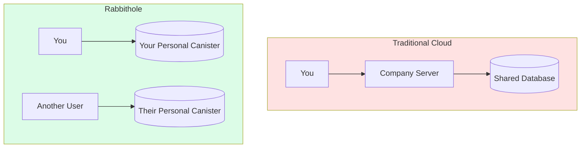
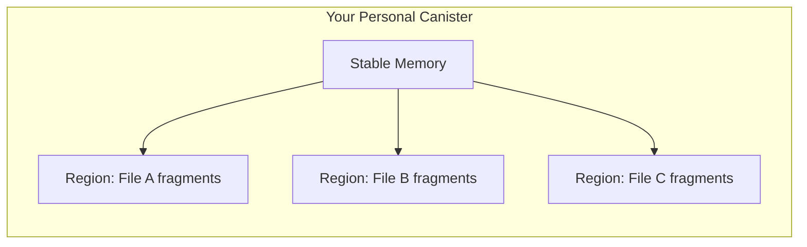

## Your data lives on the blockchain, not on someone's server

Unlike traditional cloud storage, Rabbithole doesn't store your files on company-owned servers. Your encrypted data is stored directly in **your own canister** on the **Internet Computer** — a decentralized blockchain network.

## Each user gets their own canister

When you start using Rabbithole, a **personal canister** is deployed just for you. This canister belongs to you — after deployment, Rabbithole removes itself from the controller list, making you the sole owner.

Learn more about this in [Data Sovereignty](/en/how-it-works/sovereignty).

## What are canisters?

Canisters are **smart contracts** on the Internet Computer. Think of them as programs that run on a decentralized network of independent computers. They:

- Execute code transparently (anyone can verify)
- Store data in tamper-proof memory
- Cannot be shut down by any single entity
- Run 24/7 without downtime

Your personal canister handles both:

| Function | Purpose |
|----------|---------|
| **File metadata** | Folders, permissions, file names |
| **Encrypted storage** | The actual encrypted file fragments |

## What happens to my data if Rabbithole disappears?

Your data persists in your canister as long as it has **cycles** (the ICP computation currency). Since the code is open-source, you can:

1. Deploy your own frontend
2. Point it at your existing canister
3. Access your files

:::note{title="Key point"}

Your data is not tied to the Rabbithole company — it lives in your own canister on the blockchain.

:::

---

## Technical Details

:::details{title="Click to expand technical details"}

### Stable Memory & Memory Regions

File fragments are stored in ICP **Stable Memory** — persistent storage that survives canister upgrades. Each fragment is managed through **Memory Regions**, which provide:

- Efficient blob allocation and deallocation
- Random access by fragment index
- Contiguous storage for streaming reads

### Storage layout

### Capacity

- Each canister: up to **400 GB** of stable memory
- Fragment size: ~**1.9 MB** plaintext (~1.9 MB + 28 bytes encrypted)
- A single canister can store ~200,000 fragments

### Data integrity

- SHA-256 checksums verify fragment integrity on download
- Fragments are materialized before memory operations to prevent use-after-free

:::

