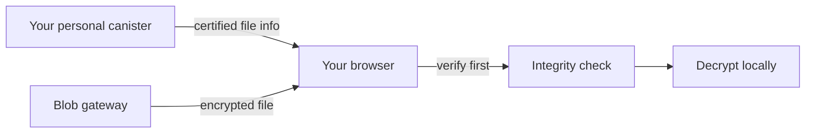

import { OverviewGroup, Steps } from '@rspress/core/theme';

## What Blob Storage is

Blob Storage is Rabbithole's lower-cost storage mode. The file is stored outside your canister, while your canister keeps the file record, access rules, and the information needed to verify that the file has not been replaced.

When encryption is enabled, the storage layer sees only ciphertext.  
When encryption is disabled, Blob Storage should be treated as a storage and access-control mode, not as a confidentiality mode.

:::tip{title="Trade-off at a glance"}

You gain lower cost and support for larger files.  
You accept that long-term availability depends on the Blob Storage service lifecycle.

:::

:::note{title="Important distinction"}

The external storage layer keeps the **file itself**.  
Your personal canister keeps the **trusted metadata and verification data**.

:::

:::note{title="Encryption changes the privacy boundary"}

With encryption enabled, Blob Storage cannot read file contents.  
Without encryption, the storage infrastructure can see file contents, even though Rabbithole still enforces access rules between users.

:::

## Where the file lives

This diagram shows the full Blob Storage path:

- your browser uploads the file
- your personal canister keeps the **trusted record and access state**
- the **Blob Gateway** is the upload and download service that stores the file in **S3-compatible object storage**
- **Cashier** and **Cleanup service** handle storage billing and cleanup behind the scenes

## How upload works

<Steps>

### Prepare the file in the browser

The browser splits the file into chunks. If encryption is enabled, those chunks are encrypted before upload.

### Upload the file

The browser sends file chunks to the Blob gateway, which stores them in an S3-compatible object storage layer.

### Save the file record in your canister

Your canister stores the file record, permissions, and the fingerprint used later to verify downloads.

</Steps>

## How download works

The browser does two separate things before opening the file:

1. It gets the expected file fingerprint from your canister.
2. It checks that the file downloaded from Blob Storage matches that fingerprint.

Only after that does decryption happen, if encryption was enabled for that file.

## How billing and cleanup fit in

- **Blob Gateway** is the service that accepts uploads and returns files during download.
- **Cashier** is the storage billing service that keeps the storage lifecycle funded and coordinated.
- **Cleanup service** synchronizes deletion and retention-related cleanup with your canister.

## Why this model is cheaper

Blob Storage is cheaper because the file itself does not have to live inside canister memory. Your canister stores a much smaller amount of information: file records, access state, and verification data.

## What this mode trusts

- The Internet Computer for your canister state
- Cryptographic verification performed in the browser
- The Blob Storage service for availability and retention of the file

That is why Blob Storage is not the same trust model as On-chain Storage, even though both use the same end-to-end encryption.

## Continue reading

<OverviewGroup
  group={{
    name: 'Related pages',
    items: [
      {
        text: 'How Rabbithole verifies your files',
        link: '/en/how-it-works/storage/integrity',
      },
      {
        text: 'How On-chain Storage works',
        link: '/en/how-it-works/storage/on-chain-storage',
      },
      {
        text: 'Payment & Cycles',
        link: '/en/how-it-works/payment',
      },
    ],
  }}
/>

<OverviewGroup
  group={{
    name: 'Official references',
    items: [
      {
        text: 'Canister smart contracts',
        link: 'https://docs.internetcomputer.org/building-apps/essentials/canisters',
      },
      {
        text: 'Asset certification',
        link: 'https://learn.internetcomputer.org/hc/en-us/articles/34276431179412-Asset-Certification',
      },
      {
        text: 'Certified data',
        link: 'https://docs.internetcomputer.org/tutorials/developer-liftoff/level-3/3.3-certified-data',
      },
    ],
  }}
/>
