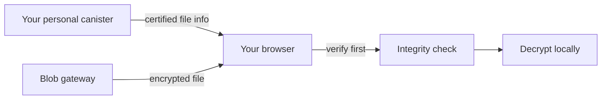

import { OverviewGroup, Steps } from '@rspress/core/theme';

## What Blob Storage is

Blob Storage is the recommended mode for most encrypted files. The bytes live
outside your canister, while the canister keeps the file record, access rules,
and the data your browser uses to detect replacement.

The storage layer sees only ciphertext. Blob Storage handles byte storage and
delivery, while browser-side encryption protects file confidentiality before
upload.

:::tip Trade-off

You pay less and handle large files more comfortably. In exchange, long-term
byte availability depends on the Blob Storage lifecycle.

:::

:::note Important distinction

The external storage layer keeps the **file itself**. Your personal canister
keeps the **trusted file record, access rules, and verification data**.

:::

## Where the file lives

The Blob Storage path looks like this:

- your browser prepares and uploads the file;
- your personal canister keeps the trusted record and access state;
- **Blob Gateway** accepts uploads and returns files during download;
- **Cashier** and **Cleanup service** handle billing and cleanup or retention
  events.

## How upload works

<Steps>

### Prepare chunks in the browser

The browser splits the file into chunks and encrypts each chunk locally.
Encrypted chunks are written to a temporary browser spool so the full encrypted
file does not have to stay in memory.

### Upload chunks to Blob gateway

The browser reads encrypted chunks from the spool and sends them to Blob
gateway. The gateway stores the data in S3-compatible object storage.

### Write the result into the canister

After successful upload, Rabbithole writes the result into the canister. The
canister stores the trusted file record: size, hashes, metadata, and access
state.

</Steps>

## How download works

The browser does two things before opening the file:

1. It gets the expected file fingerprint from your canister.
2. It checks that the file downloaded from Blob Storage matches that fingerprint.

Only after that does decryption happen, if encryption was enabled for that file.

## How billing and cleanup fit in

File bytes in Blob Storage have their own lifecycle. The canister remains the
trusted system of record, but byte availability depends on Blob Storage funding
and retention rules.

- **Blob Gateway** accepts uploads and returns files during download.
- **Cashier** keeps storage funded.
- **Cleanup service** synchronizes deletion and retention events with your
  canister.

## Why this model is cheaper

Blob Storage is cheaper because the file itself does not have to live inside
canister memory. Your canister stores a much smaller amount of information:
file records, access state, and verification data.

## What this mode trusts

Trust is split across several parts:

- The Internet Computer keeps your canister state.
- The canister certifies trusted file metadata.
- The browser verifies downloaded bytes before opening them.
- Blob Storage is responsible for byte availability and retention.

Blob Storage and On-chain Storage use the same end-to-end encryption, but their
availability models differ.

## Continue reading

<OverviewGroup
  group={{
    name: 'Related pages',
    items: [
      {
        text: 'How Rabbithole verifies your files',
        link: '/how-it-works/storage/integrity',
      },
      {
        text: 'How On-chain Storage works',
        link: '/how-it-works/storage/on-chain-storage',
      },
      {
        text: 'Payment & Cycles',
        link: '/how-it-works/payment',
      },
    ],
  }}
/>

<OverviewGroup
  group={{
    name: 'Official references',
    items: [
      {
        text: 'Canister smart contracts',
        link: 'https://docs.internetcomputer.org/building-apps/essentials/canisters',
      },
      {
        text: 'Asset certification',
        link: 'https://learn.internetcomputer.org/hc/en-us/articles/34276431179412-Asset-Certification',
      },
      {
        text: 'Certified data',
        link: 'https://docs.internetcomputer.org/tutorials/developer-liftoff/level-3/3.3-certified-data',
      },
    ],
  }}
/>
