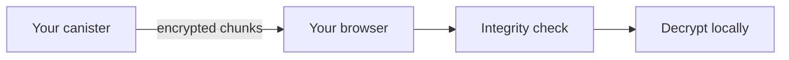

import { OverviewGroup, Steps } from '@rspress/core/theme';

## Why this matters

When a file is stored outside your browser, two different questions appear:

- **Can someone read it?**
- **Can someone replace it without you noticing?**

Encryption answers the first question. File verification answers the second.

:::tip{title="What this means in practice"}

If a file is silently replaced on the way to you, Rabbithole refuses to open it.
You get a failed download or integrity error instead of a tampered file.

:::

## Blob Storage verification

  

With Blob Storage, the browser does not trust the gateway blindly.

<Steps>

### Ask the canister for the expected file info

The browser gets the expected file hash and related metadata from your canister.

### Verify that this metadata is authentic

The metadata is delivered through an Internet Computer certification flow, so the browser can verify that it really came from your canister.

### Compare the downloaded file against that hash

If the downloaded file does not match, the browser rejects it before opening.

</Steps>

## On-chain Storage verification

With On-chain Storage there is no external storage gateway in the file path, so the verification path is simpler.

The browser still verifies what it receives before decryption, but it does not need a separate external delivery path.

## What is certified by the Internet Computer

For Blob Storage, Rabbithole certifies the metadata that tells the browser which file to expect.

That includes values such as:

- the file hash
- file size
- content type

This lets the browser detect tampering before decryption.

## What is checked locally in the browser

The browser recomputes the hash of the downloaded file and compares it with the certified value from the canister.

Only if they match does decryption continue.

:::note{title="Why both steps matter"}

Certification proves that the expected metadata really came from your canister.  
Local verification proves that the downloaded encrypted file matches that metadata.

:::

## Technical details

:::details{title="Certified metadata and local hashing"}

### Blob Storage path

For Blob Storage, the browser performs two linked checks:

1. It verifies certified metadata returned by your canister.
2. It hashes the downloaded blob locally and compares it with the certified hash.

The certified metadata currently includes:

- the expected file hash
- file size
- content type

The browser verifies that this metadata was certified by the Internet Computer, then verifies that the downloaded blob matches it byte-for-byte.

### What hash is used

Rabbithole uses **SHA-256** for the certified file hash and for local comparison in the browser.

### Why certification and hashing are separate

- **Certification** proves the expected metadata really came from your canister.
- **Local hashing** proves the downloaded blob matches that metadata.

Both checks are needed. Certification alone does not prove the gateway delivered the right file. Local hashing alone does not prove the expected hash was trustworthy.

### On-chain Storage path

With On-chain Storage there is no separate external delivery layer, so the verification path is shorter:

- the browser downloads file data from your canister
- the browser still verifies integrity before opening
- decryption only happens after integrity passes

:::

## Continue reading

<OverviewGroup
  group={{
    name: 'Related pages',
    items: [
      {
        text: 'How Blob Storage works',
        link: '/en/how-it-works/storage/blob-storage',
      },
      {
        text: 'How On-chain Storage works',
        link: '/en/how-it-works/storage/on-chain-storage',
      },
      {
        text: 'Trust Model',
        link: '/en/how-it-works/trust-model',
      },
    ],
  }}
/>

<OverviewGroup
  group={{
    name: 'Official references',
    items: [
      {
        text: 'Certified data',
        link: 'https://docs.internetcomputer.org/tutorials/developer-liftoff/level-3/3.3-certified-data',
      },
      {
        text: 'Motoko CertifiedData',
        link: 'https://docs.internetcomputer.org/motoko/core/CertifiedData',
      },
      {
        text: 'Query calls',
        link: 'https://docs.internetcomputer.org/building-apps/interact-with-canisters/query-calls',
      },
    ],
  }}
/>
