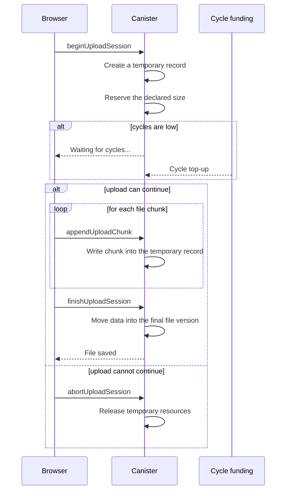

import { OverviewGroup, Steps } from '@rspress/core/theme';

## What On-chain Storage is

On-chain Storage keeps the file directly inside your personal canister. There
is no external storage service for the bytes: the canister keeps the file
itself, the file record, and access rules.

This mode is simpler to reason about, but it costs more. Every stored byte
lives in canister memory and is paid for with cycles, so On-chain Storage is a
better fit for small, high-value files.

:::tip Trade-off

You remove the external storage layer. In exchange, cost is higher, and cycle
balance becomes part of normal storage operations.

:::

## Where the file lives

The On-chain Storage path is shorter:

- your browser prepares and uploads the file directly to the canister;
- your personal canister keeps the file, trusted record, and access state;
- there is no external gateway or external object storage layer in the file
  path.

## How upload works

Before upload, the canister checks that it can safely accept the file: you have
write access, the declared size fits the storage, and the cycle balance is
enough for the operation.

<Steps>

### Prepare the file in the browser

The browser encrypts the file locally and splits it into chunks, so upload does
not require one large request.

### Send chunks to the canister

The canister accepts file chunks one by one and keeps the upload within the
allowed size and available cycles.

### Store the file and trusted record

After all chunks are transferred, the canister stores the file and records the
data your browser uses for later verification.

</Steps>

## When cycles are low

In On-chain Storage, cycle balance quickly becomes a practical constraint: the
file lives inside canister memory, and writing bytes also costs cycles. If the
safe balance is not enough during upload, two outcomes are possible.

- **Active Pro is enabled**: Rabbithole can request an automatic cycle top-up.
  The interface shows **Waiting for cycles...**, and the upload waits for
  funding.
- **Active Pro is not enabled**: the owner must top up the canister manually.
  After top-up, a compatible retry can continue the upload.

This is not an ownership error and does not mean the file is lost. The canister
is refusing to start work it cannot safely finish.

## How download works

<Steps>

### Request file chunks from the canister

The browser asks your canister for file data. There is no external file gateway
in the file path.

### Verify and open locally

The browser checks integrity and decrypts the file on your device.

</Steps>

## Why it costs more

On-chain Storage costs more because every stored byte lives inside canister
memory and affects the canister's operating balance.

- The network maintains file bytes over time.
- Stable memory and computation are paid from the canister's cycle balance.
- Large files require a larger safe floor and may trigger funding checks more
  often.

## Practical limits

On-chain Storage makes sense when:

- files are relatively small;
- the number of files is limited;
- simpler architecture matters more than cost efficiency;
- you are ready to monitor cycles or use active Pro.

For large media collections or cost-sensitive bulk storage, it is usually a poor
fit.

## Why the trust model is simpler

With On-chain Storage, there is no external file gateway and no external object
storage layer holding the file. That makes the storage path easier to reason
about:

- your browser prepares the file;
- your canister stores the file;
- your browser verifies and opens it again.

## Technical details

:::details Upload session

On-chain Storage does not write a large file directly into its final state.
Upload runs through a session: the canister creates a temporary record, reserves
the declared size, accepts file chunks, and only then moves data into the final
file version.

If cycles are low, the session waits for funding. A compatible retry can
continue the existing session, so upload does not have to start from zero. If
the upload cannot continue, the client tries to abort the session and release
temporary resources.

:::

## Continue reading

<OverviewGroup
  group={{
    name: 'Related pages',
    items: [
      {
        text: 'How Blob Storage works',
        link: '/how-it-works/storage/blob-storage',
      },
      {
        text: 'How Rabbithole verifies your files',
        link: '/how-it-works/storage/integrity',
      },
      {
        text: 'Payment & Cycles',
        link: '/how-it-works/payment',
      },
    ],
  }}
/>

<OverviewGroup
  group={{
    name: 'Official references',
    items: [
      {
        text: 'Canister smart contracts',
        link: 'https://docs.internetcomputer.org/building-apps/essentials/canisters',
      },
      {
        text: 'Canister storage and stable memory',
        link: 'https://internetcomputer.org/docs/building-apps/canister-management/storage',
      },
      {
        text: 'Motoko stable memory',
        link: 'https://internetcomputer.org/docs/motoko/base/ExperimentalStableMemory',
      },
    ],
  }}
/>
