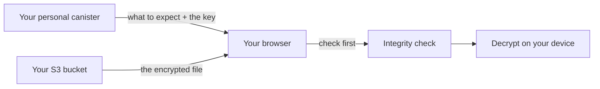

import { OverviewGroup, Steps } from '@rspress/core/theme';

## What it is

Rabbithole never stores your files itself. By default, the encrypted bytes of a
[Blob Storage](/how-it-works/storage/blob-storage) vault are held by
[**Caffeine Blob Storage**](https://caffeine.ai/) — an external service that
keeps them on S3-compatible storage and takes care of paying for that space and
keeping the stored data in order.

Own S3 storage swaps that service for a **bucket** you own — the container an S3
provider keeps objects in. The way everything works stays the same; only two
things change:

- **Who holds the bytes** — your own bucket instead of Caffeine.
- **Who pays for the space** — you pay your provider directly, instead of your
  canister paying Caffeine.

Everything else is unchanged. Files are still encrypted in your browser, and
your canister still keeps the file records, the access rules, and signs the
links used to read and write. Your bucket only ever holds encrypted data, so the
provider can see object sizes and access times but never anything readable.

## Why you might use it

- Keep the encrypted files with a provider you chose and trust, instead of the
  default service.
- Pick the region and retention policy yourself, and pay the provider at their
  price.
- Let your own canister — not a third party — track what is stored and clean up
  what you delete.

Own S3 storage is a switch you turn on for an existing Blob Storage vault, not a
separate mode you pick when creating one. On-chain vaults keep the bytes inside
your canister and never use a bucket.

## What you need, and where to get it

A **bucket** is just a container that a cloud provider keeps objects in. To
connect one you need an S3-compatible bucket and an access key that can read and
write to it. Any of these work:

- **AWS S3**, **Cloudflare R2**, **Backblaze B2**, **Wasabi** — hosted
  providers. You sign up, create a bucket, and generate an access key.
- **MinIO** — S3-compatible storage you run yourself, if you'd rather host it.

At your provider you do three things: create a bucket, note its region and the
S3 API address (the endpoint), and create an access key **scoped to that one
bucket** — not your whole account. That last part matters: the key lives in your
canister, so give it the least access it needs.

Here is what each field on the connect form is and where it comes from:

| Field | What it is | Where to find it |
|---|---|---|
| **Endpoint** | The HTTPS address of your provider's S3 API | Your provider's docs or bucket settings — e.g. `https://s3.us-east-1.amazonaws.com`, `https://<account>.r2.cloudflarestorage.com` |
| **Region** | The bucket's region code | Chosen when you create the bucket — e.g. `us-east-1` (`auto` for R2) |
| **Bucket** | The bucket's name | The name you gave it |
| **Prefix** | An optional folder-like path all objects go under | You choose it — e.g. `rabbithole/storage` |
| **Access key ID** + **Secret** | The credentials that let the canister sign links | Your provider's access-keys / API-tokens page |
| **Session token** | Only for temporary credentials | Leave empty for normal long-lived keys |
| **Force path-style** | Picks the URL format | On (the default) for MinIO and most S3-compatible providers; off for AWS S3 |

## How you connect a bucket

Connecting a bucket is a Pro feature. Once it is connected, everyday use —
uploading, downloading, sharing — works exactly as before.

<Steps>

### Open Data storage

On a Blob Storage vault, open the **Data storage** settings page.

### Enter the bucket details

Fill in the fields above: endpoint, region, bucket name, an optional prefix, and
the access key with its secret. A session token and the path-style toggle are
there for providers that need them.

### Rabbithole checks access before saving

Before anything is stored, Rabbithole writes, reads, and deletes a throwaway
test object to confirm the access key really works. If that check fails, nothing
is saved — no bucket record and no secret.

</Steps>

:::note Your secret stays in the canister

The browser never receives your S3 secret. The storage canister keeps it and
uses it only to sign short-lived links for specific objects. Canister state is
copied across the Internet Computer, so treat this as a practical convenience,
not a password vault: give the access key permission for this one bucket and
prefix, nothing more.

:::

## Where the file lives


Your canister and your bucket do different jobs. The canister keeps the file
record, decides who has access, and signs the links used to read and write. The
bucket holds two encrypted objects per file and nothing else:

```text
{prefix}/v1/blobs/{rootHash}/tree.json   how the file is verified
{prefix}/v1/blobs/{rootHash}/blob.bin    the encrypted file
```

The object names are just hashes under the prefix you chose. They carry no file
names, folders, or email addresses, so the provider sees only object sizes and
access times — never anything readable.

## How upload works

Uploading happens in a few steps.

<Steps>

### Prepare

The browser encrypts the file, then asks the canister for permission to upload.
The canister checks that you may write and hands back short-lived signed links
for this specific file.

### Send it to your bucket

The browser uploads the encrypted file straight to your bucket using those
links. Large files are sent in parts.

### Confirm

Once the upload succeeds, the browser asks the canister to record the file: its
size, its hash, and who may open it.

</Steps>

An upload that never reaches the confirm step does not become a file, and the
leftover objects are cleaned up on their own.

## How download works



The browser reads the encrypted file from your bucket, but it still asks the
canister what to expect and for permission to decrypt, and checks the file
against that before opening it. A link that leaks exposes only encrypted bytes —
without the canister's approval, no one can decrypt them.

:::note The signed links are short-lived

Each link works for one object and one action, and expires in minutes. Treat it
like a key: whoever holds it can do that one action until it expires. A leaked
read link shows only encrypted bytes; a leaked write link can at worst spoil an
upload — it cannot reveal your files.

:::

## Deleting files

Deletion happens in two stages, and the cleanup runs by itself.

When you delete a file, it disappears from the app right away: the canister
stops listing it and stops handing out the key to decrypt it.

The bytes are removed from your bucket afterwards, in the background. This is the
job Caffeine's cleanup does in the default mode; with your own bucket, your
canister does it — it sends a delete request and confirms the object is really
gone before the job counts as done. A delete that does not go through is retried
automatically. The one case that needs you is a broken access key: cleanup
pauses and the page shows a warning until you replace it.

## What it costs

There is no Rabbithole storage fee for the bytes. Your provider bills you for
them directly, at whatever they charge.

Your canister still needs [cycles](/how-it-works/payment) for its own work:
signing links and making the small delete and verify calls to your bucket during
cleanup. With Pro, [automatic top-ups](/how-it-works/payment#how-automatic-cycle-top-ups-work)
can keep it funded.

## Changing the access key or the bucket

- **Replace the access key** — same endpoint, bucket, and prefix. Create a new
  key at your provider, save it (Rabbithole re-checks access), then turn off the
  old one. Replacing the key on a bucket you already use does not require Pro.
- **Move to a different bucket** — a new endpoint, bucket, or prefix is treated
  as a new place. From then on, new uploads go there. Files you already stored
  keep pointing to where their bytes actually are.

:::note Switching buckets does not move old files

Each file remembers the exact bucket it was written to. Connecting a new bucket
changes where the next uploads go; it does not copy your existing files across.

:::

## What stays the same

Own S3 storage changes where the encrypted bytes live and who you pay for them.
Ownership and protection do not change: files are still encrypted in your browser
before they leave your device, the browser still verifies a file before
decrypting it, and your canister still keeps ownership, access rules, and the
trusted file records. Starter Vault and Pro still decide which encrypted uploads
are allowed.

:::note Availability now depends on your provider

Because the bytes live in your bucket, keeping them reachable is between you and
your provider. If you stop paying the provider or lose access to the bucket, the
encrypted files can become unavailable. Your canister still keeps the file
record either way.

:::

## Continue reading

<OverviewGroup
  group={{
    name: 'Related pages',
    items: [
      {
        text: 'How Blob Storage works',
        link: '/how-it-works/storage/blob-storage',
      },
      {
        text: 'How Rabbithole verifies your files',
        link: '/how-it-works/storage/integrity',
      },
      {
        text: 'What Rabbithole Pro gives you',
        link: '/how-it-works/pro',
      },
      {
        text: 'Trust Model',
        link: '/how-it-works/trust-model',
      },
    ],
  }}
/>

<OverviewGroup
  group={{
    name: 'Official references',
    items: [
      {
        text: 'Canister smart contracts',
        link: 'https://docs.internetcomputer.org/building-apps/essentials/canisters',
      },
      {
        text: 'HTTPS outcalls',
        link: 'https://docs.internetcomputer.org/building-apps/network-features/using-http/https-outcalls/overview',
      },
      {
        text: 'Certified data',
        link: 'https://docs.internetcomputer.org/tutorials/developer-liftoff/level-3/3.3-certified-data',
      },
    ],
  }}
/>
