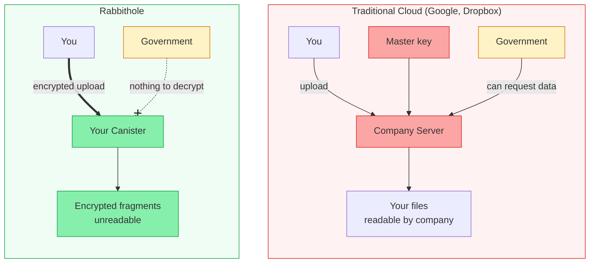

## What do you need to trust?

Every storage system has a trust model. Use this page to see what Rabbithole
removes from the trust path and what you still need to trust.

File contents are encrypted in your browser before upload. Rabbithole, storage
infrastructure, and node operators do not receive the readable file.

Privacy and availability are separate properties. Encryption protects file
contents. Availability depends on the storage mode, cycle balance, and, for
Blob Storage, retention rules of the external storage layer.

If TEE support is available on the relevant IC subnet, it can improve runtime
isolation. Treat it as an additional hardening layer, not as Rabbithole's
primary privacy guarantee.

### You do NOT need to trust

- **Rabbithole team** — we never see plaintext file contents
- **ICP node operators** — they process encrypted blobs
- **Network infrastructure** — encryption happens before data touches the network

### You DO need to trust

- **The encryption code** — it's [open source](https://github.com/rabbithole-app/v2), audit it yourself
- **Your browser** — the encryption runs in your browser's JavaScript engine
- **Internet Identity** — for authentication (also open source)
- **ICP consensus** — that the network correctly executes canister code

## Threat model

First, separate the properties. Encryption protects file contents, access
control decides who may request the file and key, and integrity verification
helps detect byte replacement. The table below avoids a single protected/not
protected label and shows the boundary instead: how protection works and what
remains a separate responsibility.

| Scenario | How protection works | Boundary |
|----------|----------------------|----------|
| Rabbithole team gets access to files | Plaintext file contents do not reach Rabbithole | The file is encrypted in the browser before upload |
| Man-in-the-middle attack | The browser verifies response and transport authenticity | It relies on IC certified responses and HTTPS |
| ICP node operator peeks at data | Nodes receive encrypted data only | Data reaches IC after browser-side encryption |
| Government requests data from Rabbithole | Rabbithole does not have plaintext file contents | Metadata and service records are not file contents |
| You lose your device | Access can be recovered through Internet Identity | The lost device still needs operating-system protection |
| Unwanted canister upgrade | Installing a new version requires the controller | If you are the controller, review code before upgrading |
| Canister runs low on cycles | File-content privacy does not change | This is an availability issue: top up manually or use active Pro |
| Blob Storage stops retaining bytes | The canister keeps the trusted file record | Byte availability depends on Blob Storage funding and retention |

## Rabbithole vs Traditional Cloud

## Comparison with other solutions

| Solution | Decentralization | Trust Required | Data Sovereignty |
|----------|:---:|:---:|:---:|
| Google Drive | — | High | None |
| Dropbox | — | High | None |
| Tresorit | — | Medium | Partial (E2E, but company controls infra) |
| IPFS + Encryption | High | Medium | Partial (no built-in encryption) |
| **Rabbithole** | **High** | **Low** | **Full (you own the canister)** |

:::note{title="No system is perfect"}

Rabbithole reduces trust assumptions, but it does not remove them entirely. If
you find a weakness, [report it](https://github.com/rabbithole-app/v2/issues).

:::
