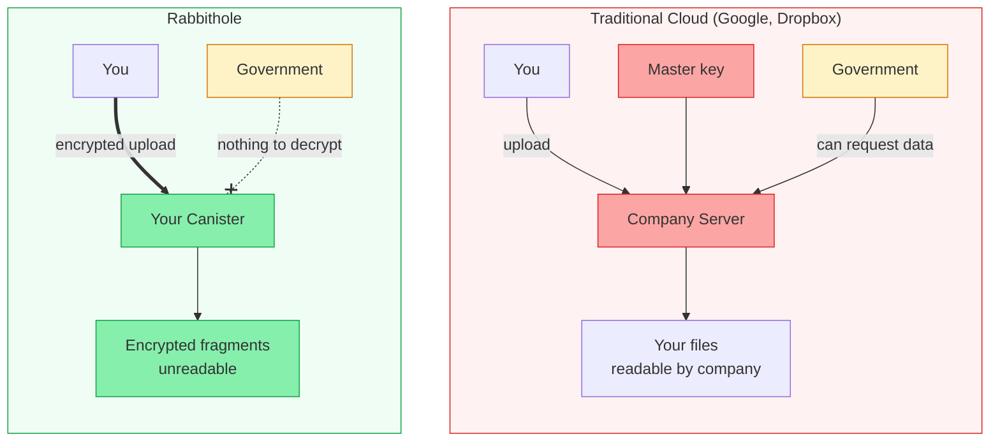

## What do you need to trust?

Every storage system requires some level of trust. Here's exactly what Rabbithole requires — and what it doesn't.

### You do NOT need to trust

- **Rabbithole team** — we never see your plaintext data
- **ICP node operators** — they only process encrypted blobs
- **Network infrastructure** — encryption happens before data touches the network

### You DO need to trust

- **The encryption code** — it's [open source](https://github.com/rabbithole-app/v2), audit it yourself
- **Your browser** — the encryption runs in your browser's JavaScript engine
- **Internet Identity** — for authentication (also open source)
- **ICP consensus** — that the network correctly executes canister code

## Threat model

| Threat | Protected? | How |
|--------|-----------|-----|
| Rabbithole reads your files | Yes | Client-side encryption, zero-knowledge storage |
| Hacker breaches your canister | Yes | Only encrypted blobs stored |
| Man-in-the-middle attack | Yes | IC certified responses + HTTPS |
| ICP node operator peeks at data | Yes | Data encrypted before reaching IC |
| Government requests your data | Yes | Rabbithole has nothing to hand over |
| You lose your device | Partial | Re-authenticate with recovery on Internet Identity |
| Malicious code update | Mitigated | Open source, canister upgrade requires controller (you) |

## Rabbithole vs Traditional Cloud

## Comparison with other solutions

| Solution | Decentralization | Trust Required | Data Sovereignty |
|----------|:---:|:---:|:---:|
| Google Drive | — | High | None |
| Dropbox | — | High | None |
| Tresorit | — | Medium | Partial (E2E, but company controls infra) |
| IPFS + Encryption | High | Medium | Partial (no built-in encryption) |
| **Rabbithole** | **High** | **Low** | **Full (you own the canister)** |

:::note{title="No system is perfect"}

Rabbithole minimizes trust assumptions, but no system can eliminate them entirely. We believe in transparency: if you find a weakness, [report it](https://github.com/rabbithole-app/v2/issues).

:::
