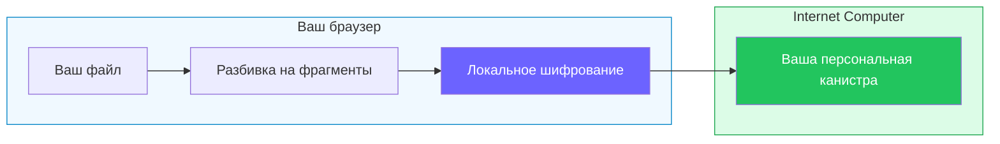

# Rabbithole — зашифрованное децентрализованное хранилище под вашим контролем

Rabbithole — файловое хранилище для тех, кому нужен привычный облачный диск, но
без центрального владельца, которому приходится доверять файлы, права доступа и
ключи шифрования.

В обычном облаке ваши файлы, серверная логика, интерфейс и правила доступа
живут в инфраструктуре оператора. Rabbithole устроен иначе: для вашего аккаунта
создаётся отдельное хранилище на [Internet Computer](https://internetcomputer.org/),
с собственным веб-интерфейсом, кодом, состоянием и правилами доступа.

Internet Computer важен здесь не как модное слово про блокчейн. Это сеть, где
приложение может работать целиком: фронтенд, серверная часть, состояние и
пользовательские хранилища не нужно выносить в обычное облако. Благодаря этому
Rabbithole создаёт для вас не просто запись в базе данных, а отдельную канистру
хранилища, контроль над которой передаётся вам.

[Канистру](https://docs.internetcomputer.org/concepts/canisters/) можно
воспринимать как смарт-контрактное приложение: у неё есть код, состояние и
собственный ресурсный баланс. В Rabbithole такая канистра хранит записи о
файлах, права доступа и, в зависимости от режима хранения, сами байты файлов.

В зашифрованном режиме файл шифруется прямо в браузере, ещё до загрузки.
Открытые данные не отправляются в серверную часть хранилища, а ключи не
выводятся из пароля и не хранятся как мастер-ключ у Rabbithole. Технические
страницы позже объясняют
[vetKeys](https://docs.internetcomputer.org/concepts/vetkeys/) и способы
хранения; для старта важно главное: контроль над хранилищем и криптография
заложены в архитектуру, а не только в обещание сервиса.

Если термины Internet Computer пока незнакомы, начните со страницы
[Основные понятия](./concepts).

## Как это работает за 30 секунд

1. Вы входите через [Internet Identity](https://id.ai), без отдельного
   пароля Rabbithole.
2. Rabbithole создаёт независимую канистру хранилища для вашего аккаунта.
3. Вы загружаете файлы через приложение.
4. Если шифрование включено, браузер шифрует файл до загрузки.
5. При скачивании браузер проверяет и расшифровывает файл локально.

## Ключевая идея

Большинство облачных хранилищ просит поверить обещанию оператора: что он
защитит серверную часть, правильно применит права доступа, сохранит сервис
живым и не раскроет ваши файлы или ключи. Rabbithole старается перенести больше
этого доверия в архитектуру.

Владение хранилищем выражается через контроль над канистрой. Правила доступа
живут вместе с канистрой хранилища. Когда шифрование включено, файлы шифруются
в браузере, а ключи выводятся сетью, а не из мастер-ключа, который Rabbithole
хранит у себя.

Это не магия и не отмена всех допущений. Ваш браузер, протокол Internet
Computer и код Rabbithole всё ещё важны. Но центр тяжести меняется: продукт
меньше опирается на “поверьте нам” и больше — на границы протокола, владение
канистрой и криптографию.

## Как сюда вписываются vetKeys

Представьте сейф, у которого нет одного главного ключа. Для каждого файла
Rabbithole просит сеть вывести файловый ключ через
[vetKeys](https://docs.internetcomputer.org/concepts/vetkeys/): каждый
vetKD-узел выдаёт только свою часть, а полный ключ собирается уже в вашем
браузере. Один узел не может открыть сейф сам и не видит полный ключ.

Standard и High Replication — продуктовые названия двух уровней VetKey в
Rabbithole. Числа узлов относятся к сервису ключей, а не к копиям файла. Если
нужны детали, читайте [Ключи и vetKeys](/ru/how-it-works/encryption/vetkeys).

## Сравнение с конкурентами

| Сервис | E2E шифрование | Zero-Knowledge | Открытый код | Децентрализация | Вы владеете инфраструктурой | Деривация ключей |
|--------|:---:|:---:|:---:|:---:|:---:|---|
| Google Drive | — | — | — | — | — | Ключи компании |
| Dropbox | — | — | — | — | — | Ключи компании |
| Tresorit | Да | Да | — | — | — | Из пароля |
| ProtonDrive | Да | Да | Частично | — | — | Из пароля |
| Internxt | Да | Да | Да | — | — | Из пароля |
| Filen | Да | Да | Частично | — | — | Из пароля |
| Storj | Да | Да | Да | Да | — | На клиенте |
| **Rabbithole** | **Да** | **Да** | **Да** | **Да** | **Да** | **Пороговая криптография (vetKeys)** |

**Чем Rabbithole отличается:**
- **Нет паролей для деривации ключей** — ваш ключ вычисляется из вашей
  [Internet Identity](https://id.ai) самой сетью
- **Персональная канистра** — вы владеете смарт-контрактом, где хранятся ваши
  данные. После успешной передачи контроля Rabbithole удаляет себя из
  контроллеров
- **Проверяемая реализация** — код
  [открыт](https://github.com/rabbithole-app/v2), шифрование работает в вашем
  браузере, а деривация ключей обеспечивается консенсусом IC

В зашифрованном режиме открытый текст не загружается в канистру или Blob Storage.
Rabbithole всё равно полагается на ваш браузер, консенсус IC и корректный код.
Эти допущения перечислены на странице [Модель доверия](/ru/how-it-works/trust-model).

:::tip{title="Хотите подробнее?"}

- [Основные понятия](/ru/getting-started/concepts) — канистры, principal,
  контроллеры, циклы и vetKeys
- [Как работает шифрование](/ru/how-it-works/encryption) — пользовательская модель приватности
- [Ключи и vetKeys](/ru/how-it-works/encryption/vetkeys) — Standard, High Replication и деривация ключей
- [Суверенитет данных](/ru/how-it-works/sovereignty) — создание канистры, передача контроля, что если Rabbithole исчезнет
- [Модель доверия](/ru/how-it-works/trust-model) — модель угроз, чему нужно и не нужно доверять

:::
