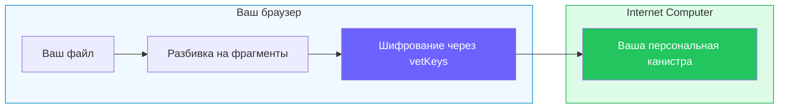

# Rabbithole — privacy-first хранилище без лишнего доверия

Что если ваше облачное хранилище не сможет прочитать файлы — не из-за политики компании, а из-за **математики**, когда шифрование включено?

Rabbithole — децентрализованное файловое хранилище на [Internet Computer](https://internetcomputer.org/). В зашифрованном режиме Rabbithole не просит вас доверять компании конфиденциальность файлов. Он заменяет это доверие **верифицируемыми криптографическими гарантиями**.

## Ключевая идея

Rabbithole задуман вокруг сквозного шифрования, хотя само шифрование зависит от тарифа и настроек папки.

Каждый сервис зашифрованного хранения обещает: «мы не можем прочитать ваши файлы». Но есть принципиальная разница между **политикой** и **математикой**:

| | Безопасность на политике | Безопасность на математике (Rabbithole) |
|---|---|---|
| «Мы не читаем ваши файлы» | Обещание | **Невозможно по конструкции** |
| Ключи шифрования | На серверах компании | **Никогда не существуют в одном месте** |
| Запрос государства | Компания может выполнить | **Нечего предоставить** |
| Компания закрылась | Данные могут быть потеряны | **Данные остаются на блокчейне** |
| Кто владеет инфраструктурой | Компания | **Вы** |

## Почему vetKeys меняют правила игры

Большинство зашифрованных хранилищ выводят ключ из пароля. Это значит: если кто-то узнает пароль — получит файлы. Если компанию принудят — она потенциально может восстановить ключи.

Rabbithole использует [vetKeys](https://docs.internetcomputer.org/building-apps/network-features/vetkeys/introduction/) — протокол пороговой криптографии, встроенный в Internet Computer:

- Ваш ключ шифрования **вычисляется по запросу** 13-34 независимыми узлами совместно
- **Ни один узел** никогда не знает ваш полный ключ
- Ключ **выводится из вашей идентичности** — нет паролей, которые можно потерять или украсть
- Каждый файл получает **уникальный производный ключ** — компрометация одного файла не затрагивает другие
- Математика основана на **пороговых подписях BLS12-381** и **шифровании на основе идентичности (IBE)** — хорошо изученных криптографических примитивах

:::note{title="Простыми словами"}

Представьте от 13 до 34 охранников, каждый из которых держит кусочек ключа. Только когда достаточное количество из них подтвердит, что это вы, кусочки собираются в ключ, который существует только в вашем браузере, на долю секунды, а потом исчезает. Ни один охранник никогда не видит полный ключ.

:::

## Сравнение с конкурентами

| Сервис | E2E шифрование | Zero-Knowledge | Открытый код | Децентрализация | Вы владеете инфраструктурой | Деривация ключей |
|--------|:---:|:---:|:---:|:---:|:---:|---|
| Google Drive | — | — | — | — | — | Ключи компании |
| Dropbox | — | — | — | — | — | Ключи компании |
| Tresorit | Да | Да | — | — | — | Из пароля |
| ProtonDrive | Да | Да | Частично | — | — | Из пароля |
| Internxt | Да | Да | Да | — | — | Из пароля |
| Filen | Да | Да | Частично | — | — | Из пароля |
| Storj | Да | Да | Да | Да | — | На клиенте |
| **Rabbithole** | **Да** | **Да** | **Да** | **Да** | **Да** | **Пороговая криптография (vetKeys)** |

**Что отличает Rabbithole:**
- **Нет паролей для деривации ключей** — ваш ключ вычисляется из вашей [Internet Identity](https://id.ai/) самой сетью
- **Персональная канистра** — вы владеете смарт-контрактом, где хранятся ваши данные. После развёртывания Rabbithole удаляет себя из контроллеров
- **Верифицируемость** — весь код [открыт](https://github.com/rabbithole-app/v2), шифрование работает в вашем браузере, деривация ключей обеспечивается консенсусом блокчейна

## Как это работает (за 30 секунд)

1. **Вы владеете канистрой** — персональный смарт-контракт разворачивается специально для вас. См. [Суверенитет данных](/ru/how-it-works/sovereignty)
2. Вы входите через **[Internet Identity](https://id.ai/)** — passkeys, биометрия или социальный вход. Без паролей
3. Если для этого файла включено шифрование, он **шифруется в браузере** ключами, вычисленными через vetKeys
4. Файл сохраняется через **вашу персональную канистру**
5. При скачивании файл сначала проверяется и **расшифровывается локально**, если шифрование было включено

В зашифрованном режиме сервер никогда не видит ваши данные в открытом виде. Не потому что мы обещаем — потому что это заблокировано самой архитектурой.

:::tip{title="Хотите подробнее?"}

- [Как работает шифрование](/ru/how-it-works/encryption) — фрагменты, AES-GCM, деривация ключей для каждого файла
- [Суверенитет данных](/ru/how-it-works/sovereignty) — создание канистры, передача контроля, что если Rabbithole исчезнет
- [Модель доверия](/ru/how-it-works/trust-model) — модель угроз, чему нужно и не нужно доверять

:::
