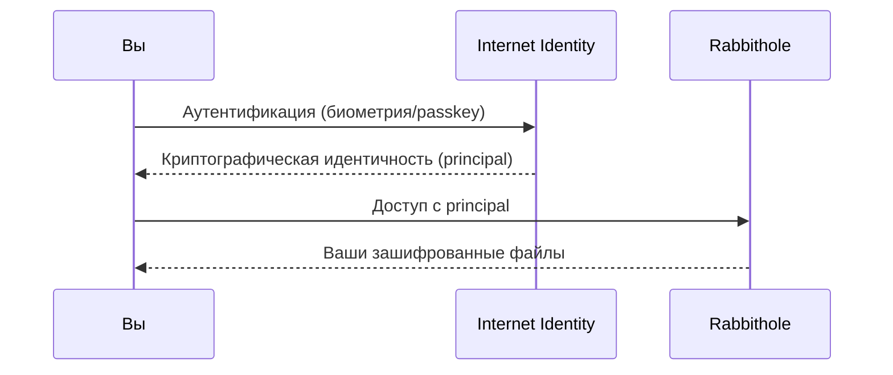
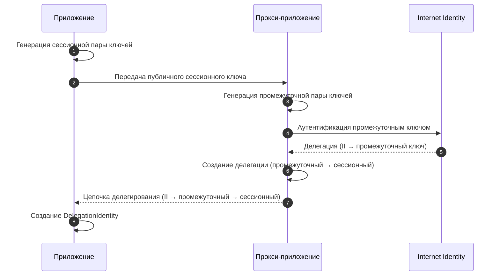

## Без паролей. Без email. Только вы.

Rabbithole использует **[Internet Identity](https://id.ai/)** — децентрализованную систему аутентификации, встроенную в Internet Computer. Вы входите через:

- **Passkeys** (отпечаток пальца, Face ID) — синхронизируются между устройствами
- **Социальный вход** (Google, Apple, Microsoft) — без потери приватности
- **Аппаратные ключи безопасности** (YubiKey)

Без email. Без пароля, который можно забыть. Без базы данных учётных записей.



## Одна идентичность везде

Независимо от того, обращаетесь ли вы к хранилищу через **rabbithole.app** или напрямую по адресу **https://&lt;canisterId&gt;.icp0.io**, ваша идентичность остаётся одной и той же. Rabbithole достигает этого с помощью **цепочки делегирования ключей** — стандартного механизма Internet Computer, при котором Internet Identity выпускает криптографическое делегирование промежуточному ключу, а тот, в свою очередь, делегирует вашему сессионному ключу.

Это означает, что вам не нужно входить отдельно для каждого URL. Ваш Principal ID всегда один и тот же.

## Почему это лучше?

| | Обычная авторизация | Internet Identity |
|---|---|---|
| **Данные входа** | Email + пароль | Биометрия / passkey |
| **Где хранятся?** | База данных компании | Только на вашем устройстве |
| **Можно украсть фишингом?** | Да | Нет |
| **Утечки данных?** | Миллионы паролей утекают | Нечему утекать |
| **Отслеживание между сайтами?** | Один email везде | Уникальная идентичность для каждого приложения |

## Приватность по умолчанию

Internet Identity создаёт **уникальный principal** (идентичность) для каждого приложения:

- Rabbithole не может отслеживать вас в других приложениях
- Другие приложения не знают, что вы используете Rabbithole
- Нет центрального провайдера, который видит всю вашу активность

---

## Технические детали

:::details{title="Нажмите, чтобы развернуть"}

### Как работает Internet Identity

Internet Identity — это **канистра** в Internet Computer, которая:

1. Хранит публичный ключ вашего устройства (WebAuthn/FIDO2)
2. Выпускает **делегации** — краткосрочные криптографические сертификаты
3. Каждая делегация привязана к конкретному приложению (разный principal для каждого)

### Цепочка делегирования ключей

Rabbithole использует промежуточное делегирование ключей для обеспечения одного и того же Principal через разные точки доступа (rabbithole.app, прямой URL канистры):



Этот подход следует [рекомендации безопасности IC](https://internetcomputer.org/docs/building-apps/security/iam#recommendation-6): промежуточный ключ выступает как защищённое прокси, поэтому сессионный ключ никогда не передаётся напрямую в Internet Identity.

### Principals

Ваша идентичность в Rabbithole — это **principal** — криптографический идентификатор вида:
```
o57ld-4as4d-f6pr2-nnmyc-mslbj-67jt3-3huxb-x6jul-f3doo-yxyhi-wqe
```

Этот principal:
- Детерминистически выводится из вашего Internet Identity anchor + origin приложения
- Используется для вывода ключа шифрования через vetKeys
- Единственный ключ доступа к вашим файлам

### Управление сессиями

- Делегации имеют настраиваемое время жизни (обычно от 30 минут до 24 часов)
- Никакие токены сессий не хранятся на серверах
- Повторная аутентификация требует подтверждения биометрией/passkey

:::
