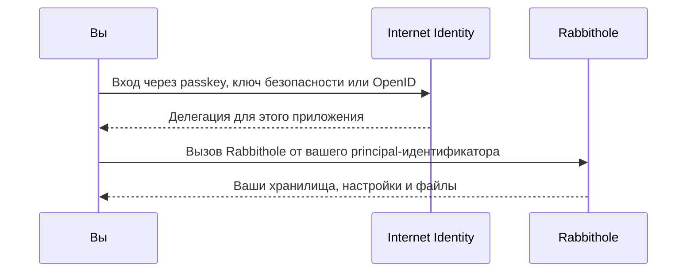
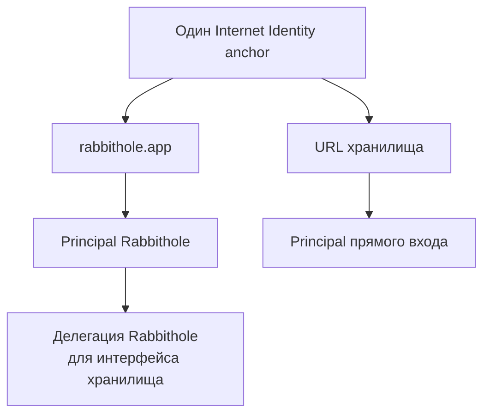
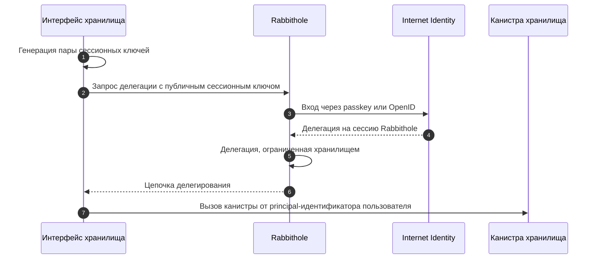
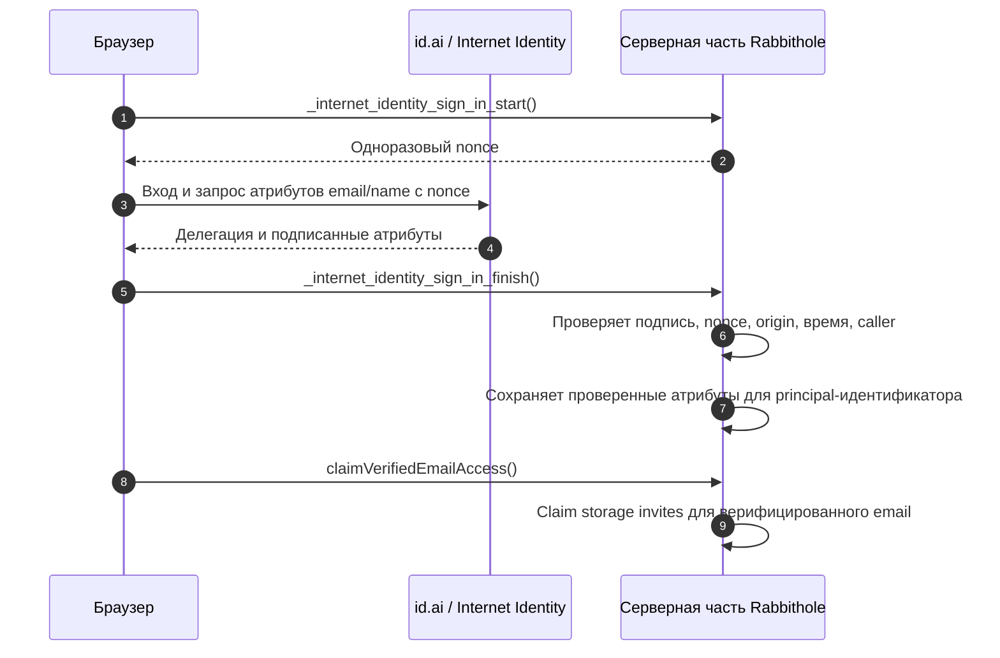

Аутентификация в Rabbithole начинается с Internet Identity и приводит к
principal-идентификатору, который может вызывать канистры. Проверенные
атрибуты, например email, находятся на отдельном уровне. Они помогают
поддерживать совместный доступ и уведомления, но не становятся вашим паролем
или ключом шифрования.

## Вход без паролей

Rabbithole использует **[Internet Identity](https://id.ai)** — систему
аутентификации Internet Computer. Вы можете войти несколькими способами без
пароля.

- **Ключи доступа (passkeys)**: Touch ID, Face ID, Windows Hello или
  аппаратные ключи безопасности
- **OpenID-аккаунты**: Google, Apple или Microsoft, если выбранный поток входа
  их поддерживает
- **SSO**: корпоративный вход, если он доступен для вашего аккаунта
- **Аппаратные ключи безопасности**, например YubiKey

У Rabbithole нет отдельного пароля, который нужно помнить, и нет базы паролей,
которую можно взломать. Ваше устройство или провайдер входа доказывает вашу
личность Internet Identity, а Rabbithole получает криптографический
идентификатор — **principal**.



## Отделяйте аутентификацию от атрибутов

Вашего **principal-идентификатора** достаточно, чтобы аутентифицировать вас.
Rabbithole не нужен email, чтобы понять, какой аккаунт вызывает серверную
часть.

Некоторые потоки входа также могут передавать **проверенные Identity
Attributes** — например email или имя. Эти атрибуты отделены от
аутентификации.

- Аутентификация отвечает: **какой principal-идентификатор делает вызов?**
- Атрибуты отвечают: **какой проверенный email или имя вы решили передать?**

Rabbithole использует атрибуты только когда они доступны через поток Internet
Identity и привязаны к вошедшему principal-идентификатору.

## Используйте email для совместного доступа

Rabbithole создаётся для приватного совместного доступа к хранилищам, в том
числе с людьми, которые ещё не зарегистрировались. Проверенный email
поддерживает сценарии, которые сложно построить только через
principal-идентификаторы.

- **Приглашение по email**: владелец хранилища может пригласить email-адрес до
  того, как человек создал аккаунт Rabbithole. Когда этот человек позже войдёт
  с совпадающим проверенным email, Rabbithole сможет автоматически связать
  приглашение с его principal-идентификатором.
- **Будущие уведомления**: email можно использовать для важных уведомлений о
  хранилищах, доступе, оплате или безопасности, когда пользователь не находится
  в приложении.
- **Меньше повторной проверки**: если email уже проверен через Internet
  Identity или OpenID, Rabbithole не нужно строить отдельный процесс
  подтверждения того же email.

Email не является вашим паролем, приватным ключом или ключом шифрования.
Аккаунт и доступ к файлам по-прежнему контролируются вашим Internet Identity
principal-идентификатором и разрешениями, сохранёнными в вашей канистре.

Читайте [Совместный доступ](./sharing/index), чтобы увидеть, как приглашение по
проверенному email превращается в права внутри канистры хранилища.

## Сохраняйте приватность по умолчанию

Internet Identity устроена так, чтобы приложения не получали глобальный
идентификатор пользователя. Пользователь получает отдельный стабильный
псевдоним для каждого веб-адреса приложения. Это помогает предотвращать
отслеживание между приложениями.

Для Rabbithole это означает:

- Другие приложения не могут определить ваш аккаунт Rabbithole по своему входу
  через Internet Identity.
- Rabbithole не получает ваш номер Internet Identity anchor или секреты ключа
  доступа.
- Биометрия не покидает устройство; она только разблокирует локальный passkey.
- Передаваемые атрибуты ограничены тем, что поддерживает поток входа и что
  разрешил пользователь.

## Используйте один аккаунт в интерфейсах хранилища

Ваша персональная канистра хранилища отдаёт собственный веб-интерфейс. Без
дополнительного механизма прямой URL канистры и `rabbithole.app` были бы
разными веб-адресами.

Rabbithole решает это через **посредническую делегацию**. Вы входите через
Rabbithole, после чего Rabbithole выпускает делегацию только для нужной цели:
сессии веб-интерфейса хранилища. Этот интерфейс может вызывать следующие
канистры:

- Вашу канистру хранилища
- Серверную часть Rabbithole
- Управляющую канистру IC, когда это нужно для операций с канистрой

Так пользовательский опыт остаётся простым. Вам не нужно создавать отдельный
аккаунт только потому, что вы открыли своё хранилище напрямую.

## Почему у одного пользователя бывают разные principal

Internet Identity защищает приватность тем, что не выдаёт один глобальный
идентификатор во все приложения. Один и тот же Internet Identity anchor
получает разные principal-идентификаторы для разных веб-адресов приложения.

Для Rabbithole это важно в двух сценариях:

- При входе через `rabbithole.app` Internet Identity выводит principal для
  основного приложения Rabbithole.
- При прямом входе через `<ваше-хранилище>.icp0.io` Internet Identity выводит
  другой principal, потому что это другой веб-адрес приложения.

В обычном сценарии хранилище всё равно видит principal основного приложения:
интерфейс хранилища получает делегацию от Rabbithole и использует её для
вызовов канистры. Поэтому пользователь не замечает разницы.



Запасной principal прямого входа используется в доступе восстановления. Это
позволяет владельцу подтвердить себя через веб-адрес самого хранилища, если
ему нужен прямой путь к своей канистре.

## Доверяйте проверенным атрибутам

Обычное поле формы — это просто заявление пользователя. Проверенный
**Identity Attribute** устроен иначе: он подписан или сертифицирован потоком
Internet Identity и отправляется в Rabbithole так, что серверная часть может
его проверить.

Rabbithole проверяет данные атрибутов перед сохранением.

1. Данные должны быть подписаны доверенной канистрой подписи Internet Identity.
2. Данные должны относиться к тому же principal-идентификатору, который
   вызывает Rabbithole.
3. Одноразовый `nonce` должен быть выдан Rabbithole и ещё не использоваться.
4. Веб-адрес (`origin`) должен совпадать с ожидаемым адресом Rabbithole.
5. Время подписи должно быть свежим.

Только после этих проверок Rabbithole сохраняет атрибуты вроде `email`,
`name`, `verifiedEmail` и `authProvider`.

---

## Технические детали

Техническая схема состоит из двух частей: делегации доказывают, что сессия
может действовать как principal-идентификатор, а Identity Attributes доказывают
конкретные сведения профиля, которые пользователь передал через поток входа.

:::details{title="Делегации, principal-идентификаторы и проверенные атрибуты"}

### Principal

**Principal** — это криптографический идентификатор, который Rabbithole
использует как ID вашего аккаунта. Он выглядит примерно так:

```text
o57ld-4as4d-f6pr2-nnmyc-mslbj-67jt3-3huxb-x6jul-f3doo-yxyhi-wqe
```

Principal используется, чтобы:

- идентифицировать вашу запись пользователя в Rabbithole,
- проверять разрешения на доступ к хранилищам,
- получать доступ к ключам зашифрованных файлов через vetKeys,
- и управлять вашей персональной канистрой хранилища там, где это применимо.

Principal зависит от веб-адреса приложения. Эта зависимость нужна для
приватности: разные приложения не могут просто сравнить один глобальный ID и
понять, что перед ними один и тот же человек.

### Цепочка делегирования

Internet Identity не передаёт Rabbithole приватный ключ passkey. Вместо этого
она подписывает краткоживущую делегацию на сессионный ключ. Rabbithole также
использует посредническую делегацию, когда веб-интерфейс хранилища должен
работать как та же пользовательская сессия.



Ограничение цели задаёт, где можно использовать делегированную сессию.

### Синхронизация Identity Attributes

Когда атрибуты доступны, браузер получает у Internet Identity подписанные
атрибуты с одноразовым nonce. Затем он выполняет финальный вызов входа от имени
identity, в которую добавлены эти атрибуты. Серверная часть проверяет подпись,
nonce, origin, время и caller, а затем сохраняет проверенные атрибуты для
principal-идентификатора. Получение доступа к storage invite остаётся отдельным
шагом и использует только уже верифицированный email.



Серверная часть отклоняет устаревшие, неподписанные, повторно использованные,
подписанные не тем источником или пришедшие с неверного веб-адреса данные до
сохранения атрибутов.

### Дополнительные материалы

Эти ресурсы помогут глубже разобраться в Internet Identity и Identity
Attributes.

- [Internet Identity](https://id.ai)
- [Internet Identity GitHub repository](https://github.com/dfinity/internet-identity)
- [Internet Identity specification](https://docs.internetcomputer.org/reference/internet-identity-spec/)
- [Identity Attributes design discussion](https://forum.dfinity.org/t/identity-attributes/64212)
- [Совместный доступ в Rabbithole](./sharing/index)

:::
