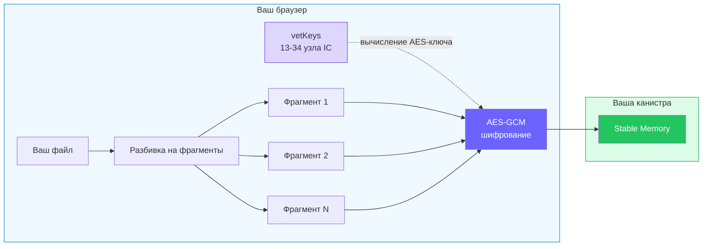
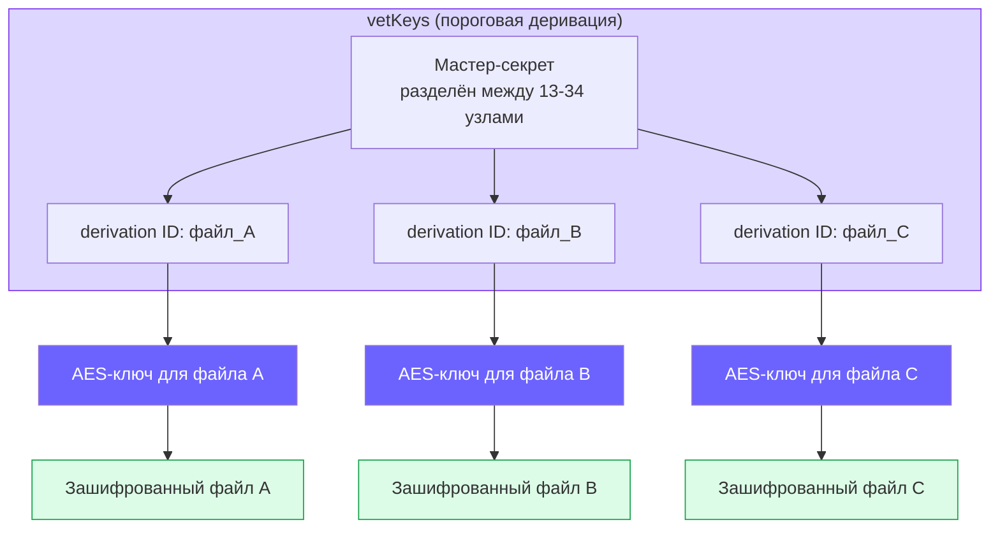
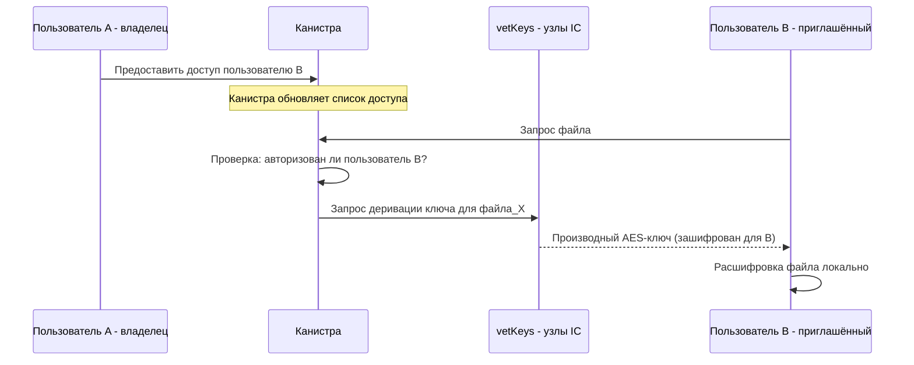
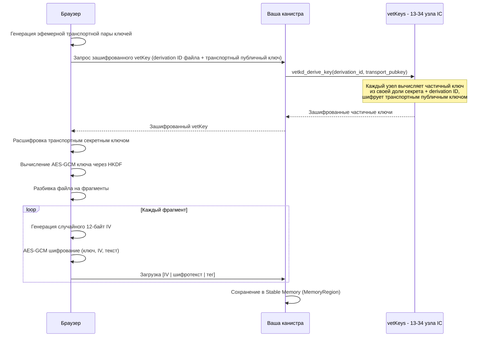

# Шифрование — основной privacy-режим Rabbithole

Rabbithole задуман вокруг сквозного шифрования. Когда шифрование включено, файлы шифруются в браузере до загрузки.

Шифрование доступно в Pro и может быть включено или выключено в зависимости от папки и настроек загрузки.

:::note{title="Важно"}

Эта страница описывает зашифрованный режим Rabbithole.  
Если вы загружаете файл без шифрования, путь хранения продолжает работать, но описанные здесь гарантии конфиденциальности уже не применяются.

:::

## Что это значит для вас

- **Никто не может прочитать ваши файлы** — даже команда Rabbithole
- **Даже узлы блокчейна** не могут расшифровать ваши данные — они хранят только зашифрованные фрагменты. Хотя узлы IC технически имеют доступ к памяти канистры, все ваши данные зашифрованы vetKeys ещё до отправки в канистру. Без пороговой деривации ключа (которая требует вашей идентичности) хранимые данные неотличимы от случайного шума
- **TEE усиливает защиту, но не является её основой** — Internet Computer постепенно разворачивает [поддержку TEE](https://forum.dfinity.org/t/upcoming-proposal-the-first-tee-enabled-subnet/64180) на базе AMD SEV-SNP. Это усиливает изоляцию среды исполнения, но основная гарантия приватности в Rabbithole по-прежнему строится на клиентском шифровании и деривации ключей, а не на одном только доверии к железу
- **Если Rabbithole закроется** — зашифрованные on-chain файлы остаются в
  вашей канистре, пока у неё есть циклы; Blob Storage файлы сохраняют доверенные
  записи в канистре, а доступность самого файла зависит от политики retention
  Blob Storage
- **Каждый фрагмент независим** — проблема с одним не затрагивает другие

## Как работают ключи шифрования

Ключ шифрования выводится из вашей **[Internet Identity](https://id.ai/)** с помощью [vetKeys](https://docs.internetcomputer.org/building-apps/network-features/vetkeys/introduction/) — пороговой криптографии, встроенной в Internet Computer.

- Не нужно запоминать или терять пароли
- Не нужно бэкапить файлы ключей
- Ключ вычисляется по запросу **13-34 независимыми узлами** совместно
- Ни один компьютер в сети не знает ваш полный ключ

:::note{title="Простыми словами"}

Представьте хранилище, которое открывается только когда достаточно независимых охранников подтверждают, что это действительно вы. Ни один охранник не может открыть его в одиночку.

:::

## Уникальный ключ для каждого файла

В отличие от сервисов, использующих один мастер-ключ для всего, Rabbithole выводит **уникальный ключ шифрования для каждого файла** с помощью концепции **derivation ID**:

Каждый файл имеет уникальный **derivation ID** — один и тот же мастер-секрет порождает совершенно разные ключи для разных файлов. Это означает:
- Компрометация ключа одного файла **не раскрывает** ключи остальных
- Ключи **детерминистичны** — один и тот же derivation ID всегда даёт один и тот же ключ, поэтому их можно вычислить повторно без хранения ключевого материала
- Мастер-секрет **никогда не существует** в одном месте — он всегда разделён между несколькими узлами

## Расшаривание зашифрованных данных

Когда вы предоставляете доступ к хранилищу другому пользователю, это происходит через **контроль доступа на уровне канистры**, а не через перешифрование:

Ключевое понимание: ключи шифрования привязаны к **ID файлов**, а не к ID пользователей. Канистра решает, кому разрешено запросить ключ для данного файла. При предоставлении доступа новый пользователь может вычислить тот же файловый ключ — **перешифрование не нужно**.

Это означает:
- **Добавление пользователей** не требует перешифрования всех данных
- **Отзыв доступа** обрабатывается на уровне канистры — канистра просто перестаёт выдавать запросы на деривацию ключей
- **Владелец контролирует всё** — только контроллер канистры решает, кто получает доступ

## Стоимость шифрования

Вычисление ключа vetKey стоит примерно **$0.035 за операцию**. Это оплачивается из вычислительных циклов вашей канистры, а не из кошелька. Одно вычисление покрывает все операции в рамках сессии.

---

## Технические детали

:::details{title="Алгоритмы, размеры фрагментов и поток vetKD"}

### Алгоритм

- **AES-GCM** (Galois/Counter Mode) — аутентифицированное шифрование
- 12-байтный случайный IV на каждый фрагмент
- 16-байтный тег аутентификации
- Общий оверхед: **28 байт на фрагмент**

### Размеры фрагментов

| Параметр | Значение |
|----------|----------|
| Макс. размер чанка канистры | 2 097 152 байт (2 МБ) |
| Фрагмент открытого текста (по умолч.) | 1 900 000 байт (~1.9 МБ) |
| Зашифрованный фрагмент | ~1 900 028 байт (открытый текст + 28 байт оверхед) |

Большие файлы автоматически разбиваются на фрагменты по ~1.9 МБ. Каждый фрагмент шифруется независимо с уникальным случайным вектором инициализации. Зашифрованные фрагменты укладываются в лимит канистры 2 МБ.

### Поток деривации ключей (протокол vetKD)

**Транспортный ключ:** Браузер генерирует эфемерную пару ключей для каждого запроса. Каждый узел IC шифрует свой частичный вклад транспортным публичным ключом. Даже при перехвате всего трафика производный ключ остаётся секретным — только браузер с транспортным секретным ключом может расшифровать частичные вклады.

### Криптографические примитивы

| Примитив | Использование |
|----------|--------------|
| **BLS12-381** | Пороговая схема подписей для деривации ключей |
| **IBE (Boneh-Franklin)** | Шифрование на основе идентичности для derivation ID |
| **AES-256-GCM** | Симметричное шифрование файлов |
| **HKDF** | Вычисление ключа из материала vetKey |
| **SHA-256** | Проверка целостности фрагментов |

### Свойства безопасности

- **Конфиденциальность** — AES-GCM с уникальным IV на каждый фрагмент
- **Целостность** — тег аутентификации выявляет любые изменения
- **Пороговое вычисление ключа** — 13-34 узла должны кооперироваться
- **Изоляция фрагментов** — каждый фрагмент зашифрован независимо
- **Ключи на файл** — уникальный derivation ID для каждого файла
- **Транспортное шифрование** — эфемерные ключи защищают ключевой материал в пути

### Механизм промежуточного хранения

Для предотвращения повреждения данных при загрузке, новые файлы помещаются в «промежуточную область» до тех пор, пока все фрагменты не загружены и не проверены контрольной суммой SHA-256. Только после этого файл появляется в вашей файловой системе.

:::
