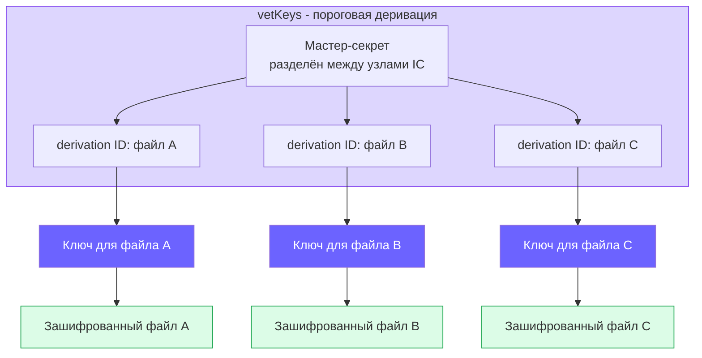
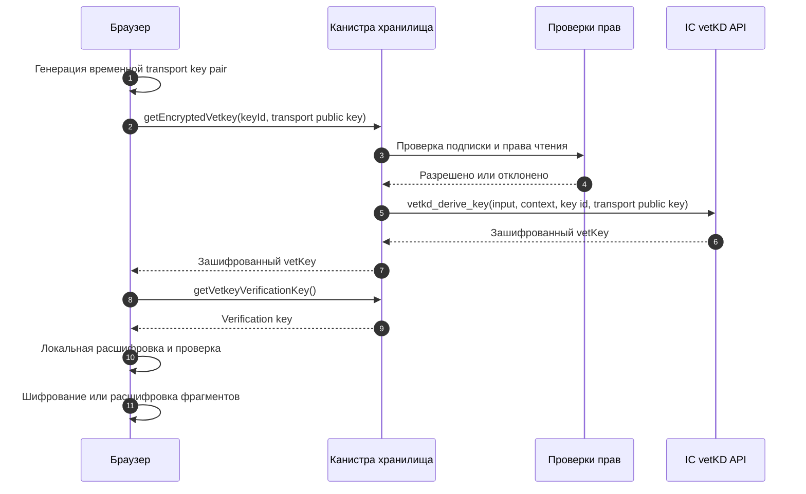

## Что описывает эта страница

Эта страница для читателей, которым нужна более низкоуровневая модель:
derivation input файла, transport keys, шифрование фрагментов и граница между
контролем доступа и криптографией.

Пользовательское объяснение начинается на странице
[Шифрование](/ru/how-it-works/encryption). Выбор уровня сервиса ключей описан в
[Ключи и vetKeys](/ru/how-it-works/encryption/vetkeys).

## Уникальный ключ для каждого файла

У каждого зашифрованного файла есть key ID. В канистре хранилища этот key ID
собирается из principal владельца ключа и идентификатора файла. Канистра строит
vetKD derivation input из этих значений и использует domain separator
`file_storage_dapp`.

Результат детерминированный: один и тот же key ID файла снова выводит тот же
ключевой материал. Благодаря этому Rabbithole может расшифровать файл позже, не
храня сырой файловый ключ в канистре.

Один master secret даёт разные ключи для разных derivation ID. Поэтому ключ
одного файла не открывает остальные файлы.

## Поток запроса ключа

Канистра проверяет доступ до обращения к Internet Computer за деривацией ключа.
Пользователь без права чтения отклоняется до vetKD-вызова.

Transport key pair временная. Публичная часть уходит в канистру. Секретная
часть остаётся в браузере, поэтому зашифрованный ответ vetKey полезен только
для этого браузерного запроса.

## Фрагменты и шифрование

Rabbithole шифрует фрагменты файла в браузере. Реализация использует клиентскую
библиотеку Internet Computer vetKeys для производного ключевого материала и
аутентифицированного шифрования.

| Параметр | Текущее значение |
|----------|------------------|
| Макс. размер чанка канистры | 2 097 152 байта |
| Открытый on-chain фрагмент по умолчанию | 1 900 000 байт |
| Blob Storage chunk | 1 048 576 байт |
| AES-GCM overhead | 28 байт: 12-байтный IV + 16-байтный authentication tag |
| Открытый фрагмент для зашифрованного Blob Storage | 1 048 548 байт |

Большие файлы разбиваются на фрагменты. Каждый зашифрованный фрагмент несёт
свои данные аутентификации, поэтому подмена ciphertext обнаруживается при
расшифровке.

## Проверка Blob Storage

Когда используется Blob Storage, зашифрованные фрагменты загружаются вне
канистры. Канистра хранит запись о файле и данные, нужные для проверки blob:
content hashes, Merkle tree и IC-certified metadata.

Так Rabbithole разделяет две проверки:

- шифрование защищает конфиденциальность;
- проверка целостности обнаруживает незаметную подмену или повреждение.

Подробнее о проверке хранения читайте в разделе
[Проверка целостности файлов](/ru/how-it-works/storage/integrity).

## Поддержка TEE

Trusted Execution Environment может усилить изоляцию среды исполнения, если
доступен на нужном IC-сабнете. Но это не основное privacy-допущение Rabbithole.

Главная граница конфиденциальности: клиентское шифрование плюс деривация
vetKey, разрешённая канистрой. TEE остаётся дополнительным слоем, а не причиной,
по которой Rabbithole может не читать содержимое зашифрованных файлов.

## Ограничения модели

Шифрование сужает область доверия, но не убирает все допущения.

- Браузер должен выполнять ожидаемый фронтенд-код Rabbithole.
- Протокол Internet Computer и vetKD-сервис должны работать корректно.
- Пользователь, который уже скачал и расшифровал файл, может сохранить копию
  после отзыва доступа.
- Открытый режим загрузки не даёт этих гарантий конфиденциальности.

Более широкие допущения перечислены в
[модели доверия](/ru/how-it-works/trust-model).
