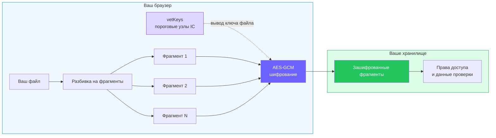
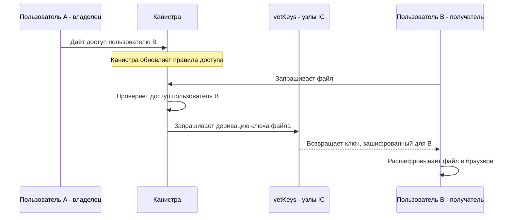

import { OverviewGroup } from '@rspress/core/theme';

## Зашифрованный режим начинается в браузере

Rabbithole может хранить файлы с шифрованием или без него. Эта страница
описывает зашифрованный режим: браузер шифрует файл до загрузки, а дальше по
пути хранения идут уже зашифрованные байты.

Это важная граница. Rabbithole может перемещать файл, хранить метаданные,
проверять права и целостность, но для этого ему не нужно видеть читаемое
содержимое файла.

:::note{title="Только для зашифрованного режима"}

Эти гарантии применяются, когда шифрование включено для файла или папки. Если
вы загружаете файл без шифрования, правила доступа всё ещё работают, но файл не
попадает под описанную здесь модель конфиденциальности.

:::

## Что это значит для вас

В зашифрованном режиме Rabbithole работает с закрытым файлом, а не с читаемым
содержимым.

- Команда Rabbithole не может читать содержимое зашифрованных файлов.
- Узлы Internet Computer и storage-сервисы хранят зашифрованные фрагменты, а не
  открытый файл.
- Канистра хранилища решает, кто может запросить ключ файла.
- Ключ возвращается зашифрованным для той сессии браузера, которая его
  запросила.
- Режим хранения остаётся отдельным выбором: Blob Storage и On-chain Storage
  отвечают за место хранения байтов, а шифрование отвечает за то, читаемы ли
  эти байты.

Главная идея такая: Rabbithole не просит верить обещанию оператора “мы не будем
смотреть”. Он убирает читаемый файл из пути оператора. Допущения всё равно
остаются: браузер, загруженный фронтенд и протокол Internet Computer имеют
значение. Они перечислены в [модели доверия](/ru/how-it-works/trust-model).

## Откуда берётся ключ

Rabbithole не просит придумывать пароль для шифрования. Когда зашифрованный файл
нужно открыть, браузер просит канистру хранилища выдать ключ файла. Канистра
проверяет, есть ли у вашего principal доступ, а затем обращается к сервису
[vetKeys](https://docs.internetcomputer.org/concepts/vetkeys/) в Internet
Computer.

Главное здесь: ключ не лежит готовым в канистре и не передаётся Rabbithole.
Internet Computer возвращает зашифрованный ответ, который может открыть только
браузер, сделавший этот запрос.

Если хотите понять, чем отличаются уровни Standard и High Replication, читайте
[Ключи и vetKeys](/ru/how-it-works/encryption/vetkeys).

## Совместный доступ не перешифровывает файл

Когда вы делитесь зашифрованным файлом, Rabbithole меняет правила доступа. Он
не загружает вторую зашифрованную копию для получателя.

Если у получателя есть доступ, канистра разрешает его браузеру запросить тот же
ключ файла. Если доступ отозван, канистра перестаёт разрешать будущие запросы
ключа для отозванной области. Как и в любой системе обмена файлами, отзыв не
может стереть копию, которую человек уже скачал.

Подробный поток описан в разделе
[Шифрование общего доступа](/ru/how-it-works/sharing/encryption-in-shared-access).

## Узнать больше

<OverviewGroup
  group={{
    name: 'Разделы о шифровании',
    items: [
      {
        text: 'Ключи и vetKeys',
        link: '/ru/how-it-works/encryption/vetkeys',
      },
      {
        text: 'Как устроено шифрование',
        link: '/ru/how-it-works/encryption/how-encryption-works',
      },
      {
        text: 'Режимы хранения',
        link: '/ru/how-it-works/storage/',
      },
      {
        text: 'Совместный доступ',
        link: '/ru/how-it-works/sharing/',
      },
      {
        text: 'Модель доверия',
        link: '/ru/how-it-works/trust-model',
      },
    ],
  }}
/>

<OverviewGroup
  group={{
    name: 'Официальные материалы Internet Computer',
    items: [
      {
        text: 'vetKeys',
        link: 'https://docs.internetcomputer.org/concepts/vetkeys/',
      },
      {
        text: 'Canister smart contracts',
        link: 'https://docs.internetcomputer.org/concepts/canisters/',
      },
    ],
  }}
/>
