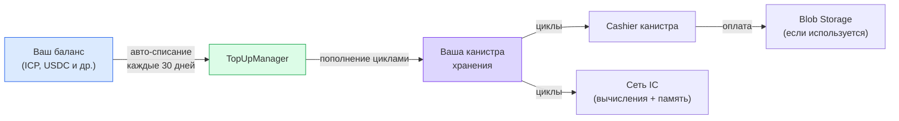
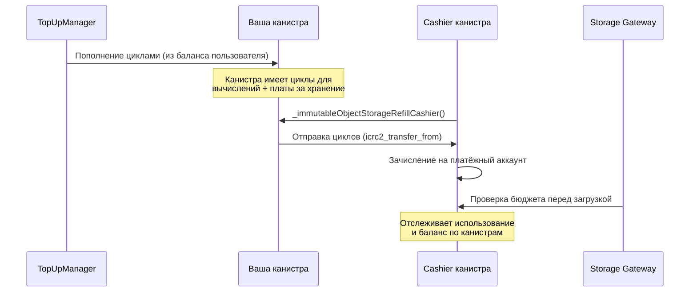

## Ваше хранилище работает на циклах

В Internet Computer вычисления и хранение оплачиваются **циклами** — стабильной единицей работы, привязанной к корзине валют. Вашей персональной канистре нужны циклы, чтобы работать и обслуживать ваши файлы.

Вам не нужно думать о циклах напрямую. Rabbithole делает это за вас.

## Как это работает

### Pro подписка

С Pro подпиской вы храните баланс в поддерживаемых токенах. Rabbithole автоматически конвертирует и пополняет циклы вашей канистры каждые 30 дней.

**Поддерживаемые токены:**

| Сеть | Токены |
|------|--------|
| Internet Computer | ICP, ckETH, ckUSDC, ckUSDT |
| Base | ETH, USDC, USDT |
| Solana | SOL, USDC, USDT |

Ваш баланс используется для:

- **Пополнения циклов** — поддержание работы канистры хранения
- **Продления подписки** — автоматически каждые 30 дней

### На что тратятся циклы

| Ресурс | Описание |
|--------|----------|
| **Вычисления** | Обработка загрузок, скачиваний, операций с файлами |
| **Stable memory** | On-chain метаданные (имена файлов, права доступа, хеши) |
| **Blob Storage** | Если используется Blob Storage — Cashier канистра взимает плату за off-chain хранение |

## Самостоятельное управление

Pro подписка не обязательна для жизнеспособности хранилища. Канистра принадлежит вам, и вы можете управлять циклами самостоятельно:

- **Ручное пополнение** — через [NNS dapp](https://nns.ic0.app), CLI `dfx` или любой ICP-кошелёк
- **Автоматическое пополнение** — через сторонние сервисы, например [CycleOps](https://cycleops.dev) для автоматического мониторинга и пополнения

:::tip{title="Ваша канистра — ваш выбор"}

Pro-сервис Rabbithole — это удобная надстройка. Канистра — стандартный смарт-контракт Internet Computer, и вы всегда можете управлять ей любым ICP-инструментом.

:::

## Что происходит, когда циклы заканчиваются?

**On-chain хранение:**
Канистра переходит в **замороженное** состояние, когда циклы падают ниже порога заморозки. Данные сохранены, но недоступны, пока не добавите циклы. Канистра не удаляется — восстановить можно всегда.

**Blob Storage:**
Cashier канистра не может списать плату за хранение. Действует **30-дневный grace period** — данные остаются на gateway, но становятся недоступными. Через 30 дней с нулевым балансом gateway удаляет данные безвозвратно.

:::note{title="Планируйте заранее"}

Если вы используете Blob Storage, убедитесь, что у канистры всегда достаточно циклов. С Pro подпиской это происходит автоматически. Без неё — настройте мониторинг через CycleOps или регулярно проверяйте баланс.

:::

---

## Технические детали

:::details{title="Нажмите, чтобы развернуть"}

### Стоимость циклов (приблизительно)

| Ресурс | Стоимость |
|--------|-----------|
| Создание канистры | ~0.1 TC |
| Stable memory | ~127 GiB-seconds на цикл |
| Вычисления (update call) | ~590K циклов на инструкцию |
| Blob Storage (30 дней) | ~38.5B циклов за ГБ |
| Blob upload | ~115.4B циклов за ГБ |
| Blob download | ~76.9B циклов за ГБ |

:::tip{title="TC = Триллион циклов"}
1 TC ≈ $1.36 (зависит от курса ICP и корзины SDR).
:::

### Взаимодействие с Cashier канистрой (Blob Storage)

Cashier канистра использует **pull-модель** — она сама инициирует списание циклов с вашей канистры, когда платёжный аккаунт нуждается в пополнении. Канистра должна иметь достаточно циклов и для вычислений, и для оплаты хранения.

### Автопродление TopUpManager

Каждые 30 дней TopUpManager Rabbithole:

1. Проверяет баланс токенов пользователя
2. Конвертирует токены в ICP (при необходимости) через exchange rate канистру
3. Конвертирует ICP в циклы через Cycles Minting Canister (CMC)
4. Отправляет циклы в канистру хранения пользователя
5. Продлевает период подписки

### Мониторинг

Проверить баланс циклов канистры:

- **В Rabbithole** — дашборд хранилища показывает текущий баланс
- **Через `dfx`** — `dfx canister status <canister-id> --network ic`
- **Через NNS** — если канистра привязана к вашей NNS-идентичности

:::
