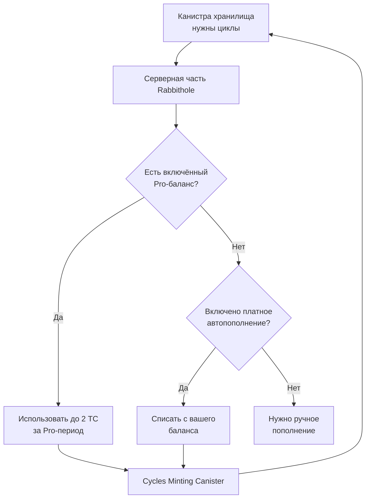
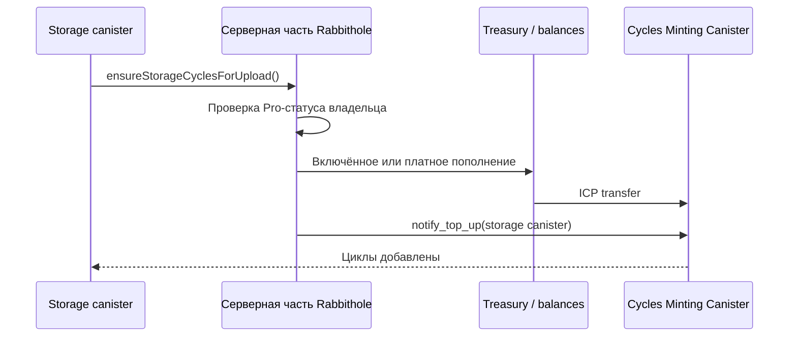
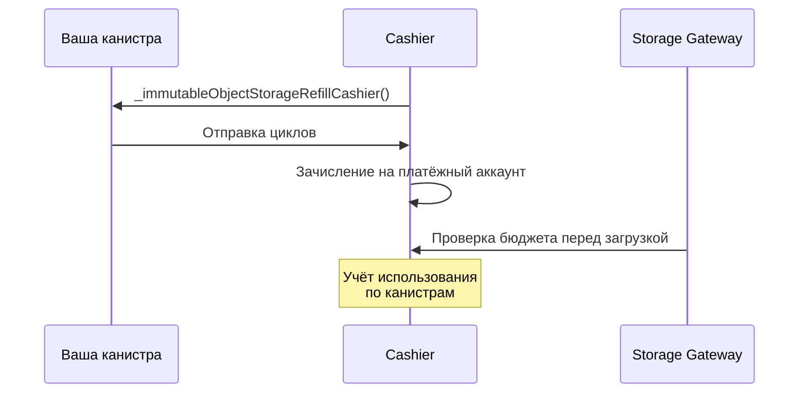

# Оплата и циклы

Ваше хранилище работает в отдельной канистре Internet Computer. Канистре нужны
[циклы](https://docs.internetcomputer.org/concepts/cycles/), чтобы хранить
данные, выполнять операции и оставаться доступной.

Циклы можно воспринимать как предоплаченное топливо для канистры. Rabbithole
может помогать с пополнением через [Pro](/ru/how-it-works/pro), но канистра
принадлежит вам, поэтому вы можете пополнять её напрямую через инструменты
Internet Computer.

## За что вы платите

Оплата в Rabbithole не сводится к одной подписке. Есть разовый запуск
хранилища, есть лицензия на базовый объём зашифрованных данных, а есть циклы,
которые поддерживают работу канистры.

| Что | Когда оплачивается | Что даёт |
|---|---|---|
| **Создание хранилища** | Один раз | Канистру хранилища, стартовый баланс циклов, установку приложения хранилища и лицензию хранилища. |
| **Rabbithole Pro** | За период подписки | Совместный доступ, обновления хранилища, зашифрованные загрузки без ограничений базовой лицензии, автопополнение циклов и 2 TC включённого баланса циклов. |
| **Циклы** | По мере расхода | Работу канистры: загрузки, операции с файлами, хранение, выдачу vetKeys и доступность хранилища. |

## Лицензия хранилища и Pro

Лицензия хранилища — это базовый слой. Она выдаётся при создании хранилища и
остаётся действовать, даже если Pro истёк или был отменён. Вы всё равно можете
пользоваться персональным зашифрованным хранением в пределах лицензии:
включённого объёма и максимального размера одного файла.

Вдобавок к лицензии Pro включает функции, которые работают через Rabbithole.
Пока Pro активен, он добавляет:

- зашифрованные загрузки без ограничений базовой лицензии;
- автопополнение циклов, когда Rabbithole пополняет канистру при необходимости;
- обновления кода и фронтенд-ассетов после вашего подтверждения;
- совместный доступ и управление доступом.

Полный список возможностей подписки описан на странице
[Что даёт подписка Pro](/ru/how-it-works/pro).

## Как работает автопополнение циклов

Автопополнение привязано к операциям, а не к календарной дате. Перед дорогими
операциями, например перед большой загрузкой в On-chain Storage, канистра
проверяет баланс. Если у вас активен Pro, она может запросить пополнение у
серверной части Rabbithole.



Серверная часть использует два источника в таком порядке:

1. **Включённый баланс циклов**: 2 TC для вас в пределах Pro-периода. Этот
   баланс общий для ваших хранилищ. Подробнее это описано на странице
   [Что даёт подписка Pro](/ru/how-it-works/pro).
2. **Платное автопополнение**: пополнение из вашего платёжного баланса, если
   включённый лимит уже исчерпан и вы включили автопополнение.

Без активного Pro всё проще: загрузка продолжится, если в канистре уже хватает
циклов. Если не хватает, вы пополняете канистру вручную.

## Поддерживаемые токены

Список токенов может меняться, если платёжные провайдеры добавят или уберут
поддержку отдельных сетей. Rabbithole показывает доступные варианты перед
подтверждением платежа.

| Сеть              | Токены                     |
| ----------------- | -------------------------- |
| Internet Computer | ICP, ckETH, ckUSDC, ckUSDT |
| Base              | ETH, USDC, USDT            |
| Solana            | SOL, USDC, USDT            |

Баланс используется для продления Pro-периода и, если вы включили
автопополнение, для платного пополнения после исчерпания включённого лимита.

## На что тратятся циклы

Циклы оплачивают ресурсы Internet Computer и связанные операции хранения.

| Ресурс               | За что списываются циклы                                             |
| -------------------- | -------------------------------------------------------------------- |
| **Вычисления**       | Загрузки, скачивания, операции с файлами и проверка прав доступа     |
| **Stable Memory**    | Метаданные, права доступа, хеши и записи проверки                    |
| **On-chain Storage** | Байты файлов, если вы храните их внутри канистры                     |
| **Blob Storage**     | Хранение и передача байтов через Blob Storage, если выбран этот режим |
| **vetKeys**          | Деривация ключей для открытия зашифрованных файлов                   |

## Карточка Canister Cycles

Карточка **Canister Cycles** в боковой панели хранилища показывает запас
циклов: хватит ли его на загрузки, обычные операции и резерв заморозки Internet
Computer. Она видна только владельцу и пользователям с доступом восстановления,
потому что это операционная и платёжная информация канистры.

Карточка делит баланс циклов на практические зоны:

- **Freeze** — резерв, который нужен канистре, чтобы не заморозиться.
- **Safe floor** — резерв заморозки плюс оценка активных загрузок, деривации
  ключей, завершения записи и дополнительного запаса.
- **Target** — безопасный минимум циклов (safe floor) плюс буфер, который
  Rabbithole использует для автопополнения циклов.
- **Headroom** — остаток выше target, доступный для обычной работы.

Нажимайте **Top up**, если баланс подходит к безопасному минимуму циклов
(safe floor) или вы готовите большую загрузку в On-chain Storage. При активном Pro
Rabbithole может пополнить канистру сам. Без Pro остаётся ручное пополнение.

:::details{title="Как считается карточка"}

Канистра хранилища обновляет метрики времени выполнения через Internet Computer
Management Canister и возвращает в приложение нормализованные метрики карточки.
Frontend не вызывает `canister_status` напрямую для этой карточки.

Safe floor — это безопасный минимум циклов. Это оценка, а не фиксированное
значение сети:

```text
safeFloor =
  freezingReserve
  + remainingUploadWriteCost
  + remainingUploadHashInstructionCycles
  + activeVetKeyDerivationCost
  + activeCommitCost
  + margin
```

Параллельные загрузки увеличивают активные резервы до завершения, отмены или
истечения срока сессии загрузки. Поэтому безопасный минимум циклов (safe floor)
и target могут расти, пока выполняются несколько больших загрузок.

:::

## Самостоятельное управление

Pro не нужен, чтобы хранилище продолжало принадлежать вам. Канистра остаётся
вашей, поэтому её можно пополнять напрямую.

Доступные варианты:

- **ручное пополнение** через [NNS dapp](https://nns.ic0.app), `icp-cli` или
  ICP-кошелёк;
- **автоматическое пополнение** через сторонние сервисы, например
  [CycleOps](https://cycleops.dev).

:::tip{title="Ваша канистра — ваш выбор"}

Rabbithole Pro снимает часть рутины. Сама канистра остаётся стандартным
смарт-контрактом Internet Computer, которым можно управлять через IC-инструменты.

:::

## Что происходит, когда циклы заканчиваются

Если у канистры заканчиваются циклы, владелец не меняется. Меняется
доступность: сеть может ограничить работу канистры.

**On-chain Storage.** Канистра переходит в замороженное состояние, когда циклы
падают ниже порога заморозки. Данные сохраняются, но канистра может перестать
обрабатывать вызовы, пока вы не добавите циклы. Если канистра слишком долго
остаётся без финансирования, Internet Computer может удалить её по правилам
жизненного цикла канистры.

**Blob Storage.** Если Blob Storage не может списать плату за хранение, данные
становятся недоступными через gateway-сервис. В текущей конфигурации действует
30-дневный льготный период. После 30 дней с нулевым балансом gateway-сервис
удаляет данные безвозвратно.

:::note{title="Следите за балансом заранее"}

Активный Pro снижает операционную нагрузку, потому что Rabbithole может
пополнять канистру при необходимости. Если вы не используете Pro, настройте
мониторинг или регулярно проверяйте баланс, особенно для On-chain Storage.

:::

## Технические детали

Этот раздел нужен, если вы хотите понять приблизительные стоимости и внутренний
поток пополнения.

:::details{title="Стоимость циклов и потоки пополнения"}

### Стоимость циклов

Текущие приблизительные значения:

| Ресурс                     | Стоимость                  |
| -------------------------- | -------------------------- |
| Создание канистры          | ~0.5 TC                    |
| Начальный баланс хранилища | 1.5 TC                     |
| Stable Memory              | ~127 GiB-seconds на цикл   |
| Вычисления (update call)   | ~590K циклов на инструкцию |
| Blob Storage (30 дней)     | ~38.5B циклов за ГБ        |
| Blob upload                | ~115.4B циклов за ГБ       |
| Blob download              | ~76.9B циклов за ГБ        |

Эти значения являются операционными оценками для текущей конфигурации продукта.
Стоимость Internet Computer, Blob Storage и обменные курсы могут меняться.

**TC = триллион циклов.** 1 TC = 1 XDR. Оценка в USD является справочной и
меняется вместе с курсом XDR/USD.

### Поток пополнения через CMC



Канистра хранилища не создаёт циклы сама. Она запрашивает пополнение у
серверной части Rabbithole, а та покупает циклы через Cycles Minting Canister.
Если CMC возвращает неоднозначный статус, операция попадает в очередь
восстановления для административной проверки. Это операционный механизм, а не
обычное действие пользователя.

### Взаимодействие с Cashier (Blob Storage)



Cashier использует pull-модель: он инициирует списание циклов с вашей канистры,
когда платёжный аккаунт Blob Storage нуждается в пополнении. Эти циклы идут на
хранение и передачу байтов в Blob Storage. Канистра должна иметь достаточно
циклов и для собственных вычислений, и для оплаты хранения.

### Мониторинг

Проверить баланс циклов канистры можно несколькими способами:

- **В Rabbithole**: боковая панель хранилища показывает карточку
  **Canister Cycles**.
- **Через `icp-cli`**: для полного статуса канистры используйте identity,
  связанную с вашим Internet Identity для `rabbithole.app`. Настройка описана
  в разделе [Как проверить владение](./sovereignty/verify-ownership).

  ```bash
  icp canister status <your-storage-canister-id> -n ic --identity rabbithole-app
  ```

- **Через NNS**: если канистра добавлена в NNS и управляется совпадающей
  identity.

:::
