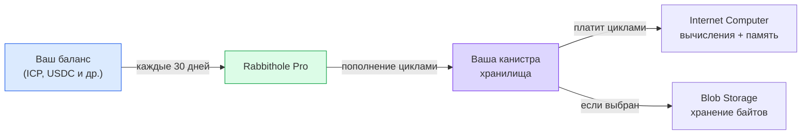
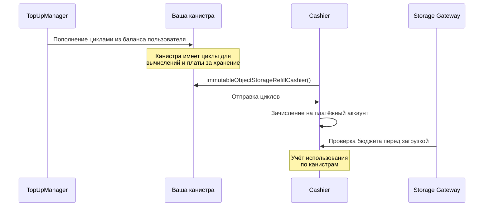

# Оплата и циклы

Ваше хранилище работает в отдельной канистре Internet Computer. Канистре нужны
[циклы](https://docs.internetcomputer.org/concepts/cycles/), чтобы хранить
данные, выполнять операции и оставаться доступной.

Циклы можно воспринимать как предоплаченное топливо для канистры. Rabbithole Pro
пополняет их автоматически, но это не единственный путь: поскольку канистра
принадлежит вам, вы можете управлять её финансированием самостоятельно.

## Простая модель

Если включён Pro-сервис, Rabbithole берёт на себя регулярное пополнение циклов.
Вы храните баланс в поддерживаемом токене, а Rabbithole каждые 30 дней
пополняет вашу канистру циклами.



Циклы расходуются на работу канистры: загрузки, скачивания, операции с файлами,
хранение метаданных и, в зависимости от режима, хранение самих байтов файла.

## Pro-подписка

С Pro-подпиской вы храните баланс в поддерживаемых токенах. Rabbithole
конвертирует нужную сумму и пополняет циклы вашей канистры каждые 30 дней.

**Текущие поддерживаемые токены:**

| Сеть | Токены |
|------|--------|
| Internet Computer | ICP, ckETH, ckUSDC, ckUSDT |
| Base | ETH, USDC, USDT |
| Solana | SOL, USDC, USDT |

Точный список может меняться, если платёжные провайдеры добавят или уберут
поддержку отдельных сетей и токенов. Rabbithole покажет доступные варианты
перед подтверждением платежа.

Ваш баланс используется для:

- **пополнения циклов**, чтобы канистра продолжала работать;
- **продления Pro-периода**, если вы используете автоматическое обслуживание.

## На что тратятся циклы

Циклы оплачивают ресурсы Internet Computer и связанные операции хранения.

| Ресурс | За что вы платите |
|--------|-------------------|
| **Вычисления** | Загрузки, скачивания, операции с файлами и проверка прав доступа |
| **Stable Memory** | Метаданные: имена файлов, папки, права доступа, хеши и записи проверки |
| **On-chain Storage** | Байты файлов, если вы храните их внутри канистры |
| **Blob Storage** | Хранение и передача байтов через Blob Storage, если выбран этот режим |

## Самостоятельное управление

Pro-подписка не обязательна для жизнеспособности хранилища. Канистра
принадлежит вам, поэтому вы можете пополнять её циклы напрямую.

Доступные варианты:

- **ручное пополнение** через [NNS dapp](https://nns.ic0.app), `icp-cli` или
  ICP-кошелёк;
- **автоматическое пополнение** через сторонние сервисы, например
  [CycleOps](https://cycleops.dev).

:::tip{title="Ваша канистра — ваш выбор"}

Rabbithole Pro — это удобная надстройка. Сама канистра остаётся стандартным
смарт-контрактом Internet Computer, которым можно управлять через IC-инструменты.

:::

## Что происходит, когда циклы заканчиваются

Если у канистры заканчиваются циклы, меняется не владелец, а доступность.
Канистра всё ещё принадлежит вам, но сеть может ограничить её работу.

**On-chain Storage.** Канистра переходит в замороженное состояние, когда циклы
падают ниже порога заморозки. Данные сохраняются, но канистра может перестать
обрабатывать вызовы, пока вы не добавите циклы. Если канистра слишком долго
остаётся без финансирования, Internet Computer может удалить её по правилам
жизненного цикла канистры.

**Blob Storage.** Если Blob Storage не может списать плату за хранение, данные
становятся недоступными на gateway. В текущей конфигурации действует 30-дневный
льготный период. После 30 дней с нулевым балансом gateway удаляет данные
безвозвратно.

:::note{title="Следите за балансом заранее"}

С Pro-подпиской Rabbithole пополняет циклы автоматически. Без неё настройте
мониторинг или регулярно проверяйте баланс, особенно если используете Blob
Storage.

:::

## Технические детали

Этот раздел нужен, если вы хотите понять приблизительные стоимости и внутренний
поток пополнения.

:::details{title="Стоимость циклов и поток пополнения"}

### Стоимость циклов

Текущие приблизительные значения:

| Ресурс | Стоимость |
|--------|-----------|
| Создание канистры | ~0.5 TC |
| Начальный баланс хранилища | 1.5 TC |
| Stable Memory | ~127 GiB-seconds на цикл |
| Вычисления (update call) | ~590K циклов на инструкцию |
| Blob Storage (30 дней) | ~38.5B циклов за ГБ |
| Blob upload | ~115.4B циклов за ГБ |
| Blob download | ~76.9B циклов за ГБ |

Эти значения являются операционными оценками для текущей конфигурации продукта.
Стоимость Internet Computer, Blob Storage и обменные курсы могут меняться.

**TC = триллион циклов.** 1 TC ≈ $1.36. Значение зависит от курса ICP и корзины
SDR.

### Взаимодействие с Cashier (Blob Storage)



Cashier использует pull-модель: он инициирует списание циклов с вашей канистры,
когда платёжный аккаунт Blob Storage нуждается в пополнении. Канистра должна
иметь достаточно циклов и для вычислений, и для оплаты хранения.

### Автопродление TopUpManager

Каждые 30 дней TopUpManager Rabbithole:

1. Проверяет баланс токенов пользователя.
2. Конвертирует токены в ICP, если это нужно.
3. Конвертирует ICP в циклы через Cycles Minting Canister (CMC).
4. Отправляет циклы в канистру хранилища пользователя.
5. Продлевает Pro-период.

### Мониторинг

Проверить баланс циклов канистры можно несколькими способами:

- **В Rabbithole**: дашборд хранилища показывает текущий баланс.
- **Через `icp-cli`**: для полного статуса используйте identity, связанную с
  вашим Internet Identity для `rabbithole.app`. Настройка описана в инструкции
  [Как проверить владение](./sovereignty/verify-ownership).

  ```bash
  icp canister status <your-storage-canister-id> -n ic --identity rabbithole-app
  ```

- **Через NNS**: если канистра добавлена в NNS и управляется подходящей
  identity.

:::
