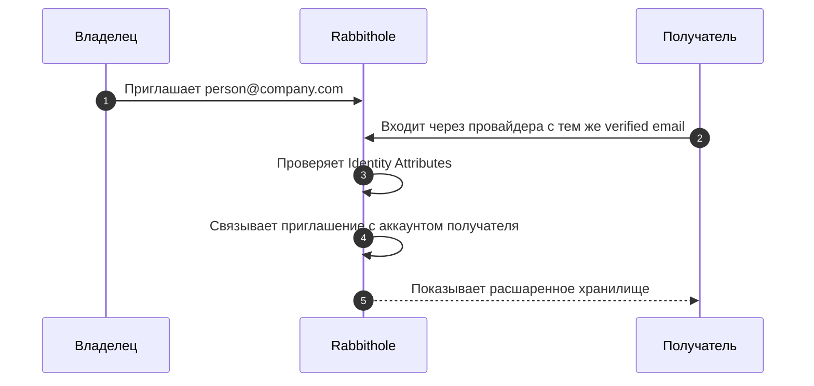
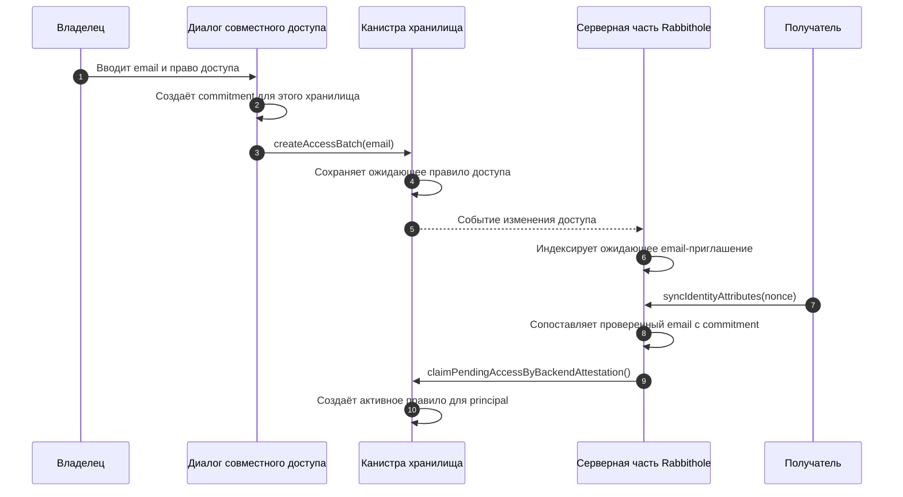

Приглашения по email позволяют поделиться доступом до того, как вы знаете
principal получателя. Вы вводите email, выбираете права, а Rabbithole держит
приглашение в ожидании, пока нужный человек не войдёт.

Email не становится паролем и не становится ключом шифрования. Это проверенный
[Identity Attribute](/ru/how-it-works/authentication#доверяйте-проверенным-атрибутам), который помогает
Rabbithole связать приглашение с правильным principal.

## Когда использовать приглашение по email

Используйте приглашение по email, когда вы знаете, кто должен получить доступ,
но этот человек ещё не пользовался Rabbithole.

- Пригласить коллегу до создания аккаунта.
- Поделиться папкой с будущим участником проекта.
- Подготовить экстренный доступ, который сработает при длительной
  неактивности владельца.
- Использовать тот же проверенный email для будущих уведомлений.

Это отличается от доступа по principal. Principal удобен, когда получатель уже
есть в приложении. Email удобен, когда вы знаете только адрес человека.

:::note{title="Какие email сейчас считаются проверенными"}

Internet Identity поддерживает вход через ключи доступа (passkeys),
OpenID-провайдеров
например Google, Microsoft и Apple, а также SSO там, где он доступен. Для
Rabbithole проверенный email — это атрибут, который пришёл из поддержанного
потока Internet Identity и прошёл проверку на серверной части Rabbithole.

Обычный ввод произвольного email с последующей проверкой письмом в Rabbithole
пока не реализован. Такой способ может появиться позже как отдельная настройка
профиля, но текущий сценарий приглашений полагается на email из поддержанного
провайдера входа.

:::

## Что увидит получатель

Получателю не нужна специальная ссылка, чтобы принять приглашение. Он входит в
Rabbithole через Internet Identity и передаёт совпадающий проверенный email из
поддержанного провайдера входа.

Rabbithole может сделать это, потому что проверяет email через поток
аутентификации. Он не доверяет обычному полю профиля, которое можно ввести
вручную.

## Почему Rabbithole может доверять email

Проверенный email отличается от текста, введённого в форму. Rabbithole
принимает его только после проверки данных Identity Attributes на серверной
части.

Серверная часть проверяет эти факты перед использованием email:

1. Данные пришли от доверенного источника Internet Identity.
2. Principal-идентификатор вошедшего пользователя совпадает с
   principal-идентификатором, которому принадлежат атрибуты.
3. Одноразовый `nonce` был выдан Rabbithole и ещё не использовался.
4. Веб-адрес (`origin`) совпадает с Rabbithole.
5. Время подписи свежее.
6. Email отмечен как проверенный.

После этих проверок Rabbithole может использовать email, чтобы подключать
ожидающие приглашения, поддерживать будущие уведомления и не повторять
проверку email без необходимости.

:::details{title="Технические детали: email commitments и ожидающие правила доступа"}

Rabbithole не обязан хранить глобальный открытый идентификатор email для
сопоставления доступа. Интерфейс и канистра считают email commitment из:

- разделителя домена Rabbithole для доступа к хранилищам,
- ID канистры хранилища,
- и нормализованного email.

Так как ID канистры входит в commitment, один и тот же email не становится
общим глобальным идентификатором доступа для всех хранилищ.

Канистра хранилища принимает подтверждение только от доверенной серверной части
Rabbithole, настроенной для этого хранилища. Сессия прямого интерфейса
хранилища тоже может получить доступ по совпадающему email после получения
проверенных атрибутов из потока входа.

:::

## Связанные страницы

Эти страницы описывают окружающую модель.

- [Аутентификация и Identity Attributes](/ru/how-it-works/authentication#доверяйте-проверенным-атрибутам)
- [Модель прав](/ru/how-it-works/sharing/permissions)
- [Шифрование общего доступа](/ru/how-it-works/sharing/encryption-in-shared-access)
