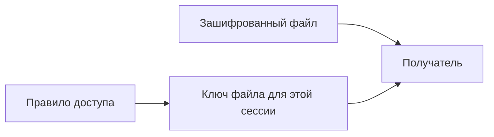
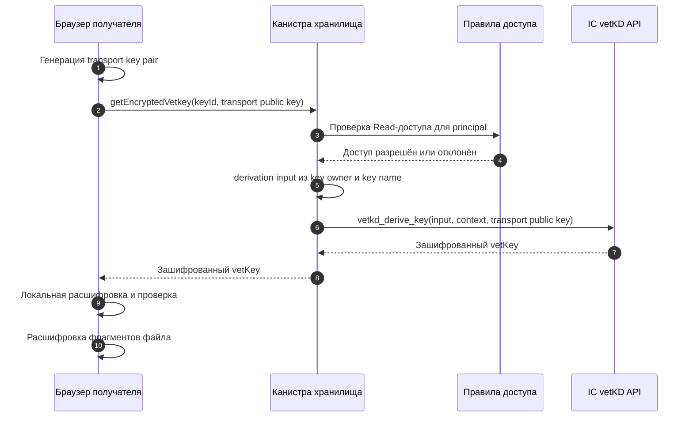

Когда вы делитесь зашифрованным файлом, Rabbithole не создаёт новую
зашифрованную копию для каждого получателя. Вместо этого канистра хранилища
проверяет, есть ли у получателя доступ. Если доступ есть, Internet Computer
выводит ключ файла для этой сессии.

Так совместный доступ остаётся быстрым, а владелец не должен быть онлайн,
когда получатель открывает расшаренный файл.

## Что меняется при расшаривании

У зашифрованного файла есть две части:

- зашифрованные байты файла,
- и правило, кто может получить ключ для расшифровки.

Когда вы делитесь файлом, Rabbithole меняет правило. Он не загружает файл
заново и не пересылает получателю ключ от владельца.

Канистра хранилища проверяет правило до того, как получатель получает данные
ключа для расшифровки файла.

## Как получатель получает ключ

Исходный ключ не передаётся канистре. Браузер создаёт временную пару
транспортных ключей (`transport keys`) и отправляет канистре только публичную
часть. Производный ключ файла возвращается зашифрованным для этой сессии
браузера.

Расшифровать и использовать его может только браузер, у которого есть
соответствующий временный секрет.

Если у пользователя нет права `Read` для key ID, канистра отклоняет запрос до
деривации ключа.

## Как это влияет на права

Совместный доступ меняет права, а не содержимое файла.

- Зашифрованные байты файла остаются там, где были.
- Канистра хранилища записывает, кто может читать или менять файл.
- Получатель с правом **View** может запросить ключ для этого файла.
- После отзыва доступа получатель больше не может запрашивать новые ключи для
  отозванной области.

Поэтому приглашения по email работают и для зашифрованных файлов. Приглашение
может ждать, пока человек войдёт, а затем канистра выдаст principal этого
человека право запрашивать нужный ключ.

Полная таблица операций и прав находится в разделе
[Модель прав](/ru/how-it-works/sharing/permissions).

:::note Что меняется без активной подписки Pro

Starter Vault сохраняет персональное зашифрованное хранение владельца в
пределах выданных лимитов, но приглашённые пользователи могут запрашивать ключи
только когда у владельца активна подписка Pro. Долговременный доступ и доступ
восстановления относятся к отдельным суверенным сценариям и описаны в модели
прав.

:::

## Ограничения отзыва доступа

Отзыв доступа запрещает будущие запросы ключей и файловые операции. Он не
может удалить копию файла или данные ключа, которые получатель уже скачал до
отзыва.

Это практическое ограничение любой системы совместного доступа к файлам: отзыв
контролирует будущий доступ, а не уже экспортированные данные.

## Связанные страницы

Эти страницы помогут увидеть общую модель.

- [Как работает шифрование](/ru/how-it-works/encryption/index)
- [Ключи и vetKeys](/ru/how-it-works/encryption/vetkeys)
- [Модель прав](/ru/how-it-works/sharing/permissions)
- [Режимы хранения](/ru/how-it-works/storage/index)
