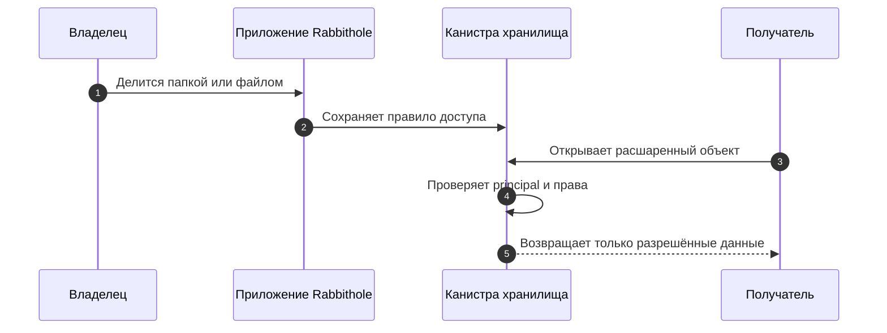
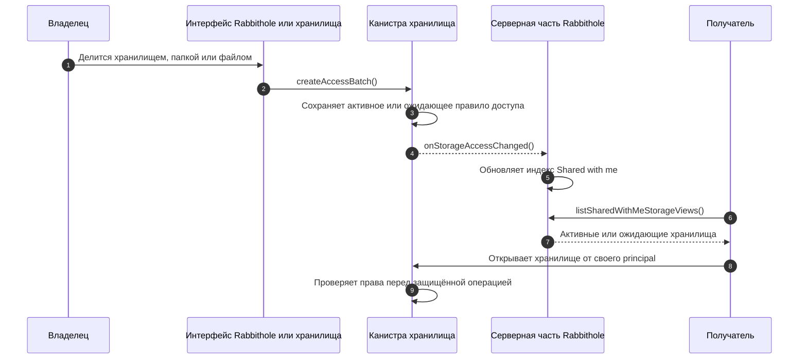

import { OverviewGroup } from '@rspress/core/theme';

Совместный доступ позволяет открыть другому человеку доступ к хранилищу, папке
или файлу. Хранилище остаётся вашим, а приглашённый человек получает только те
права, которые вы выбрали.

Вы можете поделиться с пользователем Rabbithole или с email-адресом. Доступ по
email особенно важен: вы можете пригласить человека ещё до того, как он создал
аккаунт Rabbithole.

## Что это значит на практике

Основной сценарий простой: вы выбираете, чем поделиться, выбираете права, а
Rabbithole делает этот доступ видимым для получателя.

- Поделиться всем хранилищем, папкой или одним файлом.
- Выдать права **View**, **Edit** или **Manage**.
- Пригласить человека по email до его регистрации.
- Дать человеку возможность запросить доступ, если он открыл хранилище без
  прав.
- Увидеть входящие хранилища в **Shared with me**.

:::tip{title="Почему важны приглашения по email"}

Вы можете поделиться доступом с будущим пользователем. Когда этот человек
позже войдёт с тем же проверенным email из
[Identity Attributes](/ru/how-it-works/authentication#доверяйте-проверенным-атрибутам), Rabbithole
автоматически свяжет приглашение с его аккаунтом.

:::

## Как Rabbithole защищает совместный доступ

Rabbithole не хранит совместный доступ как заметку в центральной базе. Доступ
проверяет само хранилище. В терминах Internet Computer каждое хранилище — это
канистра: самостоятельный смарт-контракт, который хранит правила доступа,
файловую структуру и собственный фронтенд.

Когда человек открывает расшаренный файл, канистра хранилища проверяет его
principal до выдачи данных файла или ключа шифрования. Principal — это
криптографический ID аккаунта, который Internet Identity выдаёт приложению.

:::details{title="Технические детали: канистры, события и список Shared with me"}

Канистра хранилища остаётся источником истины для прав. Серверная часть
Rabbithole держит синхронизированный индекс, чтобы пользователи находили
хранилища, которыми с ними поделились, в основном приложении.

Если индекс на серверной части недоступен, канистра хранилища всё равно
принимает решение о правах. Индекс нужен для обнаружения и уведомлений; он не
заменяет проверки в канистре.

:::

## Короткий словарь

Эти термины встречаются на более глубоких страницах раздела.

- **Канистра**: смарт-контракт в Internet Computer. Хранилище Rabbithole — это
  канистра.
- **Principal**: криптографический ID аккаунта, по которому проверяются права.
- **Проверенный email**: email из
  [Identity Attributes](/ru/how-it-works/authentication#доверяйте-проверенным-атрибутам), подтверждённый
  потоком входа, а не обычное поле формы.
- **Правило доступа**: запись в канистре, которая определяет, кто и что может
  делать.
- **vetKey**: криптографический ключ, который выводится по запросу после
  проверки прав в канистре.

## Узнать больше

<OverviewGroup
  group={{
    name: 'Темы совместного доступа',
    items: [
      {
        text: 'Приглашения по email',
        link: '/ru/how-it-works/sharing/email-invites',
      },
      {
        text: 'Модель прав',
        link: '/ru/how-it-works/sharing/permissions',
      },
      {
        text: 'Шифрование общего доступа',
        link: '/ru/how-it-works/sharing/encryption-in-shared-access',
      },
      {
        text: 'Аутентификация и Identity Attributes',
        link: '/ru/how-it-works/authentication#доверяйте-проверенным-атрибутам',
      },
    ],
  }}
/>
