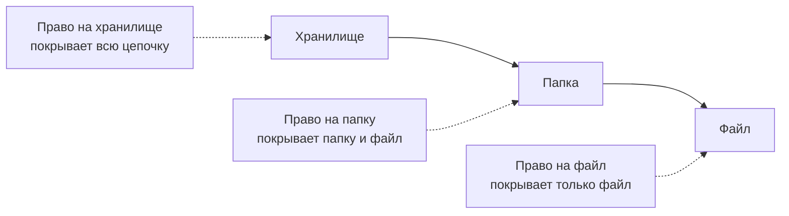
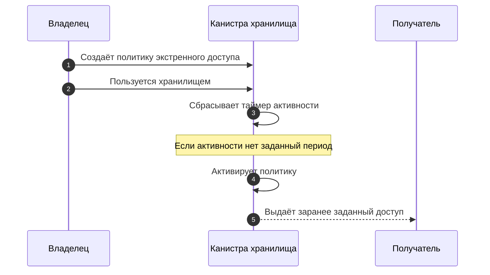
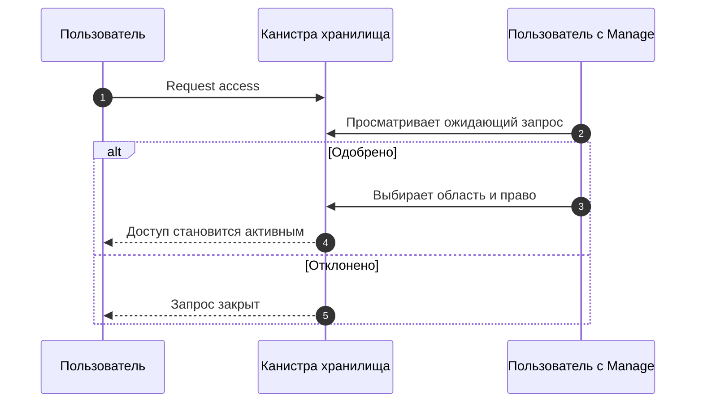

import { Badge } from '@rspress/core/theme';

Права отвечают на простой вопрос: что этот человек может делать с хранилищем,
папкой или файлом?

Rabbithole держит это решение рядом с данными. Канистра хранилища проверяет
права перед показом списка файлов, изменением контента, изменением совместного
доступа и выдачей ключа шифрования.

## Уровни прав

В интерфейсе Rabbithole показывает три уровня прав.

| Право | Что может получатель |
|---|---|
| **View** | Открывать папки и файлы, которыми с ним поделились. |
| **Edit** | Смотреть контент и менять его: загружать, переименовывать, перемещать или удалять. |
| **Manage** | Менять контент и управлять доступом для выбранной области. |

Выбирайте **View** для читателя, **Edit** для участника, который работает с
файлами, и **Manage** для человека, который может приглашать или удалять
других людей.

## Операции и нужные права

Одна и та же модель прав контролирует файловые операции, совместный доступ и
запрос ключа для зашифрованного файла. Через `/` указано техническое название
права в канистре.

| Операция | Требуемое право |
|---|---|
| Открыть папку или скачать файл | **View** / `Read` |
| Запросить ключ зашифрованного файла | **View** / `Read` |
| Загрузить, переименовать, переместить или удалить | **Edit** / `ReadWrite` |
| Управлять совместным доступом | **Manage** / `ReadWriteManage` |

Blob Storage меняет место хранения байтов файла, но не обходит проверку прав в
канистре хранилища.

:::note{title="Совместный доступ и Pro"}

Совместный доступ и управление доступом требуют активного Pro у владельца
хранилища. Лицензия хранилища сохраняет персональное зашифрованное хранение
владельца, но не поддерживает совместный доступ после истечения Pro.

:::

## Что такое область доступа

Область доступа — это объект, которым вы поделились. Это может быть всё
хранилище, одна папка или один файл.

| Где выдали право | Что оно покрывает |
|---|---|
| **Хранилище** | Всё хранилище. |
| **Папка** | Эту папку и файлы внутри неё. |
| **Файл** | Только этот файл. |

Если у человека есть доступ к папке, он может открывать файлы внутри этой
папки с тем же уровнем прав, если более сильное правило не задано в другом
месте.

:::details{title="Технические детали: key IDs и итоговые права"}

Внутри канистры папки и файлы резолвятся в стабильные key IDs. Проверки прав
используют эти key IDs и поднимаются по родительской цепочке, чтобы найти
самое сильное итоговое право.

Поэтому правило на папку может работать для файла внутри папки, а правило на
корень хранилища может работать для всего хранилища.

:::

## Приглашения и активный доступ

Rabbithole различает доступ, который уже активен, и доступ, который ждёт
получателя.

- **Активный доступ** означает, что канистра хранилища знает principal
  получателя.
- **Ожидающий доступ** означает, что Rabbithole ждёт, пока получатель примет
  приглашение, чаще всего через проверенный email.

Когда получатель принимает email-приглашение, ожидающий доступ становится
активным доступом для его principal.

:::details{title="Технические детали: записи доступа"}

В коде активная запись доступа хранится как `principal grant`, а ожидающая
запись доступа хранится как `pending grant`. Ожидающая email-запись позже
может создать активную запись для principal получателя после совпадения
проверенного email.

Пользователи с правом **Manage** могут видеть историю приглашения, включая то,
было ли email-приглашение принято через Rabbithole или через прямой интерфейс
хранилища.

:::

## Особые классы доступа

В основном интерфейсе чаще всего встречается стандартный доступ. У Rabbithole
есть и более редкие классы, которые нужны для восстановления и заранее заданных
политик.

| Название для пользователя | Технический класс | Для чего нужен |
|---|---|---|
| **Стандартный доступ** | `ordinary` | Приглашение или одобренный запрос доступа. |
| **Долговременный доступ** <Badge text="policy" type="info" outline /> | `durable` | Доступ, который заранее описан политикой и активируется, если владелец долго неактивен. |
| **Доступ восстановления** <Badge text="recovery" type="warning" outline /> | `ownerEquivalent` | Запасной principal владельца с правами уровня владельца. |

Стандартный доступ зависит от Pro владельца. Долговременный доступ и доступ
восстановления закрывают суверенные сценарии: они могут сохранять доступ к
разрешённым данным даже тогда, когда Pro владельца не активен.

:::details{title="Долговременный доступ"}

Долговременный доступ нужен для экстренных сценариев. Владелец заранее
описывает, кто получит доступ, к какой области и с какими правами, если
владелец не проявляет активность в течение заданного времени.

Пока владелец пользуется хранилищем, канистра фиксирует активность и сбрасывает
таймер. Если активности нет достаточно долго, политика срабатывает и создаёт
стандартные правила доступа для выбранных получателей.

:::

:::details{title="Доступ восстановления"}

Доступ восстановления нужен для самого жёсткого сценария: владелец должен
сохранить возможность открыть своё хранилище напрямую, даже если основной
интерфейс Rabbithole недоступен.

В обычном сценарии вы входите через `rabbithole.app`, а интерфейс хранилища
получает делегацию от Rabbithole. Поэтому хранилище видит тот же principal, что
и основное приложение.

Если владелец входит напрямую через адрес своего хранилища, например
`<ваше-хранилище>.icp0.io`, Internet Identity считает это другим приложением.
Для приватности Internet Identity выводит отдельный principal для каждого
веб-адреса приложения. Доступ восстановления сохраняет principal прямого входа
как запасной principal владельца.

Подробнее это описано на странице
[Аутентификация](/ru/how-it-works/authentication#почему-у-одного-пользователя-бывают-разные-principal).

:::

## Запросы доступа

Если вошедший пользователь открывает хранилище без прав, Rabbithole может
показать действие **Request access**. Владелец или пользователь с правом
**Manage** может одобрить или отклонить этот запрос.

Когда запрос одобрен, пользователь с правом **Manage** выбирает, чем
поделиться и какие права выдать.

## Что может и не может отзыв доступа

Отзыв доступа останавливает будущие проверки. Получатель не может продолжать
смотреть, редактировать, управлять или получать ключи для отозванной области.

Отзыв не может стереть данные, которые получатель уже скачал. Это обычное
ограничение совместного доступа к файлам: можно остановить будущий доступ, но
нельзя забрать копию, которая уже покинула систему.

## Связанные страницы

Эти страницы описывают системы, от которых зависит модель прав.

- [Обзор совместного доступа](/ru/how-it-works/sharing/)
- [Приглашения по email](/ru/how-it-works/sharing/email-invites)
- [Шифрование общего доступа](/ru/how-it-works/sharing/encryption-in-shared-access)
