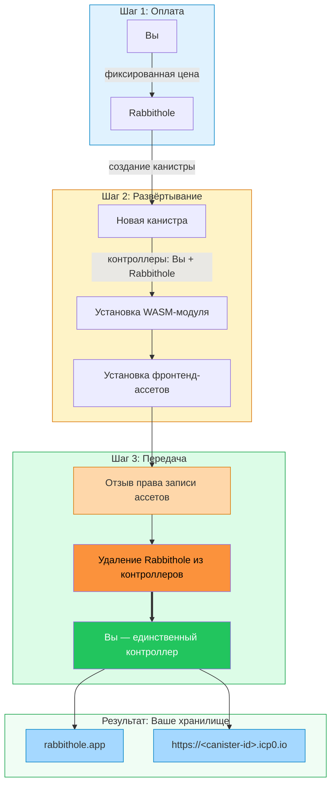
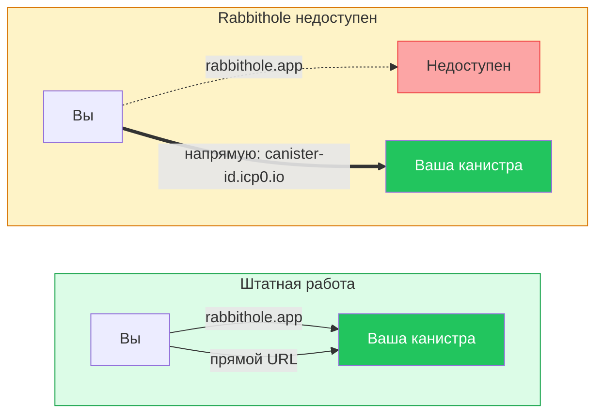
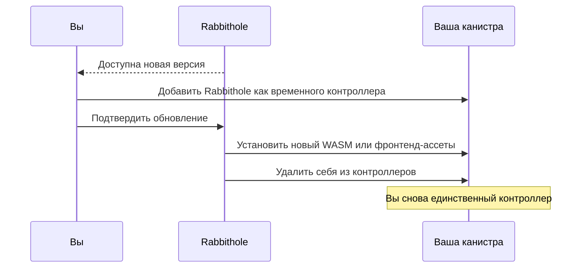

# Суверенитет данных в Rabbithole

Суверенитет данных означает, что ваше хранилище — не просто аккаунт в базе
Rabbithole. Когда вы создаёте хранилище, Rabbithole разворачивает для вас
персональную канистру Internet Computer, устанавливает код хранилища и
фронтенд-ассеты, а затем удаляет себя из управления.

:::tip{title="Короткий вывод"}

Ваше хранилище — это персональная канистра. Rabbithole помогает создать её, а
затем передаёт контроль вашему Internet Identity principal. Вы можете обращаться
к канистре напрямую, пополнять её циклы и решать, принимать ли будущие
обновления.

:::

## Что вы контролируете

После первичной передачи ваш principal становится контроллером канистры
хранилища. Это даёт вам прямой контроль над инфраструктурой, где хранятся
записи о файлах, права доступа, фронтенд-ассеты и, в режиме On-chain Storage,
сами байты файлов.

Вы контролируете эти части хранилища:

- **Права контроллера**: ваш principal управляет настройками и обновлениями
  канистры.
- **Прямой доступ**: канистра обслуживает собственный фронтенд по адресу
  `https://<canister-id>.icp0.io`.
- **Финансирование циклов**: вы можете поддерживать работу канистры через
  Rabbithole Pro или напрямую через инструменты Internet Computer.
- **Обновления**: вы решаете, получит ли Rabbithole временный доступ для
  установки новой версии.
- **Удаление**: вы можете удалить канистру и её данные, когда хранилище больше
  не нужно.

## Что по-прежнему предоставляет Rabbithole

Суверенитет не означает, что Rabbithole исчезает из пользовательского опыта. Он
означает, что Rabbithole становится сервисным слоем вокруг инфраструктуры,
которую контролируете вы.

Rabbithole может по-прежнему предоставлять эти удобства:

- **Основной интерфейс приложения** на `rabbithole.app`.
- **Создание хранилища** для развёртывания и инициализации персональной
  канистры.
- **Опциональные обновления** WASM-модулей и фронтенд-ассетов.
- **Пополнение Pro**, которое автоматически поддерживает баланс циклов.
- **Координацию Blob Storage**, если вы выбираете более дешёвый режим хранения.

## Что суверенитет не гарантирует

Суверенитет данных убирает Rabbithole из постоянных контроллеров, но не отменяет
операционные зависимости. Эти ограничения важно понимать.

- **Циклы всё равно нужны**: канистра без финансирования может заморозиться, а
  позже может быть удалена сетью Internet Computer.
- **Blob Storage имеет отдельную модель доступности**: канистра хранит
  доверенную запись о файле, но байты файла зависят от финансирования и
  retention Blob Storage.
- **Шифрование остаётся отдельной настройкой**: суверенитет отвечает за владение
  и администрирование, а шифрование — за конфиденциальность файла.
- **Потеря identity остаётся риском**: если вы потеряете доступ к Internet
  Identity, который контролирует канистру, Rabbithole не сможет восстановить
  контроль за вас.
- **Обновления создают временное окно доверия**: когда вы подтверждаете
  обновление, Rabbithole получает временный доступ, а затем снова удаляет себя.

## Как создаётся хранилище

Rabbithole использует временный доступ только для создания и инициализации
хранилища. Передача контроля происходит до того, как хранилище становится вашей
самостоятельной канистрой.



Поток создания состоит из трёх фаз:

1. **Оплатите развёртывание**: платёж покрывает создание канистры и начальный
   баланс циклов.
2. **Установите хранилище**: Rabbithole устанавливает WASM-модуль хранилища и
   фронтенд-ассеты, которые обслуживает ваша канистра.
3. **Завершите передачу**: Rabbithole отзывает своё право записи ассетов и
   удаляет себя из контроллеров канистры.

После этой передачи Rabbithole больше не имеет постоянного административного
доступа к вашей канистре.

## Как проверить владение

Вы можете проверить контроллеров канистры через `icp-cli`. Запускайте команду с
Internet Computer identity, которая контролирует вашу канистру хранения.

```bash
icp canister settings show <your-storage-canister-id> -n ic
```

Проверьте поле `controllers` в выводе:

- Ваш principal должен быть в списке контроллеров.
- Rabbithole не должен оставаться в списке после завершения передачи.

Чтобы вывести principal текущей identity в `icp-cli`, выполните:

```bash
icp identity principal
```

Вы также можете сравнить хеш установленного модуля с опубликованным релизом,
если хотите проверить код. Полный процесс описан в руководстве Internet
Computer по
[reproducible builds](https://docs.internetcomputer.org/building-apps/best-practices/reproducible-builds).

## Что будет, если Rabbithole исчезнет?

Rabbithole — один из интерфейсов к вашему хранилищу, а не владелец канистры.
Если `rabbithole.app` недоступен, канистра может обслуживать собственный
фронтенд напрямую, пока у неё достаточно циклов.



Что останется доступным, зависит от режима хранения:

- **On-chain Storage**: байты файла остаются внутри канистры, пока она
  профинансирована.
- **Blob Storage**: канистра хранит доверенную запись о файле и данные проверки,
  а доступность байтов файла зависит от retention lifecycle Blob Storage.

## Технические детали

Ниже описано, как Rabbithole выполняет передачу контроля и как работают
опциональные обновления после того, как канистра принадлежит вам.

:::details{title="Передача контроля и опциональные обновления"}

### Передача контроля

Первичная передача состоит из двух шагов на уровне протокола:

1. **Отзыв права `#Commit`**: Rabbithole вызывает `revoke_permission` на
   интерфейсе `http-assets`, удаляя свою возможность записывать или изменять
   фронтенд-файлы.
2. **Удаление Rabbithole из контроллеров**: Rabbithole вызывает
   `IC.update_settings` с `controllers = [your_principal]`. Остаётся только ваш
   principal.

Менеджмент-канистра Internet Computer применяет правила контроллеров на уровне
протокола. После удаления Rabbithole у него нет административного обхода.

### Опциональные обновления канистры

Rabbithole может доставлять обновления, но только после того, как вы подтвердите
временное окно доступа.



Перед обновлением вы можете создать snapshot из интерфейса Rabbithole. Snapshot
фиксирует текущее состояние Stable Memory и WASM-модуля. Если обновление
завершится ошибкой или будет работать некорректно, вы сможете восстановить
канистру из snapshot.

Stable Memory переживает обновления канистры, поэтому записи о файлах и
сохранённые данные остаются доступными при обычных обновлениях кода.

:::

## Продолжить чтение

Эти страницы объясняют связанные части модели.

- [Аутентификация](/ru/how-it-works/authentication)
- [Хранилище](/ru/how-it-works/storage)
- [Оплата и циклы](/ru/how-it-works/payment)
