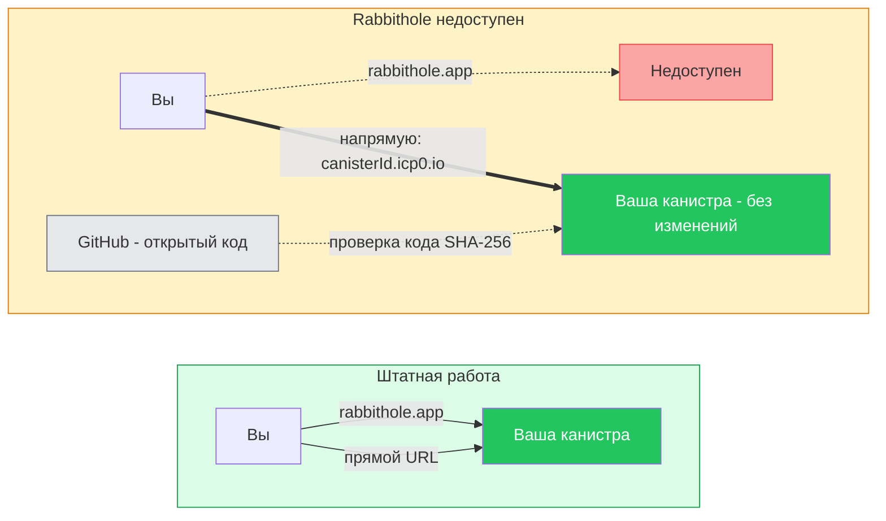
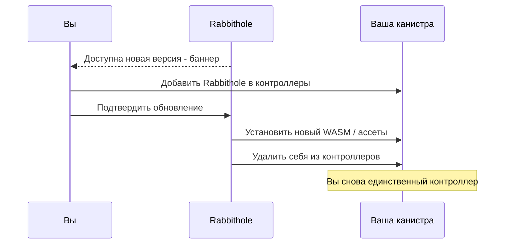

# Ваше хранилище. Ваши правила.

Rabbithole не просто шифрует файлы — он передаёт вам **реальное владение** инфраструктурой хранения. Это принципиально отличается от любого другого облачного сервиса.

## Что делает Rabbithole уникальным?

Когда вы создаёте хранилище в Rabbithole, мы разворачиваем **персональную канистру** (смарт-контракт) в блокчейне Internet Computer — и затем **передаём вам ключи**.


После развёртывания:
- **Вы — единственный контроллер** вашей канистры
- Rabbithole **удаляет себя** из списка контроллеров
- Ваша канистра содержит зашифрованные файлы, интерфейс и ваши правила доступа
- Никто — ни Rabbithole, ни государство, ни хакер — не может получить доступ к вашим данным или удалить их

## Как создаётся хранилище


### Шаг 1: Вы оплачиваете фиксированную стоимость

Вы платите фиксированную цену в USD. Она покрывает две вещи:
- **Создание канистры** — сеть Internet Computer [взимает плату](https://docs.internetcomputer.org/building-apps/essentials/gas-cost#canister-creation) за создание нового смарт-контракта
- **Начальный баланс циклов** — «топливо», необходимое вашей канистре для вычислений и хранения данных

**Rabbithole не зарабатывает на этом этапе.** Вся оплата уходит в сеть Internet Computer. Под капотом Rabbithole конвертирует вашу оплату в циклы и отправляет их в сеть — но вам не нужно об этом думать.

### Шаг 2: Rabbithole разворачивает канистру

1. **Создаёт канистру** — на этом этапе контроллерами являются вы и Rabbithole (временный доступ нужен для установки кода)
2. **Устанавливает WASM-модуль** — логику канистры хранилища, тот же открытый код, что опубликован на GitHub
3. **Устанавливает фронтенд-ассеты** — ваша канистра будет обслуживать собственный веб-интерфейс

Бекенд Rabbithole ежедневно проверяет GitHub на наличие новых релизов. При обнаружении новой версии скачивает свежий WASM-модуль и фронтенд-ассеты — поэтому каждая новая канистра получает актуальный код.

### Шаг 3: Rabbithole уходит

После установки Rabbithole выполняет двухэтапную передачу:
1. **Отзывает своё право записи** в хранилище ассетов канистры — чтобы больше не мог изменять ваши фронтенд-файлы
2. **Удаляет себя из контроллеров** — оставляя вас единственным контроллером

С этого момента вы — единственный, кто может управлять канистрой. Это обеспечивается на уровне протокола IC — бэкдоров нет.

### Результат

Вы можете обращаться к хранилищу двумя способами:
- Через **rabbithole.app** — основной интерфейс приложения
- Напрямую по адресу **https://&lt;canisterId&gt;.icp0.io** — канистра обслуживает собственный фронтенд

Ваша идентичность (Principal ID) одинакова в обоих случаях — Rabbithole использует механизм делегации ключей, чтобы Internet Identity узнавала вас независимо от URL. Подробнее на странице [Аутентификация](/ru/how-it-works/authentication).

## Что если Rabbithole исчезнет?

Этот вопрос никто не задаёт про Google Drive — потому что ответ пугающий. С Rabbithole всё просто: **для ваших данных ничего не изменится**.

Ваша канистра — полностью автономный смарт-контракт в Internet Computer. Rabbithole.app — лишь удобный способ взаимодействия с ней, но не единственный и не обязательный.



- **Ваши данные остаются** в блокчейне Internet Computer — канистра продолжает работать самостоятельно
- **Вы обращаетесь напрямую** по адресу `https://<canisterId>.icp0.io` — канистра уже обслуживает собственный фронтенд
- **Вы пополняете циклы** напрямую через интерфейс управления IC, без Rabbithole
- **Код проверяем** — все WASM-модули и фронтенд-ассеты [открыты](https://github.com/rabbithole-app/v2). Вы можете [убедиться](https://docs.internetcomputer.org/building-apps/best-practices/reproducible-builds), что модуль в вашей канистре совпадает с опубликованным релизом, сравнив хеши SHA-256: `dfx canister info <id> --network ic` возвращает хеш модуля
- **Обновления не обязательны** — канистра прекрасно работает и без обновлений

Rabbithole спроектирован так, что его собственное исчезновение не влияет на ваши данные и доступ к ним. Канистра самодостаточна с момента создания.

---

:::details{title="Как работает передача контроля?"}

Передача — двухэтапный процесс:

1. **Отзыв права `#Commit`** — Rabbithole вызывает `revoke_permission` на http-assets интерфейсе вашей канистры, лишая себя возможности записывать или изменять фронтенд-файлы.
2. **Удаление из контроллеров** — Rabbithole вызывает `IC.update_settings` с `controllers = [ваш_principal]`, удаляя себя полностью. Остаётся только ваш Principal.

Менеджмент-канистра Internet Computer обеспечивает правила контроля на уровне протокола — после удаления Rabbithole нет бэкдоров, административного доступа или механизма обхода. Это гарантирует консенсус IC.

Вы можете проверить контроллеров канистры в любой момент:
```bash
dfx canister info <id-вашей-канистры> --network ic
```

:::

:::details{title="А как насчёт обновлений канистры?"}

В Rabbithole есть встроенный механизм доставки обновлений. Когда доступна новая версия, вы видите баннер-уведомление в интерфейсе. Процесс обновления работает так:

1. **Вы решаете** — обновления никогда не навязываются. Вы видите баннер и выбираете, обновляться ли
2. **Временный доступ** — если вы согласны, Rabbithole временно добавляется в контроллеры вашей канистры
3. **Обновление** — Rabbithole устанавливает новый WASM-модуль и/или фронтенд-ассеты
4. **Доступ убирается** — Rabbithole снова удаляет себя из контроллеров



**Снимки для безопасности:** Перед любым обновлением вы можете сделать снимок (snapshot) состояния канистры через интерфейс. Снимок фиксирует текущее состояние Stable Memory и WASM-модуля. Если что-то пойдёт не так после обновления, вы можете откатиться к снимку — восстановив данные и код до состояния перед обновлением.

Данные хранятся в **Stable Memory** — персистентном хранилище, которое переживает обновления кода. Даже при обновлении логики канистры ваши файлы остаются нетронутыми.

:::
