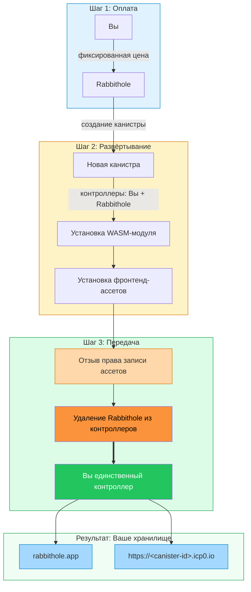
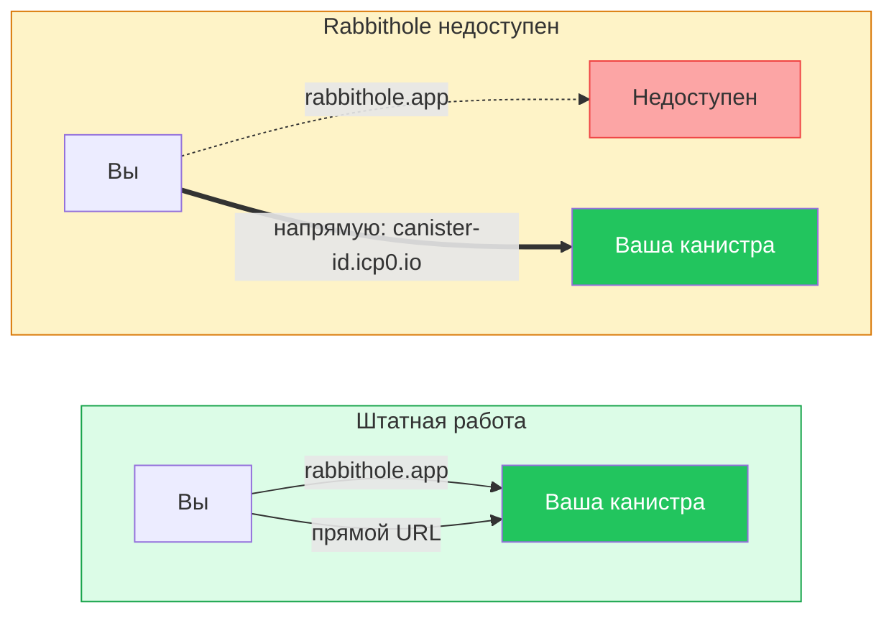

# Суверенитет данных в Rabbithole

В Rabbithole владение хранилищем связано с канистрой, а не с одной записью в
базе аккаунтов. Когда вы создаёте хранилище, Rabbithole разворачивает для вас
персональную канистру Internet Computer с кодом хранилища, данными и
собственным веб-интерфейсом.

После завершения передачи Rabbithole удаляет себя из контроллеров. Хранилище
остаётся частью Internet Computer, но управление им переходит к вам.

:::tip Короткий вывод

Rabbithole помогает создать хранилище и остаётся сервисом вокруг него. Само
хранилище принадлежит вам: вы можете открывать его напрямую, пополнять канистру
циклами и решать, принимать ли будущие обновления.

:::

## Что вы контролируете

После первичной передачи ваш Internet Identity principal становится
контроллером канистры хранилища. Это даёт вам прямой контроль над
инфраструктурой, где хранятся записи о файлах, правила доступа,
фронтенд-ассеты и, в режиме On-chain Storage, сами байты файлов.

Вы контролируете эти части хранилища:

- **Настройки канистры**: ваш principal управляет контроллерами и обновлениями.
- **Прямой доступ**: канистра обслуживает собственный фронтенд по адресу
  `https://<canister-id>.icp0.io`.
- **Финансирование циклов**: вы можете поддерживать работу хранилища через
  автопополнение циклов в Pro или пополнять канистру напрямую через
  инструменты Internet Computer.
- **Обновления**: вы решаете, давать ли Rabbithole временный доступ для
  установки новой версии.
- **Удаление**: вы можете удалить канистру и её данные, когда хранилище больше
  не нужно.

## Что по-прежнему делает Rabbithole

Суверенитет не означает, что Rabbithole исчезает из пользовательского опыта. Он
означает, что Rabbithole становится сервисным слоем вокруг инфраструктуры,
которую контролируете вы.

Rabbithole может по-прежнему предоставлять:

- основной интерфейс приложения на `rabbithole.app`;
- создание и первичную настройку хранилища;
- доставку обновлений кода и фронтенд-ассетов, когда у вас активна подписка Pro и
  вы подтверждаете временный доступ;
- автопополнение циклов для активной подписки Pro, когда канистре нужны циклы
  перед дорогими операциями;
- координацию Blob Storage, если вы выбираете более дешёвый режим хранения.

## Как создаётся хранилище

Rabbithole использует временный доступ только для создания и инициализации
хранилища. Передача контроля происходит до того, как хранилище становится вашей
самостоятельной канистрой.

Поток создания состоит из трёх фаз:

1. **Вы оплачиваете развёртывание**. Платёж покрывает создание канистры,
   начальный баланс циклов, операции развёртывания и связанные инфраструктурные
   расходы.
2. **Rabbithole устанавливает хранилище**. В канистру загружается код
   хранилища и фронтенд-ассеты, которые она будет обслуживать.
3. **Rabbithole завершает передачу**. Сервис отзывает своё право записи
   ассетов и удаляет себя из контроллеров канистры.

После этой передачи Rabbithole больше не имеет постоянного административного
доступа к вашей канистре. Целевое финальное состояние: ваш principal остаётся
единственным контроллером.

## Что будет, если Rabbithole недоступен

Rabbithole является одним из интерфейсов к вашему хранилищу, а не владельцем
канистры. Если `rabbithole.app` недоступен, канистра может обслуживать
собственный фронтенд напрямую, пока у неё достаточно циклов.

Что останется доступным, зависит от режима хранения:

- **On-chain Storage**: байты файла остаются внутри канистры, пока она
  профинансирована.
- **Blob Storage**: канистра хранит доверенную запись о файле и данные проверки,
  а доступность байтов файла зависит от срока хранения Blob Storage.

## Границы модели

Суверенитет данных убирает Rabbithole из постоянных контроллеров, но не отменяет
операционные зависимости. Эти ограничения важно понимать заранее.

- **Циклы всё равно нужны**. Канистра без финансирования может заморозиться, а
  позже может быть удалена сетью Internet Computer.
- **Blob Storage имеет отдельную модель доступности**. Канистра хранит запись о
  файле, но байты файла зависят от финансирования и срока удержания
  (retention) Blob Storage.
- **Шифрование остаётся отдельной темой**. Суверенитет отвечает за владение и
  администрирование. Шифрование отвечает за конфиденциальность файла.
- **Потеря identity остаётся риском**. Если вы потеряете доступ к Internet
  Identity, который контролирует канистру, Rabbithole не сможет восстановить
  контроль за вас.

## Продолжить чтение

Эти страницы углубляют модель суверенитета и связанные части продукта.

- [Как проверить владение](./verify-ownership)
- [Обновления хранилища](./updates)
- [Аутентификация](/ru/how-it-works/authentication)
- [Хранилище](/ru/how-it-works/storage/index)
- [Оплата и циклы](/ru/how-it-works/payment)
