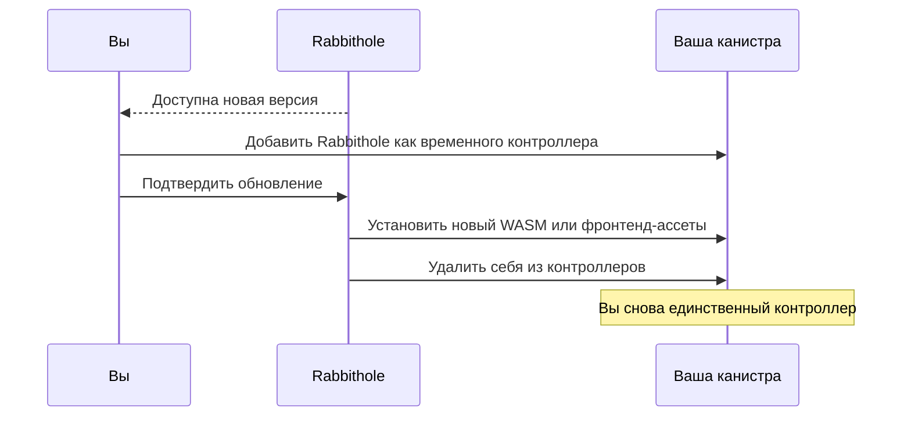

# Обновления хранилища

После передачи контроля Rabbithole не может обновить вашу канистру
самостоятельно. Это намеренная часть модели: чтобы установить новую версию,
сервису нужно временное окно доступа, которое подтверждаете вы.

Такая схема позволяет Rabbithole доставлять исправления и новые возможности,
но не оставаться постоянным администратором вашего хранилища.

Доставка обновлений — сервисная возможность подписки Pro. При этом подписка не
меняет модель контроля: обновление всё равно требует вашего подтверждения и
временного доступа к канистре.

## Почему нужен временный доступ контроллера

Обновление канистры меняет код, который обслуживает хранилище. На Internet
Computer такие операции может выполнять только контроллер канистры. Поэтому
Rabbithole не может тихо обновить ваше хранилище после передачи контроля.

Когда вы подтверждаете обновление, происходит ограниченный по задаче процесс:

1. Вы добавляете Rabbithole как временного контроллера.
2. Rabbithole устанавливает новый WASM-модуль или фронтенд-ассеты.
3. Rabbithole удаляет себя из контроллеров.
4. Хранилище снова остаётся под вашим контролем.

## Что происходит с данными

Обычное обновление меняет код канистры, но не должно стирать данные. Записи о
файлах, права доступа и сохранённые данные находятся в Stable Memory, которая
переживает обновления канистры.

Перед обновлением вы можете создать снапшот из интерфейса Rabbithole. Снапшот
фиксирует текущее состояние Stable Memory и WASM-модуля. Если обновление
завершится ошибкой или будет работать некорректно, вы сможете восстановить
канистру из снапшота.

## Что делает Rabbithole на уровне протокола

Во время первичной передачи и обновлений Rabbithole работает с двумя разными
видами доступа:

- **Права на фронтенд-ассеты**. Rabbithole может установить или обновить файлы
  веб-интерфейса, который обслуживает ваша канистра. После передачи сервис
  отзывает своё право записи ассетов.
- **Права контроллера канистры**. Rabbithole получает их только на время
  операции, устанавливает нужную версию и удаляет себя из контроллеров.

Первичная передача завершается вызовом `IC.update_settings` с финальным списком
контроллеров. После удаления Rabbithole у сервиса нет административного обхода:
правила контроллеров применяются менеджмент-канистрой Internet Computer.

## Что проверить после обновления

После завершения обновления проверьте таблицу **Controllers** на странице
канистры в Rabbithole. В списке должны остаться только ожидаемые
principal-идентификаторы.

Если вы хотите проверить это напрямую через инструменты Internet Computer,
используйте инструкцию на странице [Как проверить владение](./verify-ownership).

## Продолжить чтение

- [Суверенитет данных](./index)
- [Как проверить владение](./verify-ownership)
- [Оплата и циклы](/ru/how-it-works/payment)
