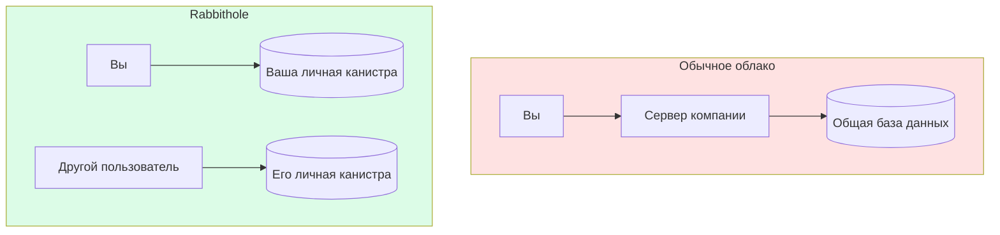
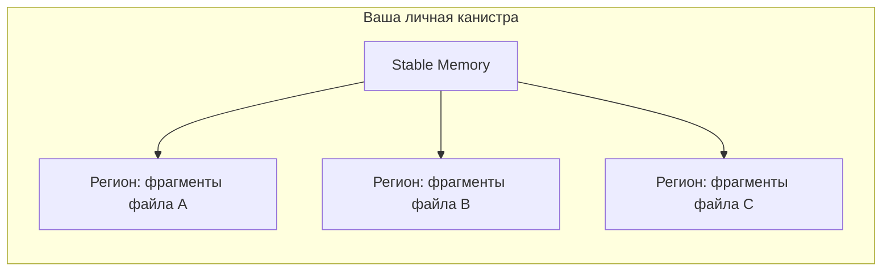

## Ваши данные живут на блокчейне, а не на чьём-то сервере

В отличие от обычных облачных хранилищ, Rabbithole не хранит файлы на серверах компании. Зашифрованные данные хранятся в **вашей собственной канистре** в **Internet Computer** — децентрализованной блокчейн-сети.

## Каждый пользователь получает свою канистру

Когда вы начинаете использовать Rabbithole, для вас разворачивается **персональная канистра**. Она принадлежит вам — после развёртывания Rabbithole удаляет себя из списка контроллеров, делая вас единственным владельцем.

Подробнее об этом в разделе [Суверенитет данных](/ru/how-it-works/sovereignty).

## Что такое канистры?

Канистры — это **смарт-контракты** в Internet Computer. Представьте программы, которые работают на децентрализованной сети независимых компьютеров:

- Код выполняется прозрачно (любой может проверить)
- Данные хранятся в защищённой от подделки памяти
- Не могут быть отключены одним лицом
- Работают 24/7 без простоев

Ваша персональная канистра управляет всем:

| Функция | Назначение |
|---------|-----------|
| **Метаданные файлов** | Папки, права доступа, имена файлов |
| **Зашифрованное хранилище** | Зашифрованные фрагменты файлов |

## Что будет с данными, если Rabbithole исчезнет?

Данные сохранятся в вашей канистре, пока у неё есть **циклы** (валюта вычислений ICP). Код открыт, поэтому вы можете:

1. Развернуть свой фронтенд
2. Подключить его к вашей существующей канистре
3. Получить доступ к своим файлам

:::note{title="Ключевой момент"}

Ваши данные не привязаны к компании Rabbithole — они живут в вашей собственной канистре на блокчейне.

:::

---

## Технические детали

:::details{title="Нажмите, чтобы развернуть"}

### Stable Memory и Memory Regions

Фрагменты файлов хранятся в **Stable Memory** ICP — персистентном хранилище, которое переживает обновления канистры. Каждый фрагмент управляется через **Memory Regions**:

- Эффективное выделение и освобождение блобов
- Произвольный доступ по индексу фрагмента
- Непрерывное хранение для потоковых чтений

### Схема хранения

### Ёмкость

- Одна канистра: до **400 ГБ** stable memory
- Размер фрагмента: ~**1.9 МБ** открытый текст (~1.9 МБ + 28 байт зашифрованный)
- Одна канистра может хранить ~200 000 фрагментов

### Целостность данных

- SHA-256 чексуммы проверяют целостность фрагментов при скачивании
- Фрагменты материализуются до операций с памятью для предотвращения use-after-free

:::

