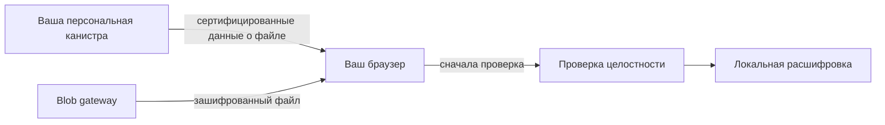

import { OverviewGroup, Steps } from '@rspress/core/theme';

## Что такое Blob Storage

Blob Storage — это более дешёвый режим хранения в Rabbithole. Файл хранится вне вашей канистры, а сама канистра хранит запись о файле, права доступа и информацию, которая нужна для проверки, что файл не был подменён.

Когда шифрование включено, слой хранения видит только шифротекст.  
Когда шифрование выключено, Blob Storage нужно воспринимать как режим хранения и контроля доступа, а не как режим конфиденциальности.

:::tip{title="Компромисс в двух строках"}

Вы получаете более низкую цену и поддержку больших файлов.  
Вы принимаете, что долгосрочная доступность зависит от жизненного цикла сервиса Blob Storage.

:::

:::note{title="Важное различие"}

Внешний слой хранения держит **сам файл**.  
Ваша персональная канистра держит **доверенные метаданные и данные для проверки**.

:::

:::note{title="Шифрование меняет границу приватности"}

Когда шифрование включено, Blob Storage не видит содержимое файла.  
Когда шифрование выключено, storage-инфраструктура может видеть содержимое файла, даже если Rabbithole всё ещё применяет правила доступа между пользователями.

:::

## Где находится файл

Эта диаграмма показывает весь путь Blob Storage:

- браузер загружает файл
- персональная канистра хранит **доверенную запись о файле и состояние доступа**
- **Blob Gateway** — это сервис загрузки и скачивания, который сохраняет файл в **S3-совместимом object storage**
- **Cashier** и **Cleanup service** незаметно для пользователя поддерживают биллинг и очистку хранения

## Как работает загрузка

<Steps>

### Подготовка файла в браузере

Браузер делит файл на части. Если шифрование включено, эти части шифруются до загрузки.

### Загрузка файла

Браузер отправляет части файла в Blob gateway, а тот сохраняет их в S3-совместимый object storage.

### Сохранение записи о файле в вашей канистре

Ваша канистра сохраняет запись о файле, права доступа и цифровой отпечаток, который позже используется для проверки скачивания.

</Steps>

## Как работает скачивание

Перед открытием файла браузер делает две отдельные вещи:

1. Получает у канистры ожидаемый цифровой отпечаток файла.
2. Проверяет, что скачанный файл совпадает с этим отпечатком.

Только после этого начинается расшифровка, если она была включена для этого файла.

## Как в схему вписываются оплата и очистка

- **Blob Gateway** — это сервис, который принимает загрузки и отдаёт файлы при скачивании.
- **Cashier** — это биллинговый сервис хранения, который поддерживает финансирование и координацию жизненного цикла.
- **Cleanup service** синхронизирует удаление и cleanup/retention-события с вашей канистрой.

## Почему этот режим дешевле

Blob Storage дешевле, потому что сам файл не обязан жить внутри памяти канистры. Канистра хранит заметно меньше данных: запись о файле, права доступа и данные проверки.

## На чём строится доверие

- на Internet Computer для состояния канистры
- на криптографической проверке в браузере
- на storage-сервисе для доступности и retention файла

Поэтому Blob Storage и On-chain Storage используют одно и то же сквозное шифрование, но не одну и ту же модель доверия.

## Читать дальше

<OverviewGroup
  group={{
    name: 'Связанные страницы',
    items: [
      {
        text: 'Как Rabbithole проверяет ваши файлы',
        link: '/ru/how-it-works/storage/integrity',
      },
      {
        text: 'Как работает On-chain Storage',
        link: '/ru/how-it-works/storage/on-chain-storage',
      },
      {
        text: 'Оплата и циклы',
        link: '/ru/how-it-works/payment',
      },
    ],
  }}
/>

<OverviewGroup
  group={{
    name: 'Официальные материалы',
    items: [
      {
        text: 'Canister smart contracts',
        link: 'https://docs.internetcomputer.org/building-apps/essentials/canisters',
      },
      {
        text: 'Asset certification',
        link: 'https://learn.internetcomputer.org/hc/en-us/articles/34276431179412-Asset-Certification',
      },
      {
        text: 'Certified data',
        link: 'https://docs.internetcomputer.org/tutorials/developer-liftoff/level-3/3.3-certified-data',
      },
    ],
  }}
/>
