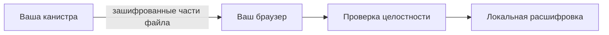

import { OverviewGroup, Steps } from '@rspress/core/theme';

## Почему это важно

Когда файл хранится вне браузера, возникают два разных вопроса:

- **Может ли кто-то прочитать файл?**
- **Может ли кто-то заменить файл так, чтобы вы этого не заметили?**

Шифрование отвечает на первый вопрос. Проверка файла отвечает на второй.

:::tip{title="Что это значит на практике"}

Если файл незаметно подменят по пути к вам, Rabbithole не должен открыть его.  
Вместо подменённого файла вы увидите ошибку загрузки или проверки целостности.

:::

## Проверка для Blob Storage

  

При Blob Storage браузер не доверяет gateway-сервису вслепую.

<Steps>

### Запросить у канистры ожидаемые данные о файле

Браузер получает у канистры ожидаемый хеш файла и связанные метаданные.

### Проверить, что эти данные действительно подлинные

Метаданные передаются через механизм сертификации Internet Computer, поэтому браузер может проверить, что они действительно пришли от вашей канистры.

### Сравнить скачанный файл с этим хешем

Если файл не совпадает, браузер отвергает его до открытия.

</Steps>

## Проверка для On-chain Storage

При On-chain Storage внешнего gateway-сервиса хранения в пути файла нет,
поэтому и путь проверки получается проще.

При этом браузер всё равно проверяет полученные данные до расшифровки, просто здесь не нужен отдельный внешний путь доставки файла.

## Что именно сертифицирует Internet Computer

Для Blob Storage Rabbithole сертифицирует метаданные, которые говорят браузеру, какой именно файл он должен ожидать.

Сюда входят, например:

- хеш файла
- размер файла
- тип содержимого

Это позволяет обнаружить подмену ещё до расшифровки.

## Что браузер проверяет локально

Браузер заново вычисляет хеш скачанного файла и сравнивает его с сертифицированным значением из канистры.

Только если они совпадают, начинается расшифровка.

:::note{title="Почему важны обе проверки"}

Сертификация доказывает, что ожидаемые метаданные действительно пришли от вашей канистры.  
Локальная проверка доказывает, что скачанный зашифрованный файл совпадает с этими метаданными.

:::

## Технические детали

:::details{title="Сертифицированные метаданные и локальное хеширование"}

### Путь Blob Storage

Для Blob Storage браузер выполняет две связанные проверки:

1. Проверяет сертифицированные метаданные, которые вернула ваша канистра.
2. Локально хеширует скачанный blob и сравнивает его с сертифицированным хешем.

Сертифицированные метаданные сейчас включают:

- ожидаемый хеш файла
- размер файла
- тип содержимого

Сначала браузер проверяет, что эти метаданные действительно сертифицированы Internet Computer, а затем проверяет, что скачанный blob побайтно совпадает с ожидаемым значением.

### Какой хеш используется

Rabbithole использует **SHA-256** для сертифицированного хеша файла и для локального сравнения в браузере.

### Почему сертификации и хеширования недостаточно по отдельности

- **Сертификация** доказывает, что ожидаемые метаданные действительно пришли от вашей канистры.
- **Локальное хеширование** доказывает, что скачанный blob совпадает с этими метаданными.

Обе проверки нужны одновременно. Одна только сертификация не доказывает, что
gateway-сервис отдал правильный файл. Одно только локальное хеширование не
доказывает, что ожидаемый хеш был надёжным.

### Путь On-chain Storage

При On-chain Storage отдельного внешнего слоя доставки нет, поэтому путь проверки короче:

- браузер скачивает данные файла из канистры
- браузер всё равно проверяет целостность до открытия
- расшифровка начинается только после успешной проверки

:::

## Читать дальше

<OverviewGroup
  group={{
    name: 'Связанные страницы',
    items: [
      {
        text: 'Как работает Blob Storage',
        link: '/ru/how-it-works/storage/blob-storage',
      },
      {
        text: 'Как работает On-chain Storage',
        link: '/ru/how-it-works/storage/on-chain-storage',
      },
      {
        text: 'Модель доверия',
        link: '/ru/how-it-works/trust-model',
      },
    ],
  }}
/>

<OverviewGroup
  group={{
    name: 'Официальные материалы',
    items: [
      {
        text: 'Certified data',
        link: 'https://docs.internetcomputer.org/tutorials/developer-liftoff/level-3/3.3-certified-data',
      },
      {
        text: 'Motoko CertifiedData',
        link: 'https://docs.internetcomputer.org/motoko/core/CertifiedData',
      },
      {
        text: 'Query calls',
        link: 'https://docs.internetcomputer.org/building-apps/interact-with-canisters/query-calls',
      },
    ],
  }}
/>
